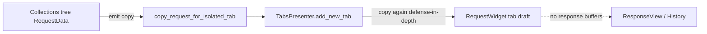

# PYPOST-407: Address RequestData deep copy overheads

## Research

- PYPOST-405/406/408 use `model_copy(deep=True)` at Collections emit, `add_new_tab`,
  `restore_tabs`, and `snapshot_persisted_fields`.
- `RequestData` today holds editor/persistence fields only; responses use `ResponseView` and
  `HistoryEntry` separately.
- Pydantic v2 deep copy duplicates nested dicts (`headers`, `params`) and strings (`body`).
  Cost is proportional to editor field size, not HTTP responses.
- Centralizing copy in `request_sync.py` matches existing helpers (`persisted_fields_equal`,
  `is_tab_dirty`) and keeps tab-sync logic in one module.

## Implementation Plan

1. Add `copy_request_for_isolated_tab(data) -> RequestData` in `pypost/core/request_sync.py`
   with module-level copy policy docstring.
2. Implement `snapshot_persisted_fields` via the new helper (same semantics, single primitive).
3. Replace inline `model_copy(deep=True)` at tab-isolation call sites:
   - `CollectionsPresenter._on_collection_clicked`
   - `CollectionTreeActions` context-menu **New tab**
   - `TabsPresenter.add_new_tab` and `restore_tabs`
   - `RequestWidget.get_request_data_from_ui`
4. Add `RequestData` class docstring stating lean-model contract.
5. Add `doc/dev/request_data_copy_policy.md`; link from `open_request_in_isolated_tab.md`.
6. Add `tests/test_request_sync.py` for copy isolation and lean-field guard.
7. Leave `model_copy(deep=True, update={...})` on Save As unchanged (copy plus id override).

## Architecture



### Module responsibilities

| Module | Change |
| --- | --- |
| `pypost/core/request_sync.py` | Canonical copy helper and policy module doc |
| `pypost/models/models.py` | `RequestData` lean-model docstring |
| `pypost/ui/presenters/*` | Use helper at emit and tab-creation boundaries |
| `pypost/ui/widgets/request_editor.py` | Use helper in `get_request_data_from_ui` |
| `doc/dev/request_data_copy_policy.md` | Developer copy policy reference |

### Interfaces

```python
def copy_request_for_isolated_tab(data: RequestData) -> RequestData: ...

def snapshot_persisted_fields(data: RequestData) -> RequestData: ...
```

## Q&A

- Q: Should `get_request_data_from_ui` use the tab helper?
  A: Yes — it creates an owned snapshot before applying UI fields, matching isolation semantics.
- Q: New metrics for copy size or duration?
  A: No — observability step defers unless profiling follow-up is opened.
