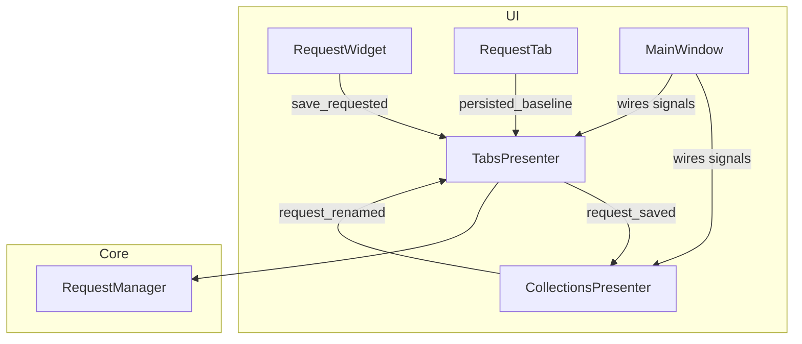
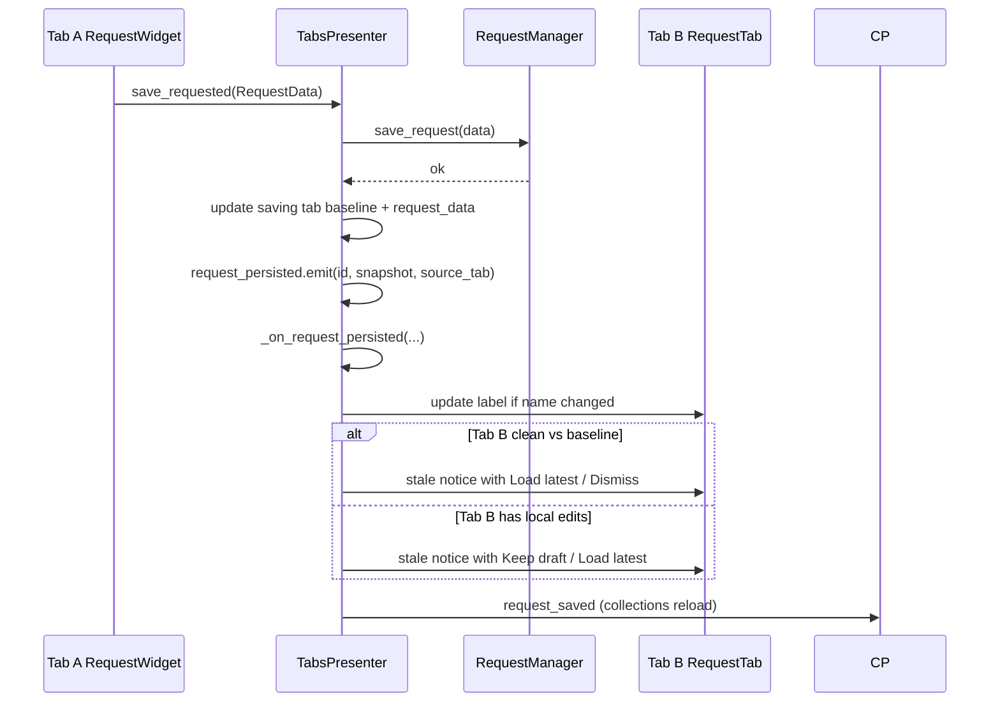

# PYPOST-408: Sync names/metadata across duplicate isolated tabs

## Research

- **PYPOST-405** introduced isolated tabs via `CollectionsPresenter.open_request_in_isolated_tab`
  (deep copy) and `TabsPresenter.restore_tabs` (deep copy per tab). Each `RequestTab` owns a
  distinct `RequestData` instance keyed by the same `id`. Unsaved edits do not leak across tabs.
- **Rename today:** `CollectionsPresenter.request_renamed` → `MainWindow._wire_signals` →
  `TabsPresenter.rename_request_tabs` updates every tab label and `tab.request_data.name` for
  matching ids. This path does not touch URL, method, headers, or body.
- **Save today:** `RequestWidget.save_requested` → `TabsPresenter._handle_save_request` persists
  via `RequestManager.save_request`, then:
  - On overwrite: updates tab text and `tab.request_data` on the **first** matching tab only
    (`break` after one hit), emits `request_saved`.
  - On first save: updates only the **current** tab, emits `request_saved`.
  - `request_saved` → `CollectionsPresenter.load_collections` + `restore_tree_state` (unchanged).
- **No dirty/stale tracking** exists. `RequestWidget` has `get_request_data_from_ui()` and
  `load_data()` for round-tripping editor state; `_loading` suppresses side effects during
  programmatic loads.
- **Qt / PySide6 pattern:** presenters expose `Signal` objects; `MainWindow` wires cross-presenter
  connections. In-presenter coordination can use private slots or internal signals (same pattern as
  `TabBarWithAddButton.layout_changed`).
- **Pydantic `RequestData`:** `model_copy(deep=True)` is the established copy primitive (PYPOST-405).
  Persisted fields per requirements: name, url, method, headers, body, body_type, params,
  post_script, yaml_as_json, expose_as_mcp, retry_policy (and any other fields written by
  `save_request`).

## Implementation Plan

1. Add a **persisted baseline** per `RequestTab` and helpers to compare UI/baseline/disk snapshots.
2. Extend `_handle_save_request` (overwrite path only) to broadcast persistence to sibling tabs
   via a new presenter signal and handler.
3. Unify **tab label updates** on save-driven name changes (fix first-tab-only `break`).
4. Implement **stale-state notification** flows (clean vs dirty) with explicit user actions.
5. Extend **rename** handling so baseline `name` stays aligned on all sibling tabs.
6. Harden **save-from-stale-tab** with informed overwrite when disk is newer than baseline.
7. Add unit tests and update `doc/dev/open_request_in_isolated_tab.md` (Step 7).

## Architecture

### Problem summary

Duplicate isolated tabs share a **request identity** (`id`) but not in-memory buffers. After a
save in tab A, tab B still shows content matching its local baseline while disk has moved ahead.
Users need awareness, consistent tab titles, and safe adoption of the latest saved version.

### Module diagram



### Sequence: save in tab A notifies tab B



### Modules and responsibilities

| Module | Responsibility |
| --- | --- |
| **`RequestTab`** | Hold `persisted_baseline: RequestData` (deep copy at open, after save, after reload). |
| **`request_sync` (new, `pypost/core/`)** | `snapshot_persisted_fields`, `persisted_fields_equal`, `is_tab_dirty(tab)`. Pure functions for tests. |
| **`TabsPresenter`** | Orchestrate save broadcast, sibling notification, label sync, reload-into-tab, stale save guard. |
| **`RequestWidget`** | Existing `get_request_data_from_ui` / `load_data`; optional thin `reload_from(data)` wrapper. |
| **`CollectionsPresenter`** | Unchanged save path; `request_renamed` still drives title sync. |
| **`MainWindow`** | No new cross-presenter wires; existing `request_saved` → collections reload preserved. |

### Signal / event design

#### New signal (TabsPresenter)

```python
request_persisted = Signal(str, object, object)
# (request_id: str, persisted_snapshot: RequestData, source_tab: RequestTab | None)
```

- **Emitted** once per successful **overwrite** save in `_handle_save_request` (existing request
  id). Payload `persisted_snapshot` is `request_data.model_copy(deep=True)` after
  `RequestManager.save_request` succeeds.
- **Not emitted** for first-time save (new id) or **Save As** (new id) — no sibling tabs share
  that identity.
- **Handler:** `request_persisted.connect(self._on_request_persisted)` in `TabsPresenter.__init__`
  (internal wiring; no `MainWindow` change).

Rationale: keeps sibling notification decoupled from save mechanics, testable via signal spy, and
consistent with existing presenter signals (`request_saved`, `request_renamed`).

#### Existing signals (unchanged wiring)

| Signal | Emitter | Consumer | Role in PYPOST-408 |
| --- | --- | --- | --- |
| `request_saved` | `TabsPresenter` | `CollectionsPresenter.load_collections`, `restore_tree_state` | Sidebar refresh after any save — **no regression**. |
| `request_renamed` | `CollectionsPresenter` | `TabsPresenter.rename_request_tabs` | Sidebar rename → all tab labels; extend to update `persisted_baseline.name`. |
| `save_requested` | `RequestWidget` | `TabsPresenter._handle_save_request` | Entry point; extended post-save broadcast. |

#### Internal events (methods, not Qt signals)

| Method | Called from | Purpose |
| --- | --- | --- |
| `_on_request_persisted` | `request_persisted` slot | Fan-out to sibling tabs; skip `source_tab`. |
| `_sync_tab_labels_for_request` | save broadcast, rename | Replace `rename_request_tabs` body or delegate to it for all matching tabs. |
| `_offer_stale_tab_resolution` | `_on_request_persisted` | Dialog/banner flow per clean vs dirty. |
| `_reload_tab_from_persisted` | user chooses Load latest | Set `request_data`, `persisted_baseline`, call `load_data()`. |
| `_check_stale_before_save` | start of overwrite branch | If disk ahead of tab baseline, strengthen overwrite prompt. |

### Persisted baseline and dirty/stale definitions

Each `RequestTab` stores `persisted_baseline` — the last adopted on-disk snapshot for that tab:

- **Initialized** in `add_new_tab` / `restore_tabs`: `baseline = initial_data.model_copy(deep=True)`.
- **Updated on this tab's save:** baseline = saved snapshot.
- **Updated on Load latest:** baseline = snapshot from `RequestManager.find_request` or broadcast
  payload.
- **Updated on collections rename:** `baseline.name = new_name` (metadata fields unchanged).

| State | Condition |
| --- | --- |
| **Clean** | `persisted_fields_equal(get_request_data_from_ui(), persisted_baseline)` |
| **Locally dirty** | not clean |
| **Stale (session)** | `persisted_fields_equal(persisted_baseline, disk_at_notify)` is false after sibling save |

Notification fires when a sibling save makes disk differ from the tab's `persisted_baseline`.
Local dirty vs clean only affects **wording and default button**, not whether to notify.

### Sibling tab handling (`_on_request_persisted`)

For each `RequestTab` where `tab.request_data.id == request_id` and `tab is not source_tab`:

1. **Tab labels:** if `persisted_snapshot.name != tab label`, call
   `_sync_tab_labels_for_request` (all tabs, including source — idempotent).
2. **Stale notice** (modal `QMessageBox` or dedicated dialog; match existing overwrite tone):
   - **Clean tab:** explain that `'{name}'` was saved elsewhere; buttons **Load latest** /
     **Dismiss** (default Dismiss per no silent overwrite).
   - **Dirty tab:** explain draft may be outdated; buttons **Keep my changes** / **Load latest**
     (default Keep my changes).
3. **Load latest:** fetch canonical copy from `RequestManager.find_request` (or use broadcast
   snapshot), `_reload_tab_from_persisted`, clear stale flag.
4. **Keep / Dismiss:** leave editor unchanged; set `tab._stale_persisted = True` (or similar) for
   optional visual indicator (banner/tooltip) until reload or successful save.

**Saving tab:** set `persisted_baseline` and `request_data` to saved snapshot; no self-notification.

### Save path changes (`_handle_save_request`)

Replace the first-match loop:

```python
for i in range(self._tabs.count()):
    ...
    break  # current: only first tab
```

With:

1. Stale guard before overwrite confirm (optional second prompt if tab baseline older than disk).
2. After `save_request`, update **saving** tab baseline + `request_data`.
3. `request_persisted.emit(request_data.id, snapshot, source_tab)`.
4. `_sync_tab_labels_for_request(request_data.id, request_data.name)`.
5. `request_saved.emit()` (unchanged).

First-time save and Save As: keep current single-tab update; no `request_persisted`.

### Rename path (`rename_request_tabs`)

Extend existing method (no new signal):

- Keep `setTabText` + `tab.request_data.name = new_name` for all matching tabs.
- Add `tab.persisted_baseline.name = new_name` when baseline is set.
- Do **not** emit stale notification (only name changed on disk; non-name fields unchanged).

### Interfaces

```python
# pypost/core/request_sync.py
def snapshot_persisted_fields(data: RequestData) -> RequestData: ...
def persisted_fields_equal(a: RequestData, b: RequestData) -> bool: ...
def is_tab_dirty(tab: RequestTab) -> bool: ...

# TabsPresenter
def _on_request_persisted(
    self, request_id: str, snapshot: RequestData, source_tab: RequestTab | None
) -> None: ...
def _sync_tab_labels_for_request(self, request_id: str, new_name: str) -> None: ...
def _reload_tab_from_persisted(self, tab: RequestTab, snapshot: RequestData) -> None: ...
```

### Architectural patterns

| Pattern | Use | Justification |
| --- | --- | --- |
| **MVP / presenter signals** | `request_persisted`, existing `request_renamed` | Matches PyPost UI architecture; testable, loose coupling. |
| **Per-tab baseline copy** | `RequestTab.persisted_baseline` | Preserves PYPOST-405 isolation; disk truth is explicit per tab. |
| **Fan-out coordinator** | `TabsPresenter._on_request_persisted` | Single owner of tab widget set; avoids `MainWindow` bloat. |
| **Pure comparison helpers** | `request_sync` module | Unit-testable without Qt event loop. |

### Out of scope (confirmed)

- External file edits, merge/diff, propagating unsaved edits, env var sync, deletion flows.
- Changing left-click tab open behavior ([PYPOST-406]).

### Verification (architecture-level)

| Scenario | Expected |
| --- | --- |
| Save URL in tab A | Tab B receives stale notice; labels unchanged if name same. |
| Save rename in tab A | All tabs show new label; siblings notified if content differed. |
| Rename in Collections | All labels + baseline names update; no content stale dialog. |
| Dirty tab B | Keep draft leaves editor intact; Load latest replaces UI from disk. |
| Clean tab B | User offered Load latest; not silently overwritten without action. |
| Save from stale tab | Stronger overwrite confirmation when disk newer than baseline. |
| `request_saved` | Collections tree still reloads after save. |

### Risks

- **Modal dialogs** for multiple sibling tabs: queue notices or show one dialog per tab when
  focused; avoid blocking unrelated tabs — prefer notifying on tab switch if many duplicates.
- **Performance:** deep compare on large bodies is acceptable for typical request sizes; compare
  hashed snapshots if profiling shows issues.
- **Left-click duplicate tabs** still share one `RequestData` reference (PYPOST-405 known gap);
  this design still helps when ids match across tabs.

## Q&A

- **Q:** Why a new `request_persisted` signal instead of only calling a private method?  
  **A:** Signals match presenter conventions, allow isolated unit tests, and leave room for
  future listeners (e.g. metrics) without touching save logic again.

- **Q:** Why not emit `request_persisted` from `RequestManager`?  
  **A:** Persistence is UI-session scoped (sibling tabs). `RequestManager` is data-layer only;
  tab fan-out belongs in `TabsPresenter`.

- **Q:** Should clean tabs auto-reload without prompting?  
  **A:** Requirements prefer an explicit **Load latest** action in the notification flow.
  Auto-reload without confirmation is a fallback only if product confirms in Step 3 UX.

- **Q:** Does the saving tab update all its siblings' `request_data` references?  
  **A:** No. Siblings keep their buffers until the user loads latest. Only labels and baseline
  name (on rename) sync without user consent.

- **Q:** Source references?  
  **A:** [PYPOST-408 requirements](10-requirements.md),
  [PYPOST-405 architecture](../PYPOST-405/20-architecture.md),
  [`doc/dev/open_request_in_isolated_tab.md`](../../doc/dev/open_request_in_isolated_tab.md).
