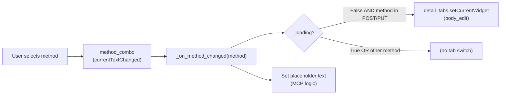
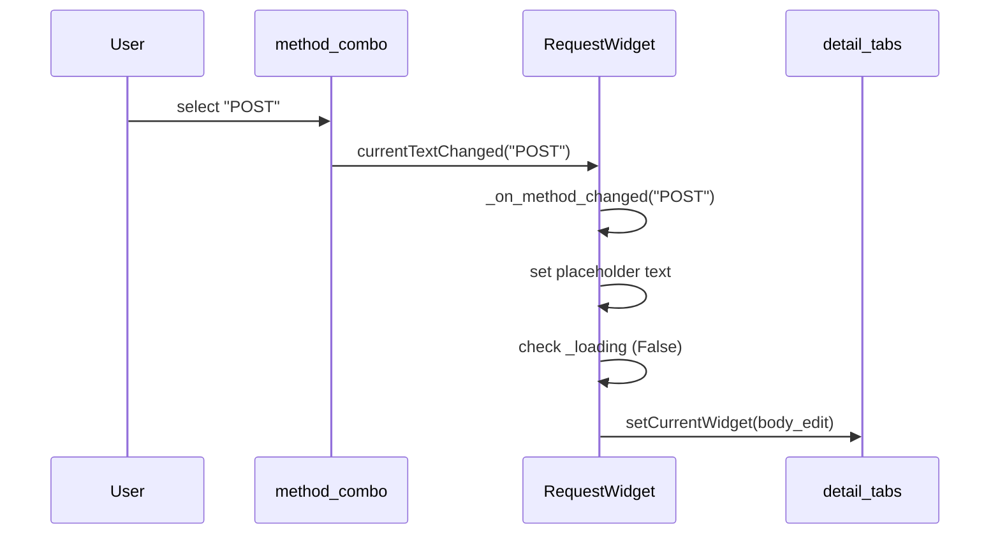
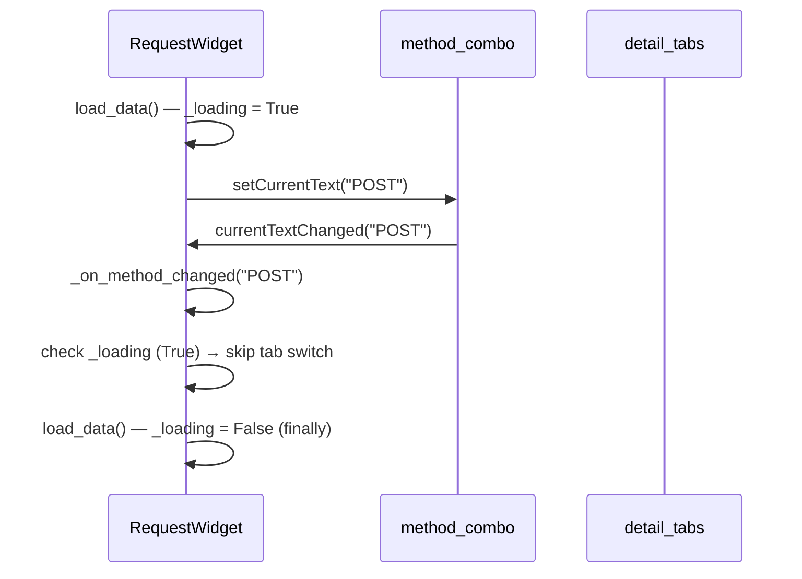

# PYPOST-42: Auto-switch to Body Tab — Architecture

## Research

### Relevant Code

**File:** `pypost/ui/widgets/request_editor.py` — `RequestWidget`

Key observations:

- `method_combo.currentTextChanged` is connected to `_on_method_changed` (line 51).
- `_on_method_changed` is also called directly in `init_ui` (line 95) and `load_data`
  (line 129).
- `load_data` calls `self.method_combo.setCurrentText(...)` (line 128), which fires
  `currentTextChanged` and therefore `_on_method_changed` a second time.
- Tabs are added in order: **Params (0), Headers (1), Body (2), Script (3)**.
- `self.body_edit` is the widget added to the Body tab (line 94).

### Problem with Naive Implementation

Adding `self.detail_tabs.setCurrentWidget(self.body_edit)` directly inside
`_on_method_changed` would also switch tabs during:
- application startup (`init_ui`)
- loading a saved request (`load_data`)

This is undesirable — only an explicit user combo interaction should trigger the switch.

### Solution Approaches

| Approach | Pros | Cons |
|----------|------|------|
| **A. Guard flag `_loading`** | Simple, no signal surgery | Flag must be set/unset in all callers |
| **B. Disconnect signal during load** | No extra state | Verbose; must reconnect; error-prone |
| **C. Separate `_on_user_method_changed` slot** | Clear intent | Requires rewiring signal; slightly more code |

**Chosen: Approach A (guard flag `_loading`)** — minimal change, easy to understand, no
rewiring of signals.

## Implementation Plan

1. Add `self._loading: bool = False` attribute in `RequestWidget.__init__` (before
   `init_ui` is called, or at top of `init_ui`).
2. Wrap the body of `load_data` with `self._loading = True` / `self._loading = False`
   (use `try/finally` to guarantee reset even on exception).
3. In `_on_method_changed`, after the existing placeholder logic, add:
   ```python
   if not self._loading and method in ("POST", "PUT"):
       self.detail_tabs.setCurrentWidget(self.body_edit)
   ```

No other files need to change.

## Architecture

### Component Diagram



### Sequence: User changes method to POST



### Sequence: load_data (no tab switch)



### Code Sketch

```python
def __init__(self, request_data: RequestData = None):
    super().__init__()
    self._loading = False          # guard: suppress auto-switch during load
    self.request_data = request_data or RequestData()
    self.init_ui()

def _on_method_changed(self, method: str):
    if method == "MCP":
        self.body_edit.setPlaceholderText(
            "Empty = list tools. JSON {name, arguments} = call tool."
        )
    else:
        self.body_edit.setPlaceholderText("")
    if not self._loading and method in ("POST", "PUT"):
        self.detail_tabs.setCurrentWidget(self.body_edit)

def load_data(self):
    self._loading = True
    try:
        self.url_input.setText(self.request_data.url)
        self.method_combo.setCurrentText(self.request_data.method)
        self._on_method_changed(self.request_data.method)
        self.params_table.set_data(self.request_data.params)
        self.headers_table.set_data(self.request_data.headers)
        self.body_edit.setPlainText(self.request_data.body)
        self.script_edit.setPlainText(self.request_data.post_script)
        self.mcp_check.setChecked(self.request_data.expose_as_mcp)
    finally:
        self._loading = False
```

### Files Changed

| File | Change |
|------|--------|
| `pypost/ui/widgets/request_editor.py` | Add `_loading` guard, update `_on_method_changed`, wrap `load_data` in try/finally |

### Out of Scope

- Changing tab order or labels.
- Auto-switch for other methods (PATCH, DELETE, MCP).
- Persisting the last-active tab across requests.

## Q&A

- **Q:** Why `try/finally` in `load_data`? **A:** Guarantees `_loading` is reset to
  `False` even if an exception occurs mid-load, preventing a stuck state where the user
  can never auto-switch tabs.
- **Q:** Why not switch tabs for PATCH? **A:** PATCH may have a body, but the requirement
  explicitly targets POST and PUT. PATCH can be added later if requested.
- **Q:** Does `init_ui` need the guard? **A:** `init_ui` calls `_on_method_changed`
  directly at line 95 (before `load_data`). At that point `_loading` is `False`, but the
  widget is not yet shown, so an unwanted switch at startup is harmless. To be safe,
  `init_ui` could also be wrapped — but the default method is GET, which won't trigger
  the switch anyway.
