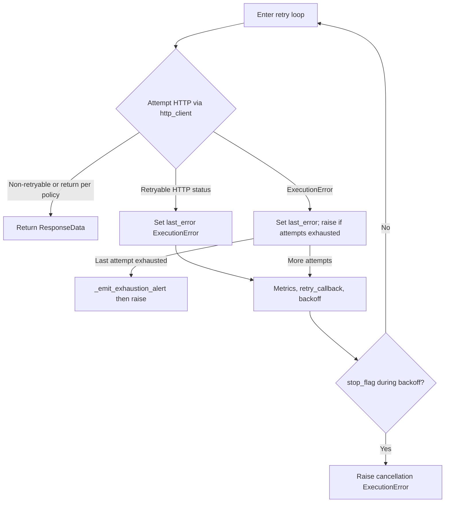

# PYPOST-421: Reliable failure handling on HTTP retry exhaustion

## Research

- **Assertions in Python**: The `assert` statement can be disabled when the interpreter runs with
  optimization flags (`-O` / `-OO`), so it must not define production control flow or error
  contracts. Exhaustion after retries must use the same explicit failure mechanism as other HTTP
  execution errors (`ExecutionError` and existing propagation).
- **Code location**: The defect is in `RequestService._execute_http_with_retry` in
  `pypost/core/request_service.py`, where a bare `assert last_error is not None` guards the block
  that finalizes `detail`, emits exhaustion diagnostics via `_emit_exhaustion_alert`, and raises
  `last_error`. Supporting types live in `pypost/models/errors.py` and `pypost/models/retry.py`;
  alerts/metrics are already wired through `_emit_exhaustion_alert` and `MetricsManager`.

## Requirements traceability

| Requirement | Architecture coverage |
| ----------- | ----------------------- |
| FR1 | Error handling strategy; post-loop refactor (no assert contract) |
| FR2 | Modules table; observability; `_emit_exhaustion_alert` |
| FR3 | Cancellation branch unchanged (error handling strategy) |
| FR4 | Testing strategy; `tests/test_retry.py` |
| NFR | `ExecutionError` parity with exception exhaustion path |

## Implementation Plan

1. **Refactor the exhaustion branch** in `_execute_http_with_retry` so the post-loop path does not
   rely on `assert` for correctness. Prefer a single, readable control-flow structure (e.g.
   explicit `ExecutionError` when an invariant is violated, or restructuring the loop so
   `last_error` is always assigned before finalization) while preserving outward behavior required
   by `10-requirements.md`.
2. **Keep scope minimal**: No redesign of retry policy, back-off caps, or HTTP client beyond what
   is required to remove the assertion-only contract and satisfy acceptance criteria.
3. **Extend tests** in `tests/test_retry.py` (and only adjacent test modules if strictly necessary)
   to cover retry exhaustion after **retryable HTTP status codes**, aligning with acceptance
   criteria that call out status-code exhaustion explicitly.
4. **Defer observability**: STEP 5 may add structured log fields or metrics only if gaps appear;
   touchpoints are listed below so implementation stays aligned with existing exhaustion logging and
   metrics.

## Architecture

### Target modules and components

| Area | Responsibility |
| ---- | -------------- |
| `request_service.py` | `RequestService._execute_http_with_retry`; exhaustion via alerts. |
| `pypost/models/errors.py` | `ExecutionError`, `ErrorCategory` for callers and tests. |
| `pypost/models/retry.py` | `RetryPolicy` config; no change beyond exhaustion consumers. |
| `alert_manager` / `MetricsManager` | Via `_emit_exhaustion_alert`; FR-2 parity on exhaustion. |

No new packages or cross-cutting modules are required for PYPOST-421 unless a tiny helper inside
`request_service.py` clarifies exhaustion handling without spreading logic.

### Data and control flow — retry exhaustion path

**Intent**: Exhaustion must use explicit `ExecutionError` handling plus `_emit_exhaustion_alert`
(and existing metrics), never `assert`, for any path that finalizes failure after retries.

**Implementation note**: The loop may be refactored so status-code exhaustion shares the same
finalization steps as exception exhaustion; development aligns control flow with acceptance tests
and `10-requirements.md` without broad policy redesign.

### Error handling strategy (replacing bare `assert`)

- **Production contract**: Use **explicit `ExecutionError`** (and/or a clearly documented branch)
  for any case that would previously rely on `assert last_error is not None`. If an impossible state
  is reached, raise a **defensive** `ExecutionError` with a stable category/message aligned with
  `NETWORK` / existing HTTP failure patterns — not `AssertionError`.
- **Consistency**: Preserve `detail` formatting (`retries_attempted: …`), categories, and raise
  vs `ExecutionResult` wrapping behavior consistent with the exception path that already exhausts
  after `ExecutionError` retries.
- **Cancellation**: Unchanged — existing `stop_flag` checks and `ExecutionError` for cancellation
  remain authoritative; the exhaustion change must not alter those branches.

### Testing strategy (architecture level)

- **Extend** `tests/test_retry.py` with scenarios where **retryable HTTP status codes** persist
  until policy exhaustion, asserting:
  - `ExecutionError` (or equivalent surfaced error) with expected category and `detail` containing
    `retries_attempted`;
  - `_emit_exhaustion_alert` / metrics hooks match existing exhaustion tests (mirror patterns in
    `TestExhaustionAlert` for exception exhaustion).
- **Regression**: Full suite stays green; no broad refactors of unrelated tests.
- **Out of scope**: UI or MCP-only tests unless a direct regression is discovered in the HTTP path.

### Observability touchpoints (implement in STEP 5 or verify during development)

- **Existing**: `logger.warning` in `_emit_exhaustion_alert`, `track_email_notification_failure`,
  `track_retry_attempt` — ensure exhaustion after status codes still hits the same sequence as the
  exception exhaustion path.
- **Optional later**: Add a distinct log key or metric label for “status-code exhaustion” vs
  “exception exhaustion” only if product needs it; default is parity with current signals.

## Q&A

- **Q**: Why focus on `RequestService._execute_http_with_retry`?  
  **A**: Requirements scope the Python HTTP retry execution path; this method contains the bare
  assert called out for PYPOST-402 within PYPOST-421.

- **Q**: May we introduce a new exception type?  
  **A**: Not required; reuse `ExecutionError` and existing categories unless a future requirement
  demands a new subtype.
