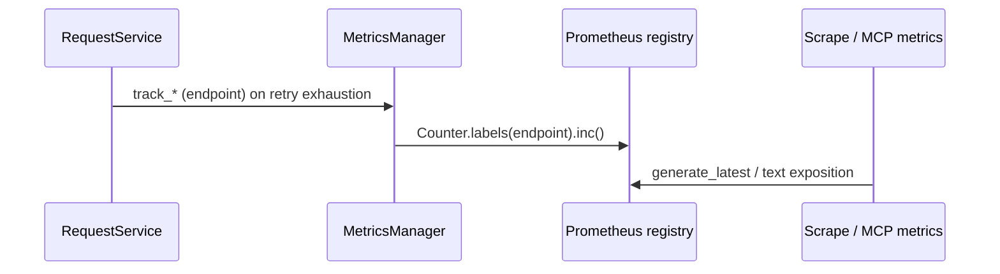

# PYPOST-422: Align misleading `email_notification_failures_total` metric

## Research

- **Prometheus naming:** Counters use the `_total` suffix; names should describe the measured
  event, not a misleading domain. Help strings supplement but do not fix an incorrect name
  (NFR-1, FR-1).
- **Codebase conventions:** Existing request-related series include `request_errors_total`,
  `request_retries_total`, and label style consistent with `MetricsManager` (Python,
  `prometheus_client`).
- **Prior art:** PYPOST-402 TD-5 and sprint notes suggest a name such as
  `request_retry_exhaustions_total` to match “all retries exhausted” semantics.

## Implementation Plan

1. Choose the exported series name and help text (see Naming strategy).
2. Update `MetricsManager` registration and increment path; rename the tracker method and
   private counter attribute for readability (NFR-4).
3. Update call site in `request_service.py` and mocks/assertions in `tests/test_retry.py` and
  `tests/test_metrics_manager.py` (NFR-3).
4. Update developer docs and release-facing notes per FR-2 / AC-3 (handled in STEP 3 and STEP 7);
   run a repo-wide search for the legacy metric and tracker identifiers so stale references are
   removed (AC-3).
5. Communicate migration expectations to dashboard/alert owners (requirements scope; not code).

## Architecture

### Metrics naming alignment strategy

- **Target series:** A name in the `request_*_total` family that states **retry exhaustion** on
  the HTTP request path, for example `request_retry_exhaustions_total` (exact spelling fixed at
  implementation time).
- **Help text:** Describe the event as exhaustion of retries for outbound HTTP requests, not
  email-specific failure.
- **Labels:** Keep `endpoint` only; no new dimensions (FR-3).
- **Python surface:** Public tracker method name should match behavior (e.g. rename
  `track_email_notification_failure` to a neutral name aligned with the metric).

### Backward compatibility and migration options

- **A — Rename only:** One new series; old name removed. Simplest code; breaks existing queries
  until consumers update.
- **B — Dual export (transition):** Deprecated alias counter mirrors increments. Easier rollout;
  two series and a documented sunset.
- **C — Help-only change:** Keep old name; improve help only. No query churn; fails FR-1 / AC-1.

**Recommendation:** Default to **A** unless product agrees on a timed **B** window; **C** is out
of scope for approved requirements.

**NFR-2 (operational safety):** If **A** is chosen, CHANGELOG or release notes must explicitly
list the previous series name, the new name, and the consumer action (update queries and alerts).
If **B** is chosen, document both series, deprecation status, and the sunset timeline so docs and
runtime do not diverge silently.

### Affected components and interaction flow

| Component | Role |
| --------- | ---- |
| `pypost/core/metrics.py` | Defines counter, `track_*` method, export via registry / MCP |
| `pypost/core/request_service.py` | Calls tracker when retries are exhausted |
| `tests/test_metrics_manager.py` | Scrapes registry; asserts series line |
| `tests/test_retry.py` | Asserts tracker called on exhaustion paths |
| `doc/dev/` (and release notes) | Consumer-facing name and migration (STEP 7) |

### Tests and observability implications

- **Tests:** Replace hard-coded old series strings and mock method names; keep scraping-style
  assertions so CI validates the exported contract (AC-2, NFR-3).
- **Observability (STEP 5):** No new business logs are required for a rename; optional
  `50-observability.md` may note dashboard/query migration and cross-reference FR-2. Metrics
  cardinality unchanged (`endpoint` label unchanged).

### Patterns

- **Single responsibility:** `MetricsManager` owns registration and increments; request layer
  only signals exhaustion.
- **Traceability:** Commit messages / docs reference PYPOST-422 and PYPOST-402 TD-5 (FR-4, AC-4).

### Traceability to requirements

| Requirement | How this architecture addresses it |
| ----------- | ------------------------------------ |
| FR-1 | Target `request_*_total` naming; option **C** rejected |
| FR-2 | Implementation steps 4–5; NFR-2 release and doc obligations |
| FR-3 | `endpoint` label only; no new dimensions |
| FR-4 / AC-4 | Explicit references to PYPOST-422 and PYPOST-402 TD-5 in commits and docs |
| NFR-1 | Aligns with existing counter suffixes and English help text |
| NFR-2 | See backward-compatibility options and **NFR-2** paragraph above |
| NFR-3 | Tests section; registry scrape assertions retained |
| NFR-4 | Rename tracker method and private counter attribute with the metric |
| AC-1 | Target series name and help describe retry exhaustion, not email-only |
| AC-2 | Tests updated; optional **B** preserves deprecated alias per requirements |
| AC-3 | Doc updates plus repo-wide legacy string search (implementation step 4) |

## Q&A

- **Why not only fix help text?** FR-1 requires the series name not to imply email-only scope.
- **Who updates Grafana?** Out of code scope; release communication covers consumer updates
  (requirements).
