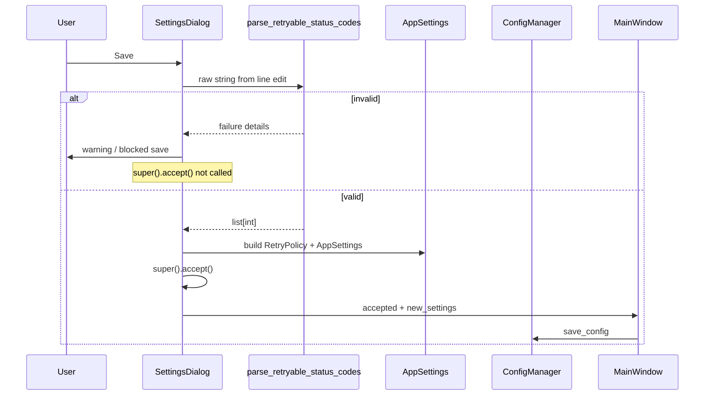

# PYPOST-423: Retryable status codes — validation architecture

## Research

- **Current behavior:** `pypost/ui/dialogs/settings_dialog.py` implements
  `_parse_retryable_codes()` by splitting on `,`, keeping only tokens where
  `str.isdigit()` is true, and silently dropping everything else. That matches the
  problem statement (silent loss, misleading effective list).
- **Persistence path:** `MainWindow.open_settings()` (`pypost/ui/main_window.py`)
  saves via `config_manager.save_config()` only after `SettingsDialog` returns
  accepted; `RetryPolicy` is defined in `pypost/models/retry.py` and embedded in
  `AppSettings` (`pypost/models/settings.py`).
- **HTTP status codes:** Standard response codes are three-digit integers; for
  validation, restrict to a well-defined inclusive range (e.g. **100–599**) so
  numeric but invalid codes (e.g. `99`, `600`) are rejected per FR-1, not only
  non-numeric tokens.
- **UI patterns in PyPost:** Other dialogs use `QMessageBox.warning` for invalid
  input (e.g. `env_dialog.py`, `save_dialog.py`, `collections_presenter.py`).
  Align retryable-codes errors with that pattern for NFR-2.

## Implementation Plan

1. Introduce a **single, testable parsing and validation** entry point (pure
   function or small helper) that takes the raw line-edit string and returns either
   a validated ordered list of integers or a structured failure (reason codes /
   messages for UI).
2. **Replace** ad-hoc `_parse_retryable_codes()` usage in the save path with this
   helper; keep delimiter rules **comma-separated** unless requirements later
   expand (placeholder already documents comma style).
3. In `SettingsDialog.accept()`, run validation **before** `super().accept()`.
   On failure: show user-visible feedback, **do not** close the dialog with an
   accepted result, and **do not** mutate `new_settings`.
4. Leave `MainWindow.open_settings()` behavior unchanged: it only persists when
   the dialog finishes accepted, so FR-4 holds automatically.
5. Add **unit tests** for the helper (all acceptance scenarios from
   `10-requirements.md`). Add or extend **UI-level** tests only if the project
   already has dialog test patterns; otherwise rely on unit tests plus manual QA.
6. **STEP 5:** Add minimal structured logging on validation failure (see below);
   avoid logging full free-text input if policy changes later.

## Architecture

### Module responsibilities

- **Retry codes input helper** (new module or `pypost/models/retry.py`):
  Parse comma-separated tokens; validate each code (integer in allowed HTTP
  range); detect non-empty raw with empty effective list; return success or
  failure with stable error ids for tests and UI strings.
- **`SettingsDialog`:** Wire line edit to helper on Save; block `accept` when
  invalid; show `QMessageBox` with clear wording; on success build `RetryPolicy`
  as today.
- **`RetryPolicy` / `AppSettings`:** Schema unchanged; only validated lists are
  applied.
- **`MainWindow`:** No change if invalid save never accepts the dialog (FR-4).

### Interaction flow

### Requirements mapping (traceability)

| Requirement | Architecture response |
| ----------- | -------------------- |
| FR-1 / AC-1 | Helper rejects bad tokens, out-of-range codes, misleading empty effective list. |
| FR-2 / FR-3 | Block `accept()`, show `QMessageBox.warning` with format guidance (NFR-1, NFR-2). |
| FR-4 | Invalid path never calls `super().accept()`; `MainWindow` unchanged. |
| FR-5 / AC-3 | Valid comma-separated lists unchanged; unit tests guard regression. |
| NFR-3 | Pure parse/validate on save path; typical list sizes only. |

### Validation and parsing strategy

- **Tokenization:** Split on `,`, strip whitespace per segment. **Decision:**
  treat **empty** segments after strip (e.g. `1,,2`, `,500`, trailing comma) as
  **validation failure**: they are not valid HTTP status code entries (FR-1) and
  avoiding implicit normalization keeps behavior predictable for AC-2.
- **Per-token rules:** Each non-empty token must be a base-10 integer in the
  chosen HTTP status range (recommend **100–599** inclusive). Reject out-of-range
  numerics and non-numeric garbage.
- **Misleading outcome (FR-1 / AC-2):** If trimmed input is non-empty but the
  effective validated list would be empty, or any token is invalid, treat as
  **validation failure**—do not persist a “partial” list that omits user intent.
- **Empty input:** Define explicitly: all-whitespace / empty string → valid empty
  list **if** product intends “no retry codes”; document in tests. If empty list
  is disallowed when retries are enabled, that is **out of scope** unless
  requirements add it—keep validation scoped to silent-drop fixes.

### User feedback strategy (FR-2, FR-3, NFR-1, NFR-2)

- **Primary:** `QMessageBox.warning` with short title and body explaining that
  the value could not be saved and what format is expected (comma-separated
  integers in range), without stack traces or internal names.
- **Consistency:** Match tone and control usage with other settings dialogs that
  use `QMessageBox.warning` for validation errors.
- **Optional enhancement:** Red border or `QLineEdit` tooltip on the field—only
  if it stays consistent with the rest of the settings UI (not required for
  minimal FR satisfaction).

### Interfaces (conceptual)

- `parse_retryable_status_codes(raw: str) -> Ok[list[int]] | Err[ValidationError]`
  (exact types: `TypedDict`, `tuple`, or a small dataclass—follow existing
  project style).

### Testing strategy

- **Unit:** Cover valid lists; invalid tokens; non-empty raw with empty
  effective list; out-of-range numbers; whitespace edge cases; ordering if
  required by product.
- **Integration / UI:** Optional Qt dialog smoke test if the project already has
  patterns; else manual checklist aligned with acceptance criteria.
- **Regression:** `tests/test_retry.py` unchanged for HTTP retry behavior;
  `RequestService` unchanged for valid persisted lists.

### Observability touchpoints (STEP 5)

- **Logging:** On blocked save due to validation, emit one **WARNING** (or
  **INFO** if noise is a concern) structured line, e.g. event key
  `retryable_codes_settings_validation_failed` with fields such as
  `reason=invalid_token` / `empty_effective`—**not** the full raw string if
  policy discourates logging user-entered text; counting invalid tokens is
  enough for support.
- **Metrics:** Optional counter for validation failures—low priority for a
  desktop app; prefer logs unless product standards require metrics.
- **No change** to HTTP retry path metrics/logging for this task beyond what
  falls out of normal saves.

## Q&A

- **Where does validation live?** Prefer a pure helper in or next to
  `pypost/models/retry.py` (or a small `pypost` module) so `SettingsDialog`
  stays thin and logic stays unit-testable.
- **Why block in `accept()`?** Stops successful close so `MainWindow` never
  gets partial `AppSettings` for this field (FR-2, FR-4).
- **Duplicate codes in input?** Out of scope unless tied to silent loss; may
  preserve order; runtime may dedupe via `set()` as today.
