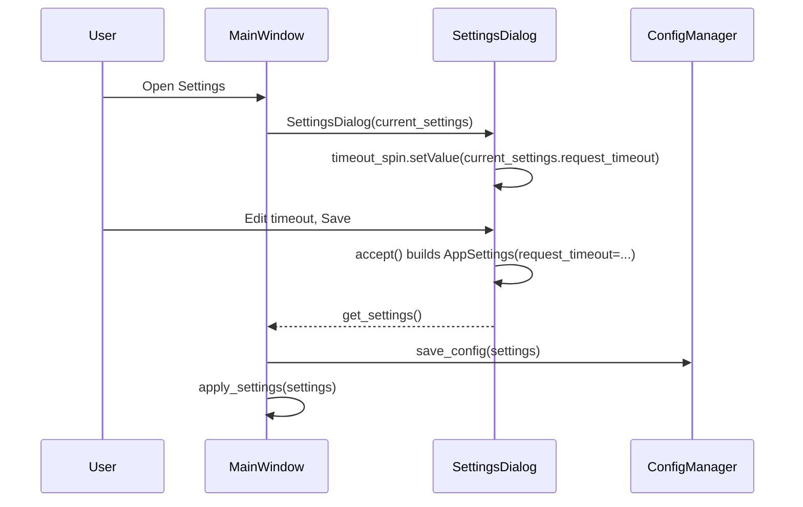
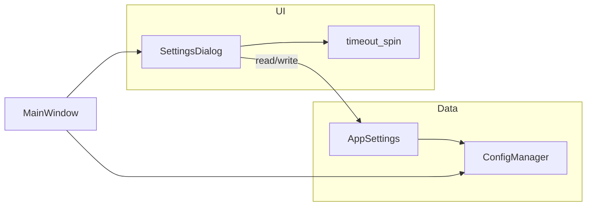

# PYPOST-424: Expose request timeout in application settings

## Research

- **Requirements source**: `ai-tasks/PYPOST-424/10-requirements.md` (PO-approved for STEP 2).
- **Existing model**: `AppSettings.request_timeout` in `pypost/models/settings.py` (default 60,
  range implied by UI spinbox 1–300 seconds).
- **Persistence**: `pypost/core/config_manager.py` loads/saves full `AppSettings` as JSON; field
  is already part of the schema.
- **Current UI gap**: `pypost/ui/dialogs/settings_dialog.py` constructs `timeout_spin`,
  initializes it from `current_settings.request_timeout`, and reads it in `accept()` into
  `AppSettings`, but **does not** `addRow` the control to `self.form_layout`. Users never see
  the widget; save path still uses the spinbox value when Save is accepted.
- **Call site**: `MainWindow.open_settings()` (`pypost/ui/main_window.py`) opens the dialog,
  assigns `new_settings`, calls `config_manager.save_config`, and `apply_settings`.
- **External research**: Not required; behavior is fully determined by the existing PySide6
  settings stack and PYPOST-402-era wiring.

## Implementation Plan

1. **Layout-only fix (primary)**: Add a single `QFormLayout.addRow` for `timeout_spin` in
   `SettingsDialog`, with label copy consistent with adjacent fields (units in label if used
   elsewhere for durations).
2. **Placement**: Group with **connection / transport** settings (MCP host/port, Metrics
   host/port) per FR-5 — e.g. immediately before the MCP rows or immediately after Metrics host,
   not inside the retry or alert webhook block. (Current layout: font/indent rows precede MCP; pick
   one insertion point and keep connection-related rows contiguous.)
3. **Verify**: No second widget or alternate code path for `request_timeout`; keep one spinbox
   bound to `AppSettings.request_timeout`.
4. **Tests**: Extend or add focused tests (see Testing strategy); run existing settings and UI
   test suites.
5. **Observability**: Defer structured logging/metrics for settings apply to STEP 5; note
   touchpoints below.

## Architecture

### Requirements traceability

- **FR-1 (Discoverability)**: `addRow` puts `timeout_spin` on the main form (no hidden path).
- **FR-2 (Editability)**: Keep the existing `QSpinBox` (1–300 s) with the same patterns as other
  integer limits.
- **FR-3 (Persistence)**: No change to `accept()` → `AppSettings` → `ConfigManager.save_config`.
- **FR-4 (Load)**: `setValue` already loads the stored value; the row makes it visible.
- **FR-5 (Consistency)**: Label/units and placement with the MCP/Metrics connection block.

Acceptance: AC-1–AC-3 via the visible row and existing load/save; AC-4 via pytest (and manual if
needed); AC-5 via one `timeout_spin` and one `addRow`.

### Module responsibilities

| Module | Responsibility |
| ------ | -------------- |
| `pypost/models/settings.py` | Canonical `AppSettings` including `request_timeout` (unchanged). |
| `pypost/core/config_manager.py` | Serialize/deserialize settings JSON (unchanged). |
| `pypost/ui/dialogs/settings_dialog.py` | Expose `timeout_spin` on the form (load/save wired). |
| `pypost/ui/main_window.py` | Opens dialog, persists via `ConfigManager`, applies settings |
| | (unchanged; may gain log fields in STEP 5). |

### UI placement strategy

- **Single visible control** for request timeout: the existing `timeout_spin` (`QSpinBox`,
  range 1–300).
- **Position**: In the `QFormLayout`, adjacent to **MCP / Metrics** rows (connection-related),
  with a clear label (e.g. seconds), matching NFR-1 patterns used for other numeric limits.
- **Tab order**: Follows layout insertion order; placing with the connection block keeps focus
  order predictable (acceptance: manual smoke on target platforms per requirements risks).

### Load and save flow

- **Load (FR-4)**: On dialog construction, `timeout_spin` already reflects stored value; once
  the row is added, the user **sees** that value.
- **Save (FR-3)**: Unchanged: `accept()` includes `request_timeout`; `MainWindow` persists the
  full model. No new API contracts.

### Interaction diagram (components)

### Patterns

- **Single source of truth**: `AppSettings.request_timeout` only; UI is a view/controller for
  that field.
- **No new persistence layer**: Repository-style access remains `ConfigManager` + Pydantic model.

### Interfaces / contracts

- **Settings dialog**: Continues to expose `get_settings() -> AppSettings` after `accept()`.
- **Config**: JSON shape unchanged; field already persisted when other settings save.

## Testing strategy

- **Unit / integration (existing style)**:
  - `tests/test_settings_persistence.py`: optional round-trip asserting `request_timeout` in
    `save_then_load` (if not already covered implicitly).
  - If a **`SettingsDialog`** test module is added: construct dialog with `AppSettings(
    request_timeout=...)`, assert spinbox value; simulate accept and assert output
    `AppSettings.request_timeout` matches (guards layout regressions).
- **Manual**: Open Settings; confirm visible timeout matches file/config. Change value, Save,
  reopen dialog, and restart app per acceptance criteria.
- **Regression**: Full `pytest` / project test entrypoint; no new crashes in save/load paths
  (NFR-2).

## Observability touchpoints (STEP 5)

- **`MainWindow.open_settings`**: Today logs `settings_applied` with font/indent; STEP 5 may add
  `request_timeout` (or a single structured `settings_snapshot` field) at **info** level when
  settings apply — avoid noise on every unrelated apply if factored elsewhere.
- **`SettingsDialog.accept`**: Optional **warning** on validation failures only (retry codes
  already logged); timeout uses spinbox range, unlikely to need new logs.
- **Metrics**: No new counters required unless product standard mandates settings-change events;
  document decision in `50-observability.md`.

## Q&A

| Question | Answer |
| -------- | ------ |
| New default or semantics for timeout? | Out of scope per requirements unless a defect appears. |
| Duplicate controls? | Forbidden; one `timeout_spin`, one `addRow`. |
| Backend/API changes? | None; same JSON and `AppSettings` surface. |
