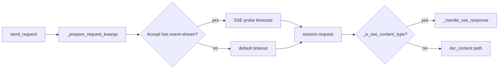

# PYPOST-430: Architecture

## Research

### Current behavior (pre-change)

- `is_sse_endpoint = GET and "/sse" in url` set pre-request SSE timeouts and `Accept`.
- Post-response also checked content-type OR the URL flag.

### HTTP semantics

- SSE responses use `Content-Type: text/event-stream` (optionally with `charset`).
- URL path is not a reliable transport indicator after Streamable HTTP (`/mcp`).

## Implementation Plan

1. Add `_is_sse_content_type(content_type)` — parse media type before `;`, compare lowercase.
2. Add `_headers_accept_event_stream(headers)` — detect explicit client SSE intent.
3. Remove URL substring check.
4. Pre-request: apply SSE probe timeout tuple only when Accept includes `text/event-stream`.
5. Post-response: route to `_handle_sse_response` when GET + SSE content-type.
6. Log `sse_stream_detected` at DEBUG after headers (replaces `sse_probe_detected`).

## Component diagram

## Tests

| Test | Verifies |
| --- | --- |
| `test_handles_sse_response_by_content_type` | Legacy `/sse` URL + SSE body |
| `test_detects_sse_without_sse_substring_in_url` | `/mcp` path + SSE body |
| `test_no_false_positive_when_url_contains_sse_substring` | `/sse-metrics` + JSON |
| `test_applies_sse_probe_timeout_when_accept_header_set` | Pre-request tuning |
| `test_handles_non_200_sse_response` | Error status preserved |

## Q&A

- **Q:** Why keep Accept-based pre-request tuning? **A:** Users who set Accept signal intent;
  shorter read timeout avoids long hangs during probe reads.
