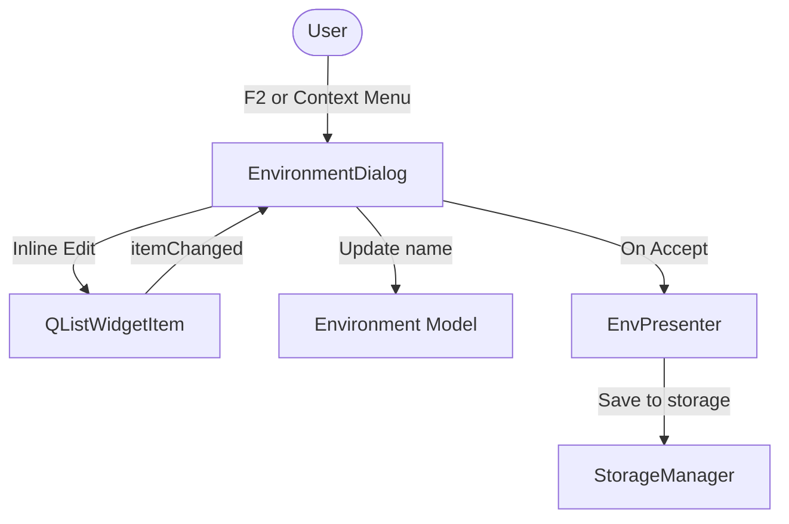

# PYPOST-435: Rename Environment

## Research

Analyzed `pypost/ui/dialogs/env_dialog.py` and `pypost/models/models.py`.
- Environments are managed in `EnvironmentDialog` and stored as a list of `Environment` objects.
- The `Environment` model has an `id` field, so renaming it only requires changing the `name` field.
- The environment list (`self.env_list`) is a `QListWidget` with a custom context menu (`_on_env_list_context_menu`).
- Context menu currently supports "Copy" and "Delete".
- Hotkeys in the application are typically implemented using `QShortcut` with `QKeySequence`.

## Implementation Plan

1. In `pypost/ui/dialogs/env_dialog.py`, update `init_ui` to register a `QShortcut` for the `F2` key on `self.env_list`. Connect it to `_rename_current_environment`. Also connect `self.env_list.itemChanged` to `_on_env_item_changed`.
2. Ensure `QListWidgetItem` objects added to `self.env_list` have `Qt.ItemFlag.ItemIsEditable` set.
3. Update `_on_env_list_context_menu` to include a "Rename" action in the `QMenu`. When triggered, call `_rename_environment_at_row(row)`.
4. Implement `_rename_environment_at_row(row)`:
   - Trigger inline editing for the item using `self.env_list.editItem(item)`.
5. Implement `_on_env_item_changed(item)`:
   - Validate the new inline name: it must not be empty, and it must not conflict with existing environment names (unless it's the same name).
   - If invalid, revert the item text to the old name.
   - If valid, update `env.name`.
   - Log the action: `logger.info("environment_renamed old_name=%s new_name=%s", old_name, new_name)`.

## Architecture

### Module Descriptions and Responsibilities

- **`EnvironmentDialog` (`pypost/ui/dialogs/env_dialog.py`)**: The UI component responsible for displaying and managing the list of environments. It will be updated to handle the rename action (via F2 hotkey or context menu), enable inline editing of the list item, validate the new name, and update the in-memory `Environment` object.
- **`Environment` (`pypost/models/models.py`)**: The data model representing an environment. Its `name` attribute will be modified during the rename operation.
- **`EnvPresenter` (`pypost/ui/presenters/env_presenter.py`)**: The presenter that manages the environment data flow. It receives the updated list of environments from the dialog and persists it to storage.

### Module Interaction Scheme

1. The user triggers the rename action in `EnvironmentDialog` via the F2 hotkey or the context menu.
2. `EnvironmentDialog` makes the list item editable inline.
3. Upon finishing editing with a valid name, `EnvironmentDialog` updates the `name` attribute of the selected `Environment` object in its in-memory list.
4. When the dialog is closed (accepted), `EnvPresenter` takes the updated list of environments and saves it using `StorageManager`.

### Selected Architectural Patterns and Justification

- **Model-View-Presenter (MVP)**: The application uses an MVP-like architecture where `EnvironmentDialog` acts as the View, `EnvPresenter` as the Presenter, and `Environment` as the Model. This pattern is maintained. The rename logic is placed in the View (`EnvironmentDialog`) because it involves direct UI interaction (prompting for input) and modifies the local state before it is committed by the Presenter.

### Definition of Main Interfaces/APIs Between Modules

- **`EnvironmentDialog._rename_current_environment(self)`**: New internal method to handle the F2 hotkey.
- **`EnvironmentDialog._rename_environment_at_row(self, row: int)`**: New internal method to execute the rename logic for a specific row.
- **`Environment.name`**: The property that will be updated.

## Q&A

*(No questions at this time)*
