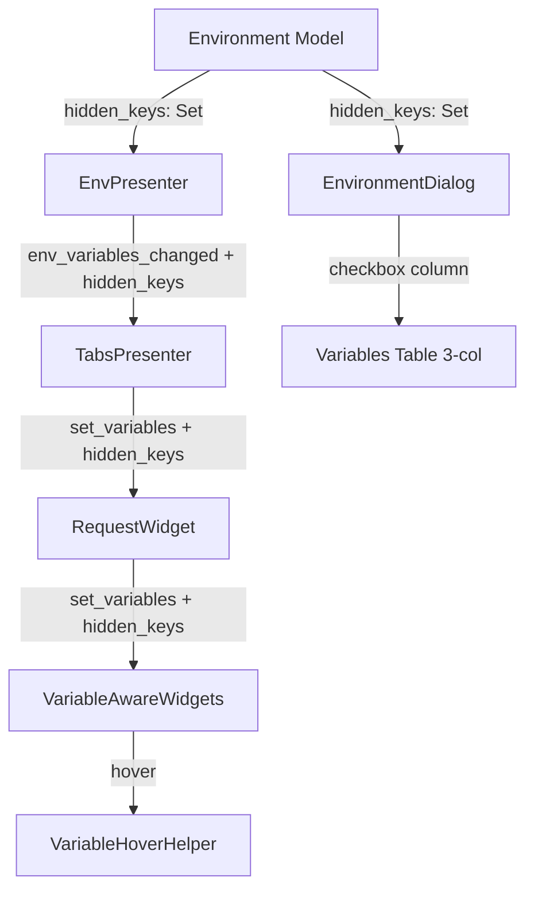

# PYPOST-437: Add "Hidden" Checkbox for Variables

## Research

### Current codebase findings

1. `Environment` model (`pypost/models/models.py:26-30`) stores
   `variables: Dict[str, str]` — flat key-value pairs.
2. `EnvironmentDialog` (`pypost/ui/dialogs/env_dialog.py`) displays a 2-column
   `QTableWidget` ("Variable", "Value") with inline editing. An extra empty row is
   appended for new entries.
3. `VariableHoverHelper` (`pypost/ui/widgets/mixins.py:6-35`) resolves `{{ var }}`
   in text via `get_variable_value()` and `resolve_text()`. Both read from a plain
   `Dict[str, str]`.
4. `VariableHoverMixin` (`pypost/ui/widgets/mixins.py:38-84`) calls
   `VariableHoverHelper.get_variable_value()` to show tooltips.
5. `EnvPresenter` (`pypost/ui/presenters/env_presenter.py`) emits
   `env_variables_changed(dict)` and `env_keys_changed(list)`. Downstream widgets
   receive a `Dict[str, str]` of variables.
6. `TabsPresenter` (`pypost/ui/presenters/tabs_presenter.py:196-206`) pushes
   variables to `RequestWidget.set_variables(dict)` and
   `ResponseView.set_env_keys(list)`.
7. `RequestWidget.set_variables()` (`pypost/ui/widgets/request_editor.py:113-118`)
   propagates to `VariableAwareLineEdit`, `VariableAwareTableWidget`, and
   `CodeEditor`.
8. `clone_environment()` (`pypost/core/environment_ops.py`) copies `variables` and
   `enable_mcp` but has no knowledge of hidden state.
9. `StorageManager` (`pypost/core/storage.py:66-80`) serializes via
   `env.model_dump()` and deserializes via `Environment(**item)` — Pydantic handles
   missing fields with defaults automatically.

### Design decision: `hidden_keys: Set[str]` vs restructuring `variables`

**Chosen: `hidden_keys: Set[str] = Field(default_factory=set)`**

Rationale:
- Zero migration — old JSON files without `hidden_keys` deserialize cleanly.
- Minimal blast radius — `variables: Dict[str, str]` remains unchanged, so all
  existing code (template rendering, HTTP client, script executor) works unmodified.
- The hidden flag is a **UI/display concern** only — actual values must still be
  substituted into requests.
- Simple O(1) set membership check for masking decisions.

## Implementation Plan

1. Add `hidden_keys` field to `Environment` model.
2. Update `EnvironmentDialog` to show a 3-column table with "Hidden" checkbox.
3. Update `VariableHoverHelper` to accept and respect hidden keys.
4. Propagate `hidden_keys` through `EnvPresenter` signals to downstream widgets.
5. Update `clone_environment` to copy `hidden_keys`.
6. Add/update tests.

## Architecture

### Module Diagram

### Modules and Responsibilities

1. **`Environment`** (`pypost/models/models.py`)
   - Add `hidden_keys: Set[str] = Field(default_factory=set)`.
   - No other model changes.

2. **`EnvironmentDialog`** (`pypost/ui/dialogs/env_dialog.py`)
   - Change table from 2 to 3 columns: "Variable", "Value", "Hidden".
   - Column 2 ("Hidden"): `QCheckBox` widget centered in cell.
   - When hidden checkbox is checked for a row, mask the value display with
     `HIDDEN_MASK` (`********`).
   - When user edits a hidden variable's value: they type the real new value;
     on commit, the underlying value is updated and display re-masked.
   - `on_env_selected()`: populate hidden checkboxes from `env.hidden_keys`.
   - `on_var_changed()`: rebuild `env.hidden_keys` from checkbox states.

3. **`VariableHoverHelper`** (`pypost/ui/widgets/mixins.py`)
   - `get_variable_value(name, variables, hidden_keys=None)`: if `name` is in
     `hidden_keys`, return `HIDDEN_MASK` instead of the real value.
   - `resolve_text(text, variables, hidden_keys=None)`: pass `hidden_keys`
     through to `get_variable_value`.
   - Backward compatible: `hidden_keys` defaults to `None` (no masking).

4. **`VariableHoverMixin`** (`pypost/ui/widgets/mixins.py`)
   - Add `_hidden_keys: set` attribute.
   - Add `set_hidden_keys(hidden_keys: set)` method.
   - Pass `_hidden_keys` to `VariableHoverHelper.get_variable_value()`.

5. **`EnvPresenter`** (`pypost/ui/presenters/env_presenter.py`)
   - Add new signal: `env_hidden_keys_changed = Signal(object)` (payload:
     `set[str]`).
   - In `_on_env_changed()`: emit `env_hidden_keys_changed` alongside existing
     signals.
   - `current_variables` property unchanged (returns real values for execution).

6. **`TabsPresenter`** (`pypost/ui/presenters/tabs_presenter.py`)
   - Add `on_env_hidden_keys_changed(hidden_keys: set)` method.
   - Propagate to `tab.request_editor.set_hidden_keys(hidden_keys)`.

7. **`RequestWidget`** (`pypost/ui/widgets/request_editor.py`)
   - Add `set_hidden_keys(hidden_keys: set)` method.
   - Propagate to `url_input`, `params_table`, `headers_table`, `body_edit`.

8. **`VariableAwareLineEdit` / `VariableAwarePlainTextEdit`**
   (`pypost/ui/widgets/variable_aware_widgets.py`)
   - Inherit `set_hidden_keys` from `VariableHoverMixin`.

9. **`VariableAwareTableWidget`**
   (`pypost/ui/widgets/variable_aware_widgets.py`)
   - Add `_hidden_keys: set` and `set_hidden_keys()`.
   - Pass `hidden_keys` to `VariableHoverHelper.resolve_text()` in
     `mouseMoveEvent`.

10. **`clone_environment`** (`pypost/core/environment_ops.py`)
    - Copy `hidden_keys` from source to new environment.

11. **`MainWindow`** (`pypost/ui/main_window.py`)
    - Wire `env.env_hidden_keys_changed` → `tabs.on_env_hidden_keys_changed`.

### Constants

Define `HIDDEN_MASK = "********"` in `pypost/ui/widgets/mixins.py` (shared by
both `VariableHoverHelper` and `EnvironmentDialog`).

### Dependencies

1. `Environment` model change is the foundation — all other changes depend on it.
2. `VariableHoverHelper` changes are independent of UI changes.
3. `EnvironmentDialog` depends on model change only.
4. Signal propagation (`EnvPresenter` → `TabsPresenter` → `RequestWidget` →
   widgets) is a chain.

### Selected Patterns and Justification

1. **Additive field with default** — `hidden_keys: Set[str] = set()` ensures
   backward compatibility without migration.
2. **Signal chain** — follows existing `env_variables_changed` pattern for
   consistency.
3. **Shared constant** — `HIDDEN_MASK` prevents magic strings.
4. **Optional parameter** — `hidden_keys=None` in helper methods maintains
   backward compatibility for callers that don't know about hidden state.

### Main Interfaces / APIs

1. `Environment.hidden_keys: Set[str]` — new field.
2. `VariableHoverHelper.get_variable_value(name, variables, hidden_keys=None)`
   — updated signature.
3. `VariableHoverHelper.resolve_text(text, variables, hidden_keys=None)`
   — updated signature.
4. `VariableHoverMixin.set_hidden_keys(hidden_keys: set)` — new method.
5. `EnvPresenter.env_hidden_keys_changed` — new signal.
6. `TabsPresenter.on_env_hidden_keys_changed(hidden_keys: set)` — new slot.
7. `RequestWidget.set_hidden_keys(hidden_keys: set)` — new method.

### Interaction Scheme

#### Checking "Hidden" in Environment Manager

1. User checks "Hidden" checkbox for variable `API_KEY`.
2. `EnvironmentDialog` adds `API_KEY` to `env.hidden_keys`.
3. Value column immediately shows `********`.
4. On dialog close, `EnvPresenter` saves environments and re-emits signals.
5. `env_hidden_keys_changed({"API_KEY"})` propagates to all open tabs.
6. Hover tooltips now show `********` for `{{ API_KEY }}`.

#### Unchecking "Hidden"

1. User unchecks "Hidden" for `API_KEY`.
2. `EnvironmentDialog` removes `API_KEY` from `env.hidden_keys`.
3. Value column shows the real value again.
4. Signal propagation clears masking in hover tooltips.

## Q&A

- Q: Does hidden state affect request execution?
  - A: No. `RequestWorker` and `HTTPClient` use `env.variables` directly. The
    `hidden_keys` field is never consulted during execution.
- Q: Why a separate signal instead of bundling with `env_variables_changed`?
  - A: Separation of concerns. The variables dict is used for execution; hidden
    keys are used for display. Bundling them would require changing all consumers.
- Q: What happens when a hidden variable is edited in the table?
  - A: The user types the new real value. On commit, the value is saved and the
    display re-masks to `********`.
