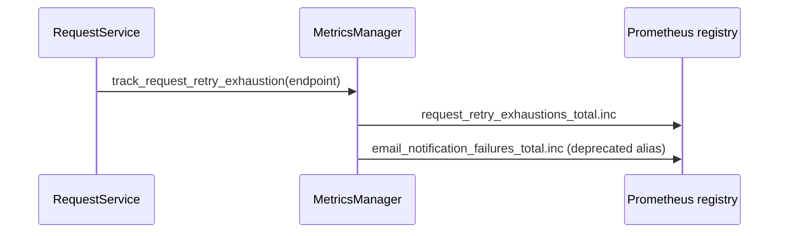

# PYPOST-443: Metric rename migration architecture

## Research

- **PYPOST-422 outcome:** Option A (hard rename) shipped; `request_retry_exhaustions_total`
  is canonical. Consumer migration deferred to this task.
- **Prometheus deprecation pattern:** Export deprecated series with explicit DEPRECATED help
  text; mirror increments from the single tracker method.
- **Prior art:** `doc/dev/encryption_key_migration.md` — staged rollout and operator checklist.

## Decision

**Hybrid: transitional alias (option B-lite) + migration documentation.**

| Aspect | Choice |
| ------ | ------ |
| Canonical metric | `request_retry_exhaustions_total` (unchanged) |
| Legacy alias | `email_notification_failures_total` — mirrored increment, DEPRECATED help |
| Sunset | Document removal target; alias removal tracked as future debt |
| Operator guide | New `doc/dev/metric_rename_migration.md` |

**Rejected:** Doc-only without alias — insufficient for unmigrated dashboards during rollout.
**Rejected:** Permanent dual export — increases cardinality maintenance without sunset.

## Implementation Plan

1. Register deprecated alias counter in `MetricsManager._init_metrics`.
2. Update `track_request_retry_exhaustion` to increment canonical + alias (same `endpoint` label).
3. Add unit test asserting both series in scrape output.
4. Author `doc/dev/metric_rename_migration.md` with checklist, PromQL examples, sunset note.
5. Link from `doc/dev/README.md`.

## Affected Components

| Component | Change |
| --------- | ------ |
| `pypost/core/metrics.py` | Alias counter + mirror increment |
| `tests/test_metrics_manager.py` | Dual-export assertion |
| `doc/dev/metric_rename_migration.md` | Operator migration guide |
| `doc/dev/README.md` | Index link |

## Traceability

| Requirement | Addressed by |
| ----------- | ------------ |
| Migration plan | `doc/dev/metric_rename_migration.md` |
| Transitional support | Alias counter mirror |
| Operator checklist | Doc § Rollout checklist |
| Tests | `test_track_request_retry_exhaustion` extended |
| Sunset | Doc + `60-tech-debt.md` follow-up for alias removal |
