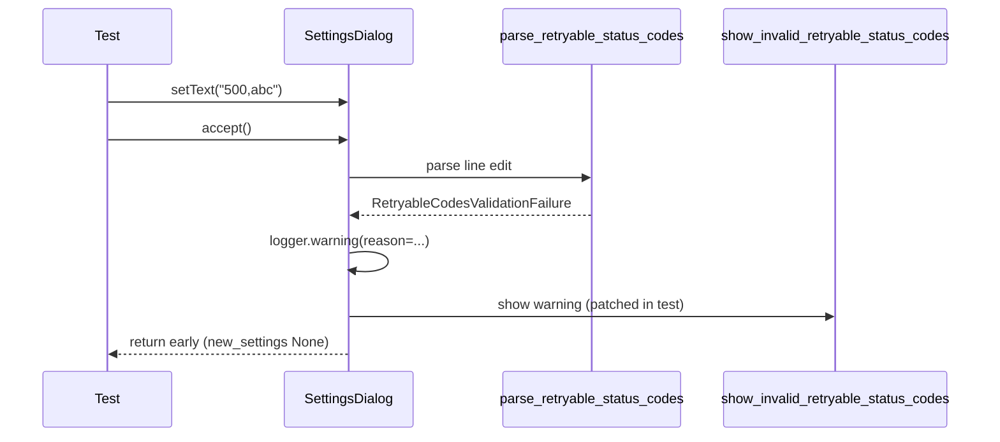

# PYPOST-444: Architecture

## Approach

Add a test class to `tests/test_settings_dialog.py` that drives the existing
`SettingsDialog.accept()` validation path without modifying production code.

## Test design

| Element | Choice |
| ------- | ------ |
| Fixture | Module-scoped `qapp` (existing) |
| Invalid input | `"500,abc"` → `invalid_token` failure |
| Patch target | `pypost.ui.dialogs.settings_dialog.show_invalid_retryable_status_codes` |
| Blocked save | `assert dlg.new_settings is None` |
| Logging | `caplog.at_level(WARNING, logger="pypost.ui.dialogs.settings_dialog")` |
| Timeout | Module `pytestmark = pytest.mark.timeout(60)` (existing) |

## Out of scope

- Parametrizing all parser `reason` values (unit tests own that matrix).
- Testing `QMessageBox` directly (helper already unit-tested in `test_collection_item_dialogs.py`).

## Files touched

- `tests/test_settings_dialog.py` — new `TestSettingsDialogRetryableCodesValidation`
- `doc/dev/settings_dialog.md` — document test coverage (STEP 7)
- `doc/dev/gui_testing.md` — reference module scope (STEP 7)
