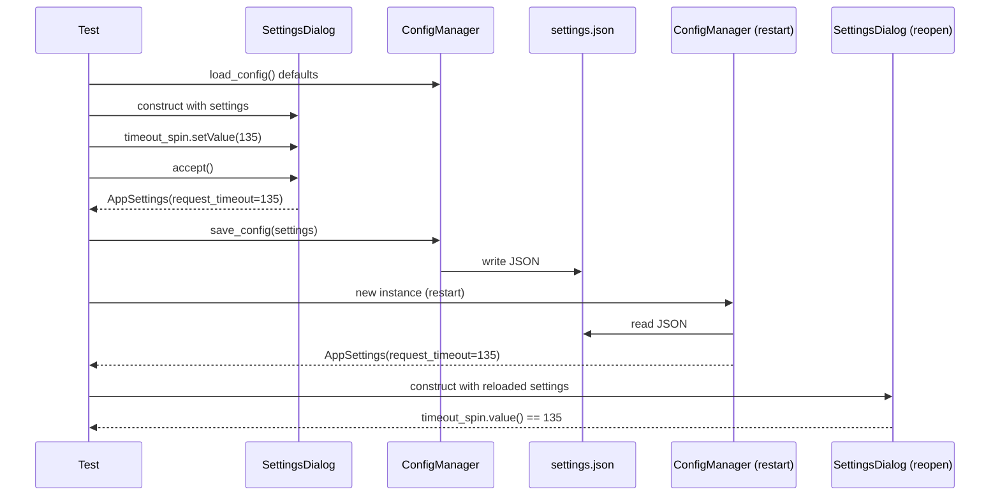

# PYPOST-445: Architecture

## Approach

Add one pytest integration test to `tests/test_settings_persistence.py` that exercises the
full settings save and restart path for `request_timeout` without modifying production code.

## Test design

| Element | Choice |
| ------- | ------ |
| Fixture | Module-scoped `qapp` (new in this module) |
| Isolation | `tempfile.TemporaryDirectory` + patch `user_config_dir` |
| Changed value | `135` (distinct from default `60`) |
| Restart simulation | Fresh `ConfigManager()` after save |
| Assertions | Dialog accept output, JSON on disk, reload, spinbox on reopen |
| Timeout | Module `pytestmark = pytest.mark.timeout(120)` (existing) |

## Relationship to existing tests

| Test | Coverage |
| ---- | -------- |
| `test_save_then_load_roundtrip` | Direct `AppSettings` mutation + ConfigManager round-trip |
| `test_accept_includes_request_timeout_in_result` | Dialog accept only, no disk/restart |
| **New test** | SettingsDialog → save → restart → reopen |

## Out of scope

- MainWindow `open_settings()` wiring (covered indirectly via same save API).
- HTTP client timeout application at request execution time.

## Files touched

- `tests/test_settings_persistence.py` — new integration test + `qapp` fixture
- `doc/dev/settings_dialog.md` — document test coverage (STEP 7)
