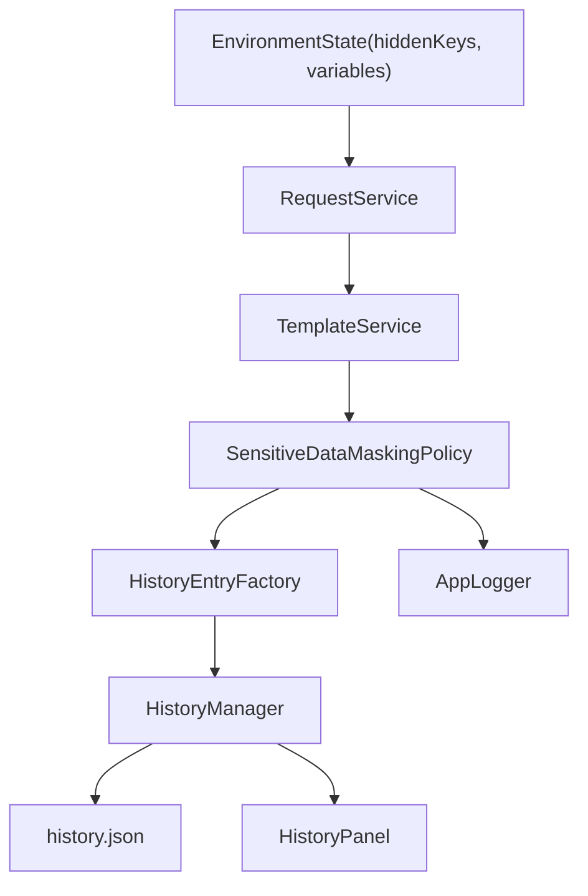

# PYPOST-446: Hidden-variable masking policy for history and logs

## Research

This architecture is based on:

- Existing code flow in `RequestService`, `HistoryManager`, and `HistoryPanel`.
- Existing hidden variable behavior introduced earlier (`Environment.hidden_keys`,
  variable-aware rendering in UI).
- Security guidance for handling sensitive data in logs:
  - [OWASP Secrets Management Cheat
    Sheet](https://cheatsheetseries.owasp.org/cheatsheets/Secrets_Management_Cheat_Sheet.html)
  - [Microsoft secrets best
    practices](https://learn.microsoft.com/en-us/azure/security/fundamentals/secrets-best-practices)

Key external recommendations applied at high level:

- sanitize before persistence;
- keep redaction deterministic and consistent across surfaces;
- avoid logging raw secret values in operational logs.

## Implementation Plan

1. Introduce a dedicated masking policy module that receives rendered request data and produces
   safe representations for history and logs.
2. Integrate policy application in request execution flow before `HistoryEntry` creation.
3. Ensure UI history rendering consumes already-sanitized fields from `HistoryEntry`.
4. Align application logging statements with the same masking policy (no raw hidden-derived
   values in debug/info/error payloads).
5. Add focused tests for policy behavior, history persistence output, and UI-visible consistency.

## Architecture

### Module Diagram

### Modules and Responsibilities

- `RequestService` (`pypost/core/request_service.py`)
  - Orchestrates request execution and currently creates `HistoryEntry`.
  - Becomes the integration point where sanitized request snapshots are produced.
- `SensitiveDataMaskingPolicy` (new core module)
  - Single source of truth for masking hidden-variable-derived values.
  - Accepts resolved URL, headers, body, variable context, and hidden key set.
  - Returns masked values for persistence and display-safe logging.
- `HistoryEntryFactory` (can be helper class or internal function set)
  - Creates `HistoryEntry` from policy output plus metadata
    (`timestamp`, `status_code`, `response_time_ms`, names).
  - Keeps construction rules centralized and testable.
- `HistoryManager` (`pypost/core/history_manager.py`)
  - Persists and loads `HistoryEntry` records.
  - Remains storage-focused and should not own masking decisions.
- `HistoryPanel` (`pypost/ui/widgets/history_panel.py`)
  - Displays stored history entry fields.
  - Uses already-sanitized values from stored entries without re-implementing policy.
- Application logging layer (`logging` usage inside core modules)
  - Consumes policy-safe values or metadata-only fields to avoid raw secret leakage.

### Interaction Scheme

1. Request is rendered with variables through `TemplateService`.
2. Hidden key context is provided from selected environment state.
3. `SensitiveDataMaskingPolicy` evaluates rendered values and applies policy rules.
4. `HistoryEntryFactory` builds a history entry from sanitized values.
5. `HistoryManager` appends and persists entry.
6. `HistoryPanel` reads entry and displays consistent masked content.
7. Runtime logs related to request/history use policy-safe output.

### Architectural Patterns and Justification

- Policy Object pattern
  - Encapsulates masking rules in one unit, reducing duplication and policy drift.
- Separation of Concerns
  - Request execution, masking, persistence, and UI rendering remain isolated.
- Single Responsibility Principle
  - `HistoryManager` handles storage, not secret-handling logic.
- Dependency Injection friendly design
  - Policy component can be injected/mocked in tests for deterministic verification.

### Main Interfaces

- `SensitiveDataMaskingPolicy`
  - Input:
    - resolved request fields (`url`, `headers`, `body`);
    - environment variables mapping;
    - hidden key set.
  - Output:
    - sanitized `url`, `headers`, `body`;
    - optional metadata for safe logging/auditing.
- `RequestService -> HistoryEntryFactory`
  - Contract that only sanitized values are allowed to enter `HistoryEntry`.
- `HistoryManager -> HistoryPanel`
  - Existing `HistoryEntry` retrieval interface remains stable; data semantics change to
    guaranteed-safe content.

### Affected Components

- `pypost/core/request_service.py`
- `pypost/core/history_manager.py` (minimal or no logic change expected)
- `pypost/ui/widgets/history_panel.py` (consume/surface safe values consistently)
- `pypost/models/models.py` (only if metadata fields are required)
- `tests/test_request_service.py`
- `tests/test_history_manager.py`
- `tests/` UI/history coverage for masked display behavior

## Q&A

- Q: Why place policy in a dedicated module instead of UI-only masking?
  A: History is persisted and also used outside one widget. Sanitization must happen before
  persistence and before operational logs are emitted.
- Q: Should masking happen during read or write?
  A: At write time (before persistence) to prevent sensitive values from entering storage.
- Q: How is consistency across surfaces guaranteed?
  A: A single policy component is applied for history creation and log-safe output.
