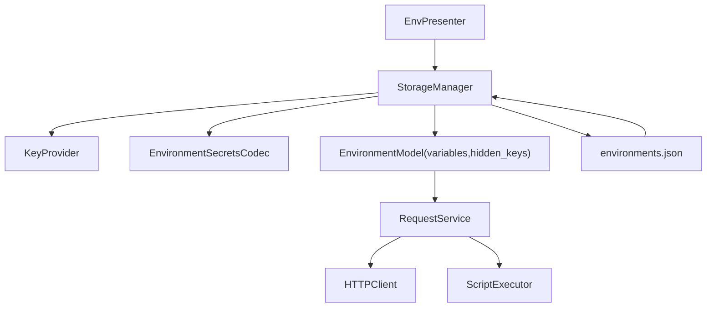

# PYPOST-447: Optional encrypted-at-rest storage for sensitive environment values

## Research

This architecture is based on current code paths and existing security-related behavior:

- `StorageManager` persists all environments to a single `environments.json` via
  `model_dump(mode="json")` and loads via `Environment(**item)` (`pypost/core/storage.py`).
- `Environment` keeps flat `variables: Dict[str, str]` and `hidden_keys: Set[str]`
  (`pypost/models/models.py`).
- Runtime request execution still requires plain string variables in `RequestService`,
  `HTTPClient`, and `ScriptExecutor` (`pypost/core/request_service.py`,
  `pypost/core/http_client.py`, `pypost/core/script_executor.py`).
- `EnvPresenter` is the integration point that saves environments and emits active env state
  (`pypost/ui/presenters/env_presenter.py`).

Design constraints derived from Step 1:

- encryption-at-rest is optional and backward-compatible;
- decrypted values must only exist on runtime boundaries where request execution needs them;
- existing plain-text files must continue to load without manual migration steps.

## Implementation Plan

1. Add a dedicated encryption codec layer for sensitive env values in storage I/O.
2. Add key-provider abstraction with a default local strategy and explicit failure semantics.
3. Introduce versioned encrypted payload schema for per-variable values.
4. Integrate decode-on-load and encode-on-save in `StorageManager` without changing runtime
   `Environment.variables` contract.
5. Add migration strategy for mixed datasets (plain + encrypted) and deterministic save policy.
6. Add focused tests for compatibility, key failures, migration, and runtime boundary behavior.

## Architecture

### Module Diagram

### Data Model and Persistence Shape

Keep runtime `Environment` model unchanged for execution compatibility:

- `Environment.variables` remains `Dict[str, str]` in memory.
- `Environment.hidden_keys` remains the baseline marker for sensitive values.

Persisted value format (per variable) becomes dual-mode:

- legacy plain text value (existing behavior);
- encrypted envelope object for sensitive entries, e.g.:
  - `enc`: boolean marker;
  - `v`: schema version;
  - `alg`: algorithm identifier;
  - `kid`: key identifier/fingerprint;
  - `ct`: ciphertext blob;
  - `nonce`: nonce/iv;
  - `aad`: optional additional authenticated data metadata.

This allows mixed datasets and gradual migration without breaking old records.

### Modules and Responsibilities

- `StorageManager` (`pypost/core/storage.py`)
  - Orchestrates encryption/decryption during save/load.
  - Owns migration policy for legacy and mixed data.
  - Preserves atomic write behavior (`.tmp` + `os.replace`).
- `EnvironmentSecretsCodec` (new, `pypost/core/environment_secrets_codec.py`)
  - Encodes sensitive values to encrypted envelope and decodes back to plain strings.
  - Validates envelope schema/version and maps crypto failures to typed errors.
  - Never logs raw secret values.
- `KeyProvider` interface (new, `pypost/core/key_provider.py`)
  - Resolves active encryption key and stable key id.
  - Supports key lookup by `kid` for decrypting old entries.
- `LocalKeyProvider` (new default implementation)
  - Reads key material from local app configuration source (initially process environment/config).
  - Fails closed when encryption is enabled but key is unavailable.
- `EnvPresenter` (`pypost/ui/presenters/env_presenter.py`)
  - Continues to pass plain variables to runtime.
  - Surfaces storage/load errors to user-facing flow (via existing dialog/warning patterns).
- Runtime components (`RequestService`, `HTTPClient`, `ScriptExecutor`)
  - No encryption awareness required; they consume plain in-memory values only.

### Key-Management Strategy

Use strategy pattern to keep security policy explicit:

- primary key source: local machine-scoped secret configured for the app runtime;
- key identity (`kid`) persisted with each encrypted value for future rotation support;
- architecture keeps provider pluggable for future keyring or external secret store.

Initial architecture decision:

- do not add network dependency for key retrieval in this task;
- keep key retrieval local and deterministic to preserve offline behavior.

### Migration and Compatibility Policy

Load path:

1. If value is plain string, keep as-is.
2. If value is encrypted envelope, decrypt using `kid` route.
3. If decryption fails, mark environment load as partial failure and block unsafe overwrite.

Save path:

1. If encryption is disabled, preserve plain behavior.
2. If encryption is enabled, encrypt values marked sensitive by policy (`hidden_keys` baseline).
3. Keep non-sensitive values plain unless policy expands in later tasks.

Mixed-state handling:

- deterministic rewrite policy: once encryption mode is enabled and key is valid,
  sensitive plain entries are rewritten as encrypted on next save.
- unknown envelope version is treated as non-recoverable load error for that value.

### Runtime Decryption Boundaries

Allowed boundary:

- decryption occurs only inside storage load pipeline before `Environment` objects are provided
  to presenters/runtime execution.

Prohibited boundaries:

- no decryption in UI rendering layers;
- no decryption inside `RequestService`, `HTTPClient`, `ScriptExecutor`;
- no ciphertext/plaintext secret dumps in logs/metrics/history.

### Failure Semantics and Recovery

- Missing key when encrypted payload exists:
  - do not silently replace with empty/plain value;
  - return explicit load/save failure with actionable message.
- Corrupted envelope:
  - fail value decode, keep file intact, avoid destructive auto-save.
- Key mismatch (`kid` not resolvable):
  - report deterministic error path; preserve current on-disk state.

### Affected Components

- `pypost/core/storage.py`
- `pypost/core/environment_secrets_codec.py` (new)
- `pypost/core/key_provider.py` (new)
- `pypost/models/models.py` (only if envelope typing metadata is introduced)
- `pypost/ui/presenters/env_presenter.py` (error-handling integration)
- `tests/test_storage_environments.py`
- `tests/test_env_persistence_e2e.py`
- new codec/key-provider tests under `tests/`

### Test Architecture

- Unit tests:
  - codec roundtrip, bad envelope, wrong key, unknown version.
- Storage integration tests:
  - legacy plain-text load compatibility;
  - mixed payload load/save behavior;
  - atomic save safety on encryption failure.
- E2E presenter tests:
  - environment manager save/reload with encryption enabled;
  - failure surfacing when key is missing.
- Runtime regression tests:
  - request execution path still receives plain strings as before.

## Q&A

- Q: Why keep `Environment.variables` plain in memory instead of encrypted objects?
  A: Runtime execution code expects `Dict[str, str]` broadly; changing it would create a large
  cross-cutting refactor and increase regression risk.
- Q: Why store `kid` per variable payload?
  A: It enables future key rotation and deterministic decrypt routing without guessing key origin.
- Q: Why restrict encryption to sensitive keys first?
  A: It matches Step 1 scope, minimizes migration risk, and keeps behavior predictable.
