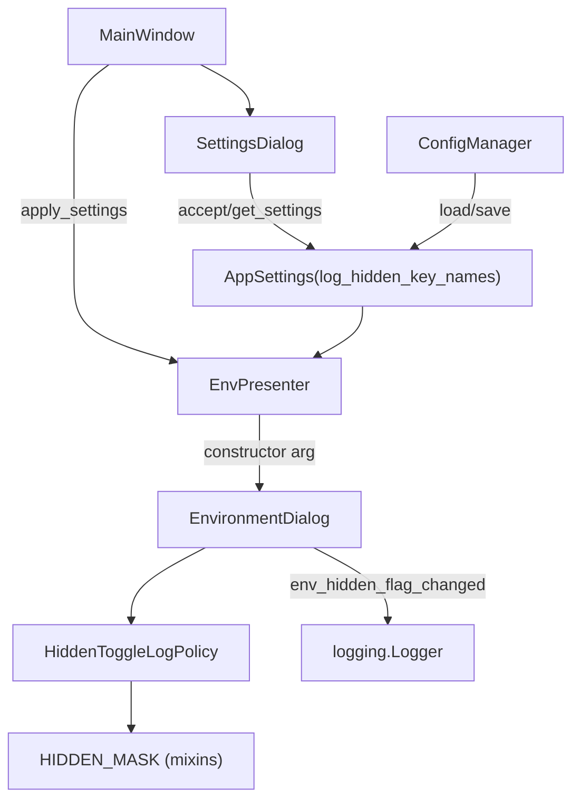

# PYPOST-448: Configurable hidden-key name logging

## Research

This architecture is based on:

- Existing hidden-flag toggle logging in `EnvironmentDialog`
  (`pypost/ui/dialogs/env_dialog.py`, line ~284).
- `AppSettings` persistence via `ConfigManager` (`pypost/models/settings.py`,
  `pypost/core/config_manager.py`).
- `SettingsDialog` checkbox pattern for boolean preferences
  (`pypost/ui/dialogs/settings_dialog.py`).
- `HIDDEN_MASK = "********"` shared constant in `pypost/ui/widgets/mixins.py`
  (used for value masking in UI).
- Sibling policy module `SensitiveDataMaskingPolicy`
  (`pypost/core/sensitive_data_masking_policy.py`) from PYPOST-446.

External security guidance applied:

- [OWASP Logging Cheat
  Sheet](https://cheatsheetseries.owasp.org/cheatsheets/Logging_Cheat_Sheet.html):
  sensitive or identifying metadata should be removed, masked, sanitized, hashed, or
  encrypted before persistence in logs; log only what is necessary.
- [OWASP Logging Vocabulary Cheat
  Sheet](https://cheatsheetseries.owasp.org/cheatsheets/Logging_Vocabulary_Cheat_Sheet.html):
  treat logged fields as a data-stewardship decision; exclude private or secret
  identifiers when not required for investigation.
- [OWASP Secrets Management Cheat
  Sheet](https://cheatsheetseries.owasp.org/cheatsheets/Secrets_Management_Cheat_Sheet.html):
  secrets and identifying metadata should never be logged in plaintext; prefer masking
  over raw disclosure.
- OWASP ASVS V16 (Security Logging): enforce logging based on data protection level;
  hashed values still classify logs as sensitive when correlation is possible.

Key conclusions for this task:

- Variable **values** remain out of scope (PYPOST-437 constraint); only **key names**
  in `env_hidden_flag_changed` events are configurable.
- Fixed redaction is preferred over hash-based pseudonymization: a stable hash of the
  key name still enables correlation across log lines and can aid reconstruction of
  naming patterns.
- Omitting the `key` field entirely would break log-schema stability for operators
  who parse `env_name`, `key`, and `hidden` together; replacing the value with a fixed
  redaction token preserves field shape while removing readable identifiers.
- Reusing `HIDDEN_MASK` keeps UI and log redaction visually and semantically aligned.

## Implementation Plan

1. Add `log_hidden_key_names: bool = False` to `AppSettings` (default suppresses key
   names; opt-in enables full visibility).
2. Introduce `HiddenToggleLogPolicy` core helper as the single source of truth for key
   representation in hidden-flag toggle logs.
3. Extend `SettingsDialog` with a security/observability checkbox bound to the new
   field; propagate through `accept()` / `get_settings()`.
4. Pass the current setting into `EnvironmentDialog` from `EnvPresenter`; replace the
   inline `key` argument in the toggle log call with policy output.
5. Add `EnvPresenter.apply_settings()` and call it from `MainWindow.apply_settings()`
   so saved settings are visible to the next dialog open without restart.
6. Add unit tests for the policy module, logging behavior in `EnvironmentDialog`, settings
   dialog load/save, and backward-compatible deserialization of old `settings.json`.
7. Update `doc/dev/hidden_variables.md` with the new logging setting and default behavior.

## Architecture

### Module Diagram



### Modules and Responsibilities

- `AppSettings` (`pypost/models/settings.py`)
  - New field: `log_hidden_key_names: bool = False`.
  - `False` (default): key names are redacted in toggle logs.
  - `True`: current behavior — full key name in toggle logs.
  - Pydantic default supplies `False` when the field is absent in legacy
    `settings.json`.
- `HiddenToggleLogPolicy` (new, `pypost/core/hidden_toggle_log_policy.py`)
  - Single source of truth for how a variable key name appears in
    `env_hidden_flag_changed` log events.
  - Pure function or small class with no UI or persistence dependencies.
  - Imports `HIDDEN_MASK` from `pypost/ui/widgets/mixins.py` for redaction token.
- `EnvironmentDialog` (`pypost/ui/dialogs/env_dialog.py`)
  - Accepts `log_hidden_key_names: bool = False` in constructor; stores on instance.
  - On hidden-checkbox toggle, calls policy before `logger.info(...)`.
  - UI hidden-flag behavior, value masking, and persistence remain unchanged.
- `EnvPresenter` (`pypost/ui/presenters/env_presenter.py`)
  - Holds current `AppSettings` via `_settings`.
  - Passes `log_hidden_key_names=self._settings.log_hidden_key_names` when constructing
    `EnvironmentDialog`.
  - New `apply_settings(settings: AppSettings)` updates `_settings` reference.
- `MainWindow` (`pypost/ui/main_window.py`)
  - Extends `apply_settings()` to forward settings to `EnvPresenter`.
- `SettingsDialog` (`pypost/ui/dialogs/settings_dialog.py`)
  - Adds checkbox under a security/observability grouping (after confirm-overwrite or
    near alert webhook fields).
  - Label: **"Log variable key names when hidden flag is toggled"**.
  - Unchecked by default (`log_hidden_key_names=False`).

### Suppression Mechanism (Architecture Decision)

**Chosen approach: fixed redaction token via `HIDDEN_MASK`.**

When `log_hidden_key_names` is `False`, the log line keeps the same template:

```text
env_hidden_flag_changed env_name=%s key=%s hidden=%s
```

but the `key` argument is replaced with `HIDDEN_MASK` (`********`).

| Approach | Verdict | Rationale |
| --- | --- | --- |
| Fixed redaction (`HIDDEN_MASK`) | **Selected** | Deterministic; matches UI mask; stable schema. |
| Omit `key` field | Rejected | Changes log shape; breaks parser/test expectations. |
| Hash / pseudonymize key | Rejected | Stable hash correlates identical keys across events. |
| Encrypt key in log | Rejected | Key-management overhead unjustified for diagnostic logs. |

Values are never passed to the logger in either mode (unchanged PYPOST-437 rule).

### Interaction Scheme

1. User opens **Settings**, checks **"Log variable key names when hidden flag is
   toggled"**, saves.
2. `SettingsDialog.accept()` builds `AppSettings(log_hidden_key_names=True)`;
   `ConfigManager` persists to `settings.json`.
3. `MainWindow.apply_settings()` updates `EnvPresenter._settings`.
4. User opens **Manage Environments**; `EnvPresenter` constructs
   `EnvironmentDialog(..., log_hidden_key_names=True)`.
5. User toggles hidden checkbox for `API_KEY`.
6. `EnvironmentDialog` calls
   `HiddenToggleLogPolicy.format_key_name("API_KEY", log_hidden_key_names=True)`
   → `"API_KEY"`.
7. Logger emits:
   `env_hidden_flag_changed env_name=Dev key=API_KEY hidden=True`.
8. With default setting (`log_hidden_key_names=False`), step 6 returns `********` and
   step 7 emits `key=********`.

Setting changes affect **subsequent** toggle events only: the dialog reads the flag at
construction time; toggles before a settings save use the prior value.

### Architectural Patterns and Justification

- **Policy Object** (`HiddenToggleLogPolicy`)
  - Encapsulates redaction rules in one testable unit, mirroring
    `SensitiveDataMaskingPolicy` from PYPOST-446 without coupling unrelated surfaces.
- **Single Source of Truth**
  - `HIDDEN_MASK` defines the redaction token; policy module references it rather than
    duplicating a magic string.
- **Constructor Injection**
  - `EnvironmentDialog` receives the boolean at open time — minimal change, no global
    settings singleton, easy to test with explicit parameters.
- **Separation of Concerns**
  - Settings UI owns preference capture; core policy owns representation; dialog owns
    event emission; presenter owns wiring.

### Main Interfaces

- `HiddenToggleLogPolicy.format_key_name(key: str, *, log_hidden_key_names: bool) -> str`
  - Returns `key` when `log_hidden_key_names` is `True`.
  - Returns `HIDDEN_MASK` when `log_hidden_key_names` is `False`.
  - Never receives or logs variable values.
- `EnvironmentDialog.__init__(..., log_hidden_key_names: bool = False)`
  - Snapshot of logging policy for the dialog session.
- `EnvPresenter.apply_settings(settings: AppSettings) -> None`
  - Replaces `_settings`; used by `MainWindow` after settings save.
- `SettingsDialog.get_settings() -> AppSettings`
  - Includes `log_hidden_key_names` after `accept()`.

### Affected Components

- `pypost/models/settings.py`
- `pypost/core/hidden_toggle_log_policy.py` (new)
- `pypost/ui/dialogs/env_dialog.py`
- `pypost/ui/dialogs/settings_dialog.py`
- `pypost/ui/presenters/env_presenter.py`
- `pypost/ui/main_window.py`
- `doc/dev/hidden_variables.md`
- `tests/test_hidden_toggle_log_policy.py` (new)
- `tests/test_env_dialog.py`
- `tests/test_settings_dialog.py`
- `tests/test_settings_persistence.py`

### Test Architecture

| File | Scenarios |
| --- | --- |
| `tests/test_hidden_toggle_log_policy.py` | Enabled → real key; disabled → `HIDDEN_MASK`. |
| `tests/test_env_dialog.py` | `caplog`: default `key=********`; enabled logs readable key. |
| `tests/test_settings_dialog.py` | Checkbox on form; load/save via `accept()`. |
| `tests/test_settings_persistence.py` | Missing field → `log_hidden_key_names=False`. |
| `tests/test_env_presenter.py` (optional) | `apply_settings` refreshes `_settings`. |

Regression guard: existing hidden-flag UI tests in `test_env_dialog.py` (masking,
model updates, rename) must remain green — logging policy must not alter UI paths.

### Persistence and Backward Compatibility

- New installs and legacy `settings.json` files without `log_hidden_key_names` deserialize
  with `False` via Pydantic field default.
- This intentionally changes runtime behavior from PYPOST-437 (key names were always
  logged) to security-first suppression; document in `hidden_variables.md` so users can
  opt in to full visibility.
- No migration script required; checkbox opt-in writes the field on next settings save.

## Q&A

- Q: Why `log_hidden_key_names=False` instead of a `suppress_*` field defaulting to
  `True`?
  A: The positive name maps directly to the opt-in checkbox label ("Log variable key
  names…"). Unchecked = `False` = suppress. Avoids double-negative conditionals in the
  dialog.
- Q: Why not reuse `SensitiveDataMaskingPolicy`?
  A: That policy masks rendered request **values** in history/logs (PYPOST-446). This
  task controls **key-name metadata** in a single UI observability event — a separate,
  smaller policy avoids scope creep.
- Q: Why pass the setting via constructor instead of reading `AppSettings` inside the
  dialog?
  A: Keeps the dialog testable without `ConfigManager`, matches existing presenter-owned
  wiring, and limits the change to hidden-flag toggle logging only.
- Q: Does `EnvPresenter.apply_settings` need to refresh an open `EnvironmentDialog`?
  A: No. Settings and environment manager are separate modal dialogs; the requirement is
  that subsequent toggle events use the new policy, which is satisfied on the next dialog
  open (or the same session if the dialog was constructed after `apply_settings`).
- Q: Source ticket?
  A: [PYPOST-448](https://pypost.atlassian.net/browse/PYPOST-448)
- Q: OWASP ASVS reference?
  A: https://github.com/OWASP/ASVS/blob/v5.0.0/5.0/en/
  0x25-V16-Security-Logging-and-Error-Handling.md
