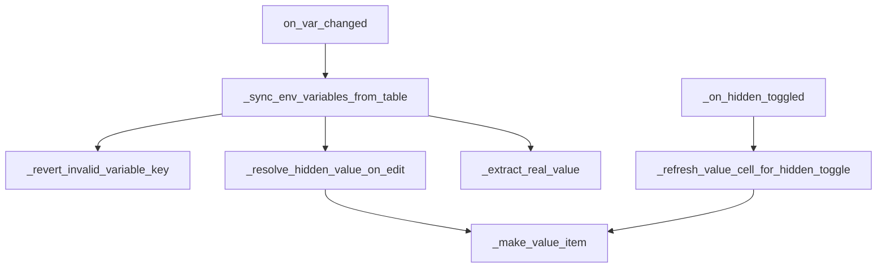

# PYPOST-449: Row update helper decomposition

## Research

Target module: `pypost/ui/widgets/environments/environment_variables_widget.py` (extracted
from `EnvironmentDialog` in PYPOST-496).

Dense areas identified:

1. `_sync_env_variables_from_table` — per-row validation, hidden-value edit masking, model sync.
2. `_on_hidden_toggled` — hidden set mutation plus value-cell refresh.
3. `on_var_changed` — trailing-row append + sync orchestration (already thin).

Existing helpers (unchanged): `_make_value_item`, `_extract_real_value`, trailing-row helpers.

## Implementation Plan

1. Add `_is_edited_cell(edited_item, row, column) -> bool` — shared edit-target check.
2. Add `_revert_invalid_variable_key(...) -> bool` — revert key cell and show error when the
   edited row has an invalid name.
3. Add `_resolve_hidden_value_on_edit(...) -> str` — resolve real value when editing a hidden
   cell; refresh masked display via `_make_value_item`.
4. Add `_refresh_value_cell_for_hidden_toggle(...)` — update value column when hidden checkbox
   toggles.
5. Simplify `_sync_env_variables_from_table` and `_on_hidden_toggled` to call helpers.
6. Add `tests/test_environment_variables_widget.py` with direct widget tests.

## Architecture

### Helper responsibilities

| Helper | Responsibility |
| --- | --- |
| `_is_edited_cell` | True when `edited_item` matches row/column |
| `_revert_invalid_variable_key` | Revert Variable cell + error dialog on invalid rename/add |
| `_resolve_hidden_value_on_edit` | Typed value for hidden row edit; re-mask cell |
| `_refresh_value_cell_for_hidden_toggle` | Show mask or plaintext after checkbox toggle |

### Test strategy

| File | Coverage |
| --- | --- |
| `tests/test_environment_variables_widget.py` | Widget-only: hidden edit, invalid key revert, toggle |
| `tests/test_env_dialog.py` | Regression — unchanged, must stay green |

## Q&A

- Q: Why widget methods instead of a separate adapter module?
  - A: Helpers need `vars_table` and dialog parent for `show_invalid_variable_name_error`;
    extraction stays in-widget to minimize scope and avoid new public APIs.
- Q: Source ticket?
  - A: Follow-up from [PYPOST-437](https://pypost.atlassian.net/browse/PYPOST-437).
