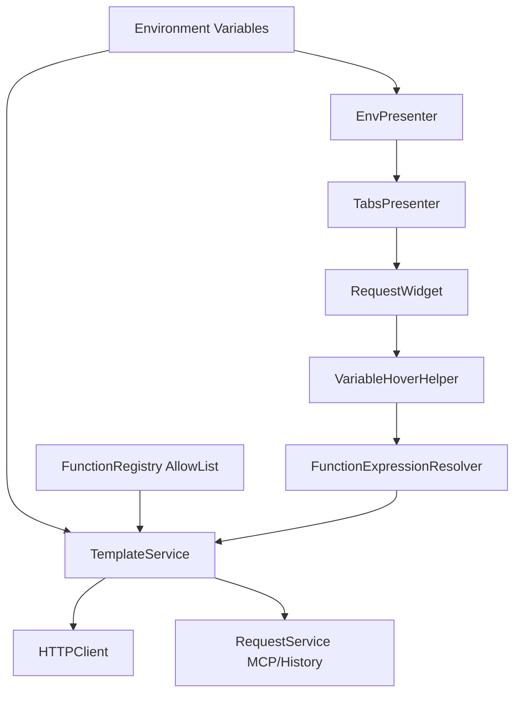

# PYPOST-450: Support Functions Where Variables Are Allowed

## Research

### Current codebase findings

1. Request rendering already goes through `TemplateService.render_string()` that uses
   Jinja2 (`pypost/core/template_service.py`).
2. Runtime request execution depends on rendered values from `TemplateService` in both
   `HTTPClient` and MCP execution paths (`pypost/core/http_client.py`,
   `pypost/core/request_service.py`).
3. Hover preview for editor widgets currently supports only plain variable pattern
   `{{name}}` via regex in `VariableHoverHelper` (`pypost/ui/widgets/mixins.py`).
4. Environment-to-editor propagation already exists:
   `EnvPresenter -> TabsPresenter -> RequestWidget` with `set_variables(...)` and hidden-key
   propagation (`pypost/ui/presenters/env_presenter.py`,
   `pypost/ui/presenters/tabs_presenter.py`, `pypost/ui/widgets/request_editor.py`).
5. Existing requirements for this task fix canonical UX syntax (functions only inside `{{...}}`):
   function expression inside braces, e.g. `{{urlencode(db)}}`
   (`ai-tasks/PYPOST-450/10-requirements.md`).

### External security and design references

- OWASP classifies direct dynamic code evaluation (`eval`) as injection risk; user input must
  not be executed as arbitrary code.
- CWE-95 documents risks of improper neutralization in dynamically evaluated code:
  [CWE-95](https://cwe.mitre.org/data/definitions/95.html)
- Safe expression libraries based on restricted AST exist, but for this scope we need only a
  narrow controlled function catalog and should keep expression grammar intentionally small:
  [simpleeval](https://github.com/danthedeckie/simpleeval),
  [asteval](https://lmfit.github.io/asteval/)

## Implementation Plan

1. Introduce a dedicated expression layer for template function calls in canonical form
   `{{func(arg)}}`.
2. Add a function catalog with explicit allow-list entries:
   `urlencode`, `md5`, `base64`.
3. Integrate catalog into `TemplateService` as Jinja2 filters/functions, preserving existing
   `{{var}}` behavior and backward compatibility.
4. Extend hover resolution so function expressions render preview values consistently with
   runtime rendering and hidden-key masking.
5. Keep security boundary strict: no `eval`, no arbitrary function names, no userspace Python.
6. Add architecture-level interfaces to isolate parser/registry from UI and request execution.
7. Add a context coverage matrix and acceptance checks for each variable-enabled surface.
8. Enforce canonical syntax: function calls only inside `{{...}}`.
9. Define formal argument grammar and error model for deterministic validation.

## Architecture

### Module Diagram

### Modules and Responsibilities

1. **`TemplateService`** (`pypost/core/template_service.py`)
   - Remains the single rendering entry point for request URL/headers/params/body.
   - Hosts integration with function expression resolution for `{{...}}` placeholders.
   - Ensures backward-compatible rendering for plain variables.

2. **`FunctionRegistry`** (new core module)
   - Declares the approved function catalog and maps names to implementations.
   - Initial catalog: `urlencode`, `md5`, `base64`.
   - Rejects unknown function names deterministically.

3. **`FunctionExpressionResolver`** (new core module)
   - Parses allowed expression subset inside `{{...}}`.
   - Resolves variable references and validates function call signatures.
   - Delegates execution only to `FunctionRegistry`; never executes arbitrary code.

4. **`VariableHoverHelper`** (`pypost/ui/widgets/mixins.py`)
   - Extends from variable-only hover resolution to function-expression-aware previews.
   - Reuses the same resolver path (or equivalent contract) as runtime template rendering.
   - Preserves hidden-key masking behavior for direct variable values.

5. **UI propagation chain**
   (`pypost/ui/presenters/env_presenter.py`,
   `pypost/ui/presenters/tabs_presenter.py`,
   `pypost/ui/widgets/request_editor.py`)
   - No structural redesign needed.
   - Continues supplying environment variables to all request editors.
   - Provides stable input context for function argument resolution.

### Interaction Scheme

#### Runtime request rendering

1. User enters expression, e.g. `"/{{host}}/{{urlencode(db)}}"`.
2. `RequestService`/`HTTPClient` calls `TemplateService.render_string(...)`.
3. `TemplateService` resolves variable and function expression via allow-listed catalog.
4. Rendered value is passed to transport layer unchanged.

#### Canonical syntax enforcement

1. Expression parser accepts function calls only inside braces: `{{func(arg)}}`.
2. Alternative forms (for example Jinja filter form or free-form calls outside braces) are
   rejected as invalid user input.
3. Validation failures produce explicit, non-executable error paths for UI/runtime handling.

#### Hover preview rendering

1. User hovers expression in editor field.
2. `VariableHoverHelper` detects expression token under cursor.
3. Helper resolves expression using the same function catalog rules.
4. Tooltip shows resolved value or controlled fallback message.

### Dependencies Between Modules

1. `FunctionRegistry` is a foundational dependency for expression support.
2. `FunctionExpressionResolver` depends on registry and variables context.
3. `TemplateService` depends on resolver/registry contracts.
4. Runtime modules (`HTTPClient`, `RequestService`) depend on `TemplateService` only.
5. Hover module depends on resolver contract for UX parity with runtime rendering.

### Selected Architectural Patterns and Justification

1. **Allow-list registry pattern**
   - Explicitly controls executable functions.
   - Matches security requirement to avoid arbitrary userspace execution.

2. **Single rendering gateway**
   - Keep `TemplateService` as canonical render boundary.
   - Prevents duplicated parsing logic across transport paths.

3. **Shared resolver contract**
   - Aligns runtime and hover behavior.
   - Reduces UX drift between preview and final rendered request.

4. **Additive extension**
   - Extends current variable template behavior without breaking existing expressions.
   - Supports incremental rollout and safer regression testing.

### Main Interfaces / APIs

1. `TemplateService.render_string(content: str, variables: dict) -> str`
   - Existing API; behavior extended for function expressions inside `{{...}}`.

2. `FunctionRegistry.get(name: str) -> Callable`
   - Returns implementation for approved function.
   - Raises controlled error for unknown names.

3. `FunctionExpressionResolver.resolve(expr: str, variables: dict[str, str]) -> str`
   - Resolves allowed expression forms (variables + allow-listed function calls).

4. `VariableHoverHelper.resolve_text(text: str, variables: Dict[str, str], hidden_keys=...)`
   - Extended to resolve function expressions in addition to variable placeholders.

5. `FunctionExpressionResolver.validate(expr: str) -> ValidationResult`
   - Validates syntax and argument contract before resolution.

### Context Coverage Matrix

- Context: request URL field
  - Existing variable path: `RequestWidget.url_input` + `TemplateService`
  - Planned function path: canonical `{{...}}` parse in `TemplateService` + resolver
  - Owner modules: `pypost/ui/widgets/request_editor.py`,
    `pypost/core/template_service.py`
- Context: query params table
  - Existing variable path: `RequestWidget.params_table` + `TemplateService`
  - Planned function path: same render pipeline with function-placeholder support
  - Owner modules: `pypost/ui/widgets/request_editor.py`,
    `pypost/core/template_service.py`
- Context: headers table
  - Existing variable path: `RequestWidget.headers_table` + `TemplateService`
  - Planned function path: same render pipeline with function-placeholder support
  - Owner modules: `pypost/ui/widgets/request_editor.py`,
    `pypost/core/template_service.py`
- Context: request body editor
  - Existing variable path: `RequestWidget.body_edit` + `TemplateService`
  - Planned function path: same render pipeline with function-placeholder support
  - Owner modules: `pypost/ui/widgets/request_editor.py`,
    `pypost/core/template_service.py`
- Context: hover preview in URL/params/headers/body
  - Existing variable path: regex resolve in `VariableHoverHelper`
  - Planned function path: resolver-backed preview with same catalog
  - Owner module: `pypost/ui/widgets/mixins.py`

Acceptance policy for matrix:

- Each context must pass positive tests for `{{urlencode(db)}}`, `{{md5(db)}}`,
  `{{base64(db)}}`.
- Each context must pass negative tests for unsupported syntax and unknown function names.

### Security Boundaries

- Explicitly prohibited: evaluating userspace expressions with Python `eval`/`exec`.
- Function execution path is only through `FunctionRegistry` allow-list.
- Unknown functions or invalid argument arity produce controlled validation outcomes.
- Scope is limited to initial catalog (`urlencode`, `md5`, `base64`) from requirements.
- Jinja environment must expose only approved function call surface and no dynamic user-bound
  callables outside the registry.
- Attribute traversal and non-catalog invocation chains are rejected by parser validation.
- Security test set must include negative cases for:
  - unknown function names;
  - malformed argument lists;
  - nested unsafe constructs;
  - attempts to execute arbitrary Python snippets.

### Function Argument Contract

- Canonical grammar (current scope):
  - `{{identifier}}` for plain variable;
  - `{{functionName(identifier)}}` for one-argument function calls.
- `identifier` format: `[a-zA-Z_][a-zA-Z0-9_]*`.
- `functionName` must exist in `FunctionRegistry`.
- Current catalog arity:
  - `urlencode`: 1 argument;
  - `md5`: 1 argument;
  - `base64`: 1 argument.
- Nested function calls and multi-argument calls are not in scope for this iteration and must
  fail validation with explicit error output.

## Q&A

- Q: Why not use generic Python expression evaluation for flexibility?
  - A: Security posture and product scope require strict control. `eval`-style execution is
    an injection risk and violates agreed requirements.
- Q: How do we keep UX consistent between preview and real requests?
  - A: Use one resolver contract shared by `TemplateService` (runtime) and hover helper
    (preview).
- Q: Can users call any Python function if syntax looks valid?
  - A: No. Only functions in the application-managed allow-list are executable.

## Review Notes (Subagent + Assistant)

### Finding 1

- Severity: high
- Title: Incomplete coverage proof for all variable-enabled contexts
- Subagent note:
  - Architecture does not explicitly map every variable-enabled context to the function path.
  - This may violate parity and acceptance expectations.
  - Recommendation: add a context coverage matrix.
- Assistant comment: agree
  - I agree because the architecture currently describes key flows but does not include a
    complete surface inventory table. Without that mapping, parity can be missed during STEP 3.

### Finding 2

- Severity: medium
- Title: Canonical syntax is stated, but exclusivity is not enforced
- Subagent note:
  - Canonical syntax is documented, but engine-level acceptance of alternative forms is not
    constrained.
  - Recommendation: define acceptance/rejection policy for non-canonical syntax.
- Assistant comment: agree
  - I agree because the document declares UX canon but does not define enforcement gates.
    Architecture should explicitly state if non-canonical forms are rejected or tolerated.

### Finding 3

- Severity: medium
- Title: Security boundary needs stricter enforcement details
- Subagent note:
  - No `eval` and allow-list are declared, but hardening details are not explicit.
  - Recommendation: define Jinja hardening boundaries and negative security tests.
- Assistant comment: agree
  - I agree because current security statements are correct but high-level.
    Architecture should name concrete enforcement points to prevent bypass paths.

### Finding 4

- Severity: low
- Title: Function argument model is under-specified for future compatibility
- Subagent note:
  - Initial set is single-argument, while requirements say functions accept arguments.
  - Recommendation: define grammar and validation contract.
- Assistant comment: agree
  - I agree because even with one-arg initial catalog, documenting argument grammar now will
    reduce ambiguity for future extensions and testing.

### Open Questions From Review

- Resolved: variable-enabled contexts and owners are fixed in the context coverage matrix.
- Resolved: non-canonical syntax is explicitly rejected.
- Resolved: use restricted resolver contract integrated with `TemplateService`; do not evaluate
  arbitrary expressions.
- Resolved masking policy:
  - direct hidden variable preview remains masked;
  - derived function output may be shown only as resolved output in scope of this task;
  - additional redaction policies for derived outputs can be tracked as a separate follow-up.

### Overall Verdict

- Subagent verdict: architecture direction is solid, but constraints are not strict enough yet
  to guarantee parity and security outcomes.
- Assistant verdict: agree
  - I agree with this verdict and consider the review actionable for tightening STEP 2 before
    final approval.
