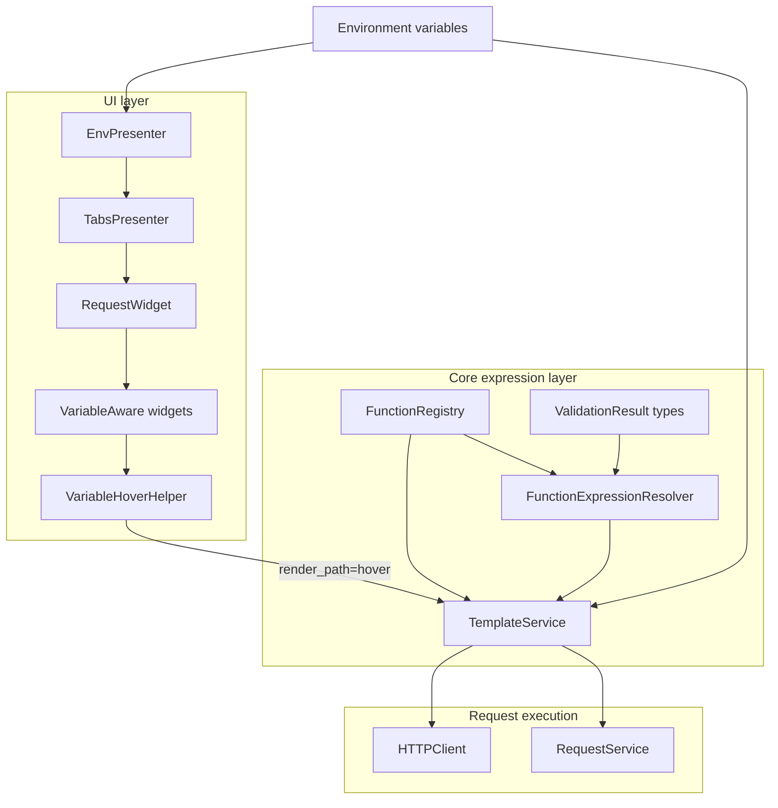

# PYPOST-450: Support Functions Where Variables Are Allowed

## Research

### Current codebase findings

1. **Runtime rendering gateway** — `TemplateService.render_string()` in
   `pypost/core/template_service.py` is the single entry point for substituting `{{...}}`
   placeholders. `HTTPClient._prepare_request_kwargs()` renders URL, header keys/values,
   param keys/values, and body through this API (`pypost/core/http_client.py`). MCP/history
   paths use the same service via `RequestService` (`pypost/core/request_service.py`).

2. **Dedicated expression modules (implemented)** — Allow-list ownership lives in
   `FunctionRegistry` (`pypost/core/function_registry.py`) with catalog entries
   `urlencode`, `md5`, and `base64`. Syntax validation lives in
   `FunctionExpressionResolver` (`pypost/core/function_expression_resolver.py`).
   `TemplateService` orchestrates validation, Jinja2 render, observability, and fallback.
   PYPOST-451/452 originally planned this split; the modules now exist, though
   `TemplateService` still combines orchestration concerns (tracked in PYPOST-459).

3. **Hover preview** — `VariableHoverHelper` in `pypost/ui/widgets/mixins.py` resolves
   function expressions by delegating to `TemplateService.render_string(...,
   render_path="hover")`, giving runtime/hover parity. Plain variables still use direct lookup
   with hidden-key masking (`HIDDEN_MASK`). Widgets in `request_editor.py` (URL line edit,
   params/headers tables, body editor) propagate variables via `set_variables()` /
   `set_hidden_keys()` from the env presenter chain.

4. **Canonical UX syntax** — Function calls appear only inside `{{...}}`, e.g.
   `{{urlencode(db)}}` or chained `{{md5(urlencode(db))}}`. Requirements forbid
   multi-argument comma-separated calls and arbitrary user-defined code
   (`ai-tasks/PYPOST-450/10-requirements.md`).

5. **Invalid-expression behavior (locked)** — On validation or render failure,
   `render_string` logs observability events and **returns the original content** unchanged.
   This preserves backward compatibility for existing variable workflows and prevents one bad
   field from breaking unrelated request parts.

### External security and design references

- **CWE-95 (Eval Injection)** — Dynamic evaluation of untrusted input without neutralization
  enables arbitrary code execution. Mitigations emphasize canonicalization before validation
  and avoiding `eval` on user strings.
  [CWE-95](https://cwe.mitre.org/data/definitions/95.html)

- **Python `eval`/`exec` warnings (CPython 3.13+)** — Official docs state that calling
  `eval`/`exec` with untrusted input leads to security vulnerabilities; overriding
  `__builtins__` is **not** a security mechanism because evaluated code can still reach
  builtins. See
  [CPython GH-145773](https://github.com/python/cpython/commit/3b5c4a2).

- **Deny-list vs allow-list** — Restricted expression engines (e.g. `simpleeval`) moved
  toward explicit allow-lists: only declared node types, functions, and operators run; all
  other constructs fail closed.
  [simpleeval PR #81](https://github.com/danthedeckie/simpleeval/pull/81),
  [AST allow-list overview](https://medium.com/@laurentkubaski/using-an-ast-to-make-eval-secure-211545f53e6c)

- **Design choice for pypost** — Requirements need only three string transforms inside
  `{{...}}`. A **custom grammar + catalog registry + Jinja globals binding** is narrower
  than a general AST evaluator and avoids `eval`, `exec`, and user-supplied callables.
  Libraries like [simpleeval](https://github.com/danthedeckie/simpleeval) or
  [asteval](https://lmfit.github.io/asteval/) remain reference material, not dependencies.

## Implementation Plan

1. **Keep `TemplateService` as the rendering gateway** for all variable-enabled surfaces.
2. **Validate before render** — Scan every `{{...}}` token with `FunctionExpressionResolver`;
   reject unknown functions, multi-arg calls, and non-canonical inner forms.
3. **Execute only via catalog** — `FunctionRegistry.register_into_env()` binds approved
   names to implementations on the Jinja2 `Environment`; no other user-callable globals.
4. **Support nested allow-listed calls** — Single-argument recursion per PYPOST-453 policy
   (`NESTED_FUNCTION_CALLS_ALLOWED = True`); no fixed depth cap while each level stays
   catalog-valid.
5. **Reject multi-arg calls** — Top-level comma at parenthesis depth 0 yields
   `invalid_arity`.
6. **Fallback on invalid expressions** — Return original field content; emit structured
   validation observability for diagnostics without breaking the request editor.
7. **Hover parity** — Route function-expression preview through the same `render_string`
   path with `render_path="hover"`; keep plain-variable hidden-key masking unchanged.
8. **Context matrix acceptance** — Positive/negative checks for every enumerated context
   (URL, header name/value, param name/value, body, hover preview).
9. **Documentation (DoD #5)** — Catalog syntax, examples (`urlencode`, `md5`, `base64`),
   context list, and edge cases are documented in
   [`doc/dev/template_expression_functions.md`](../../doc/dev/template_expression_functions.md)
   (STEP 7). PYPOST-456 covers optional polish only.
10. **Follow-up hardening (out of PYPOST-450 scope)** — Orchestration refactor (PYPOST-459),
    shared tokenization (PYPOST-460), explicit registry/globals parity test (PYPOST-457).

## Architecture

### Module diagram


```mermaid
flowchart TD
    subgraph UI["UI layer"]
        EP[EnvPresenter]
        TP[TabsPresenter]
        RW[RequestWidget]
        VA[VariableAware widgets]
        VH[VariableHoverHelper]
    end

    subgraph Core["Core expression layer"]
        TS[TemplateService]
        FR[FunctionRegistry]
        FE[FunctionExpressionResolver]
        VT[ValidationResult types]
    end

    subgraph Runtime["Request execution"]
        HC[HTTPClient]
        RS[RequestService]
    end

    ENV[Environment variables] --> EP
    EP --> TP --> RW --> VA
    VA --> VH
    ENV --> TS
    FR --> TS
    FE --> TS
    VT --> FE
    FR --> FE
    VH -->|render_path=hover| TS
    TS --> HC
    TS --> RS
```

### Modules and responsibilities

| Module | Path | Responsibility |
| --- | --- | --- |
| `TemplateService` | `pypost/core/template_service.py` | Orchestrates placeholder counting, pre-render validation, Jinja2 render, metrics/logging, and backward-compatible fallback. Public API: `render_string`, `validate_function_expressions`. |
| `FunctionRegistry` | `pypost/core/function_registry.py` | Single source of truth for allowed function names and implementations (`urlencode`, `md5`, `base64`). Exposes `is_allowed`, `get`, `register_into_env`. |
| `FunctionExpressionResolver` | `pypost/core/function_expression_resolver.py` | Parses/validates inner `{{...}}` text: plain identifiers, single-arg catalog calls, nested catalog calls. No execution. |
| `ValidationResult` | `pypost/core/template_expression_types.py` | Typed validation outcomes (`code`, optional `function_name`). |
| `VariableHoverHelper` | `pypost/ui/widgets/mixins.py` | Detects tokens under cursor; resolves plain variables with masking; resolves function expressions via `TemplateService`. |
| UI propagation | `env_presenter.py`, `tabs_presenter.py`, `request_editor.py` | Supplies variable map and hidden keys to all editors; no expression parsing here. |
| `HTTPClient` / `RequestService` | `pypost/core/http_client.py`, `request_service.py` | Consumers of rendered strings; depend on `TemplateService` only. |

**Current vs planned:** Core split (`FunctionRegistry`, `FunctionExpressionResolver`) is
implemented. Remaining tech debt is orchestration density inside `TemplateService` and
class-level hover service instantiation (PYPOST-459, hover DI polish).

### Interaction scheme

#### Runtime request rendering

1. User enters expressions in a request field, e.g. `"/{{host}}/{{urlencode(db)}}"`.
2. On send, `HTTPClient` (or MCP path) calls `TemplateService.render_string(field, variables)`.
3. Resolver validates every `{{...}}` token against catalog and grammar rules.
4. On success, Jinja2 renders with variables plus catalog globals from `FunctionRegistry`.
5. Rendered strings become the outbound URL, headers, params, and body.

**HTTP vs MCP render scope:** `HTTPClient` renders all six field surfaces (URL, header/param
keys and values, body). `RequestService` MCP/history paths render URL and body only; headers
and params are not part of the MCP request model.

#### Hover preview rendering

1. User hovers a `{{...}}` token in URL, params table, headers table, or body editor.
2. `VariableHoverHelper.find_expression_at_index()` locates the token.
3. Plain `{{var}}` → direct lookup with hidden-key mask when applicable.
4. Function form → `TemplateService.render_string(token, variables, render_path="hover")`.
5. Tooltip shows resolved value, or original token text when validation/render fails
   (fallback parity with runtime).

#### Invalid-expression fallback

```text
validate_content → invalid? → log/metrics → raise ValueError inside try
render_with_jinja → exception? → log/metrics
finally: return original content string unchanged
```

Predictable feedback: the field keeps the user's literal expression; observability records
`validation_error` or `render_error`. Unrelated fields and plain `{{var}}` behavior stay
stable.

**User-visible feedback:** Hover tooltips show the resolved value on success, or the original
`{{...}}` token when validation/render fails (same text the user typed). At request send,
invalid expressions leave the **entire field** unchanged rather than partially substituting.
Structured validation codes appear in logs/metrics (`TemplateService._VALIDATION_MESSAGES`);
there is no separate inline error UI in PYPOST-450 scope.

### Expression grammar and nesting policy

**Allowed forms inside `{{...}}`:**

| Form | Example | Notes |
| --- | --- | --- |
| Plain variable | `{{db}}` | Identifier `[a-zA-Z_][a-zA-Z0-9_]*`; unchanged from pre-feature behavior. |
| Single-arg function | `{{urlencode(db)}}` | `functionName` must be in catalog; one argument only. |
| Nested function chain | `{{md5(urlencode(db))}}` | **Allowed** (PYPOST-453). Argument may be identifier or nested single-arg catalog call; validated recursively. No fixed depth limit. |
| Spaced variants | `{{ md5( db ) }}` | Inner text is trimmed per token; outer `{{` / `}}` required. |

**Rejected forms:**

| Form | Validation outcome | Runtime/hover behavior |
| --- | --- | --- |
| Unknown function | `unknown_function`, `function_name` set | Original content returned |
| Multi-arg call (`{{md5(a,b)}}`) | `invalid_arity` | Original content returned |
| Malformed signature / non-identifier arg | `invalid_syntax` or `invalid_argument` | Original content returned |
| Unbalanced nested parens | Typically `invalid_argument` on outer function | Original content returned |
| Calls outside `{{...}}` | Not part of placeholder grammar; Jinja may treat as literal text | Unchanged legacy behavior |
| Jinja filters / arbitrary Python | Not in catalog; resolver rejects non-canonical inner calls | Original content returned |

**Multi-arg rejection:** `_extract_single_argument()` scans for `,` at parenthesis depth 0;
any top-level comma rejects the call as multi-argument (out of scope per requirements).

### Context coverage matrix

Every row maps a requirements expression context to the same core pipeline. Requirements
list six context groups; this matrix enumerates seven render/hover surfaces (header/param
name and value columns separately).

| Context | UI surface | Render path | Hover path | Owner modules |
| --- | --- | --- | --- | --- |
| Request URL | `RequestWidget.url_input` | `HTTPClient` → `render_string(url)` | `VariableAwareLineEdit` → `VariableHoverHelper` | `request_editor.py`, `http_client.py`, `template_service.py`, `mixins.py` |
| Header names | `RequestWidget.headers_table` key column | `render_string(k)` per header row | Table cell hover via `VariableAwareTableWidget` | same |
| Header values | `RequestWidget.headers_table` value column | `render_string(v)` per header row | Table cell hover | same |
| Param names | `RequestWidget.params_table` key column | `render_string(k)` per param row | Table cell hover | same |
| Param values | `RequestWidget.params_table` value column | `render_string(v)` per param row | Table cell hover | same |
| Request body | `RequestWidget.body_edit` | `render_string(body)` | `CodeEditor` hover mixin | same |
| Variable hover preview | All supported editors above | N/A (preview only) | `VariableHoverHelper.resolve_text` | `mixins.py`, `variable_aware_widgets.py` |

**Acceptance policy per context:**

- Positive: `{{urlencode(db)}}`, `{{md5(db)}}`, `{{base64(db)}}`, nested
  `{{md5(urlencode(db))}}`.
- Negative: unknown function, multi-arg, malformed nesting — field content unchanged;
  validation codes recorded where applicable.

### Dependencies between modules

```text
FunctionRegistry          (no upstream deps)
    ↓
FunctionExpressionResolver
    ↓
TemplateService           ← MetricsManager (optional)
    ↓
HTTPClient, RequestService, VariableHoverHelper (hover-only)

UI presenters → RequestWidget → variable maps → hover/render inputs
```

Runtime modules must not import resolver/registry directly; they call `TemplateService` only.

### Architectural patterns and justification

| Pattern | Application | Why |
| --- | --- | --- |
| Allow-list registry | `FunctionRegistry` + resolver `is_allowed` checks | Meets security NFR: no arbitrary user-defined execution. |
| Gateway / façade | `TemplateService.render_string` | One validation+render contract for HTTP, MCP, hover, masking. |
| Fail-open field fallback | Return original content on error | Backward compatibility; invalid call does not break unrelated fields. |
| Validate-then-execute | Resolver before Jinja render | Prevents non-catalog constructs from reaching template engine. |
| Shared hover/runtime path | `render_path="hover"` | UX consistency between tooltip and executed request. |

### Main interfaces / APIs

```python
# pypost/core/template_service.py
def render_string(
    content: str,
    variables: dict[str, Any],
    render_path: str = "runtime",
) -> str: ...

def validate_function_expressions(content: str) -> ValidationResult: ...
```

```python
# pypost/core/function_registry.py
class FunctionRegistry:
    def allowed_names(self) -> frozenset[str]: ...
    def is_allowed(self, name: str) -> bool: ...
    def get(self, name: str) -> Callable[..., Any] | None: ...
    def register_into_env(self, env: Environment) -> None: ...
```

```python
# pypost/core/function_expression_resolver.py
class FunctionExpressionResolver:
    def validate_content(self, content: str) -> ValidationResult: ...
```

```python
# pypost/ui/widgets/mixins.py — signatures match implementation (typing module)
class VariableHoverHelper:
    @staticmethod
    def resolve_text(
        text: str,
        variables: Dict[str, str],
        hidden_keys: Optional[Set[str]] = None,
    ) -> str: ...

    @staticmethod
    def find_expression_at_index(text: str, index: int) -> Optional[str]: ...
```

**Validation codes** (`ValidationResult.code`):

| Code | Meaning |
| --- | --- |
| `unknown_function` | Name not in catalog |
| `invalid_arity` | More than one top-level argument |
| `invalid_argument` | Bad nested arg or recursive validation failure |
| `invalid_syntax` | Inner text is neither identifier nor parseable single-arg call |

User-visible messages are mapped in `TemplateService._VALIDATION_MESSAGES` for logging;
fields still fall back to original content at render time.

### Security boundaries

- **Prohibited:** `eval`, `exec`, `compile` on user template text; dynamic import of user
  modules; exposing non-catalog callables on the Jinja environment.
- **Enforcement points:**
  1. `FunctionExpressionResolver` — grammar and catalog membership before render.
  2. `FunctionRegistry.register_into_env` — only catalog keys bound to `env.globals`.
  3. Jinja `Environment` — Catalog callables bound via `FunctionRegistry.register_into_env`
     only; resolver rejects non-canonical inner expressions before `from_string` / `render`.
     This is not `SandboxedEnvironment`; security relies on allow-list + grammar validation,
     not template sandboxing.
- **Negative test themes:** unknown functions, multi-arg attempts, nested unsafe constructs,
  Jinja injection snippets that are not canonical function-call forms.
- **Masking:** Direct hidden variables remain masked in plain-variable hover; function outputs
  show resolved values (derived-output redaction is a separate follow-up if needed).

### Documentation

Developer documentation for DoD #5 lives in
[`doc/dev/template_expression_functions.md`](../../doc/dev/template_expression_functions.md).
It covers:

- Canonical `{{...}}` syntax and the initial catalog (`urlencode`, `md5`, `base64`)
- Nested-call policy (`NESTED_FUNCTION_CALLS_ALLOWED`) and rejected forms
- Context list aligned with the coverage matrix above
- Acceptance-test matrices (malformed nesting, spacing variants, hover/runtime parity)

PYPOST-456 tracks optional polish beyond this document.

## Q&A

- Q: Why not use Python `eval` or a general expression library?
  - A: CWE-95 and CPython guidance treat dynamic evaluation of user strings as high risk.
    Product scope needs only three catalog functions with a fixed grammar; a dedicated resolver
    plus allow-list registry is smaller and easier to audit than `eval` or full AST engines.

- Q: How is UX kept consistent between hover and executed requests?
  - A: Function expressions share `TemplateService.render_string`; hover passes
    `render_path="hover"` for observability only. Plain variables keep the fast masked path.

- Q: What happens when a function call is invalid?
  - A: Validation fails, observability records the outcome, and the original field content is
    returned unchanged. Hover shows the original `{{...}}` token; send leaves the entire field
    literal. Other fields and plain `{{var}}` expressions are unaffected. No inline error UI
    in PYPOST-450 scope.

- Q: Are nested calls like `{{md5(urlencode(db))}}` supported?
  - A: Yes. PYPOST-453 policy allows recursive single-argument catalog calls with no fixed
    depth limit, validated by `FunctionExpressionResolver`.

- Q: Are multi-argument calls like `{{md5(a,b)}}` supported?
  - A: No. Requirements exclude comma-separated arguments; resolver returns `invalid_arity`.

- Q: Which contexts must support functions?
  - A: All variable-enabled contexts from requirements: URL, header names and values, param
    names and values, body, and hover preview in supported editors (see context matrix).

- Q: Can users run arbitrary Python through template fields?
  - A: No. Only catalog functions registered in `FunctionRegistry` may execute; resolver
    rejects non-canonical inner expressions before Jinja render.

- Q: Where is follow-up work tracked?
  - A: Orchestration refactor (PYPOST-459), tokenization dedup (PYPOST-460), registry parity
    tests (PYPOST-457), developer doc polish beyond
    [`doc/dev/template_expression_functions.md`](../../doc/dev/template_expression_functions.md)
    (PYPOST-456). Core module split is already landed.
