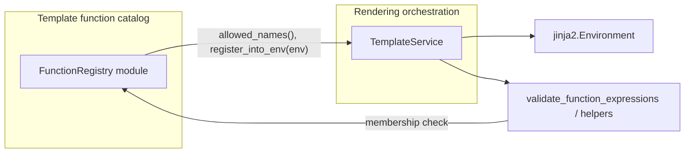

# PYPOST-451: Separate ownership of permitted template functions from rendering flow

## Research

### Codebase context

- `TemplateService` (`pypost/core/template_service.py`) defines `_ALLOWED_FUNCTIONS`,
  `_register_allowed_functions()`, and validation via
  `function_name not in self._ALLOWED_FUNCTIONS`, duplicating the catalog with Jinja
  `env.globals` registration.
- Prior sprint vision in `ai-tasks/PYPOST-450/20-architecture.md` names a future
  `FunctionRegistry` and `FunctionExpressionResolver`; this ticket implements only the
  registry slice. Resolver extraction (PYPOST-452), nested-call policy (PYPOST-453), and
  edge tests (PYPOST-454) stay out of scope.
- `doc/dev/template_expression_functions.md` documents that the allow-list currently lives
  in `TemplateService`; after implementation, that dev doc should be updated in STEP 7.

### External pattern references (web)

- Registry pattern in Python commonly uses a **dictionary mapping names to callables**
  with explicit `register` / `get` style APIs, separating **catalog configuration** from
  **routing or orchestration** that consumes the catalog. That matches the goal of
  isolating “what may run” from “how rendering runs.”
- Summaries of the pattern emphasize **O(1) lookup**, **Open/Closed** extension at the
  catalog boundary, and **testability** versus long conditional chains; see:
  - Conor Hollern, “Using Registry Patterns for Cleaner Conditional Logic”:
    https://conorhollern.dev/blog/python-registry-patterns-conditional-logic-conor-hollern
  - DEV Community, “Python Registry Pattern: A Clean Alternative to Factory Classes”
    (full URL under [Links](#links)).
- Preference in many codebases is for **explicit registration** over heavy metaclass or
  “magic” auto-registration when governance and reviewability matter (same articles).

## Implementation Plan

1. Add a dedicated core module (working name: `pypost/core/function_registry.py`) that
   owns an **immutable set of permitted names** (`frozenset`-style) and **fixed**
   name→callable **bindings** for the built-in catalog (`urlencode`, `md5`, `base64`
   initially). “Frozen” here means that set and map are not mutated at runtime for the
   default catalog, not that the Python type must be frozen in every implementation
   detail.
2. Implement a small **registry type** (e.g. `TemplateFunctionRegistry` or
   `FunctionRegistry`) with the minimal API described below; use type hints per
   `.cursor/lsr/do-python.md`.
3. Refactor `TemplateService` to **construct or hold** a registry instance (default
   built-in catalog is sufficient for this ticket; optional injection can stay internal
   unless tests need it), **register** allowed callables into `self.env` via the registry,
   and **validate** using `allowed_names()` (or equivalent) instead of `_ALLOWED_FUNCTIONS`.
4. Remove duplicated catalog state from `TemplateService` (`_ALLOWED_FUNCTIONS` and
   hand-maintained `env.globals` dict in `_register_allowed_functions`).
5. **Regression guard:** Before and after moving implementations, run a **repo-wide
   search** for any use of `TemplateService._urlencode`, `_md5`, `_base64_encode`, or
   other former private entry points; update or remove stale references so behavior stays
   centralized in the registry module.
6. Add or adjust **tests** (architecture expectation, slightly stronger than bare
   requirements): keep **golden template** cases for valid renders (all three functions
   and representative variables); assert **parity** on `unknown_function` validation
   paths (message shape / error code as today). **Registry-only unit tests** are
   optional; if `FunctionRegistry` is **not** constructor-injected, prefer
   **`TemplateService` integration tests** as the primary proof, or document that
   tradeoff in the STEP 3 iteration notes.
7. **Do not** introduce `FunctionExpressionResolver` or move parsing out of
   `TemplateService` in this ticket (PYPOST-452).
8. **STEP 7 checklist:** Update `doc/dev/template_expression_functions.md` so it states
   the new catalog home, drops stale “allow-list only in TemplateService” wording, and
   stays consistent with runtime behavior—do not ship code without this doc pass.

## Architecture

### Module diagram



### Modules and responsibilities

**`FunctionRegistry`** (new, e.g. `pypost/core/function_registry.py`)

- Single source of truth for permitted template function **names** and their
  **implementations**.
- Exposes a minimal API for validation and Jinja registration.
- No Jinja render loop, no metrics, no UI.

**`TemplateService`** (`pypost/core/template_service.py`)

- Orchestration: build `Environment`, delegate catalog registration to the registry, run
  validation and `render_string`; metrics/logging hooks unchanged in spirit.
- Parser helpers (`_parse_function_expression`, arity checks, nested argument rules)
  **remain** here until PYPOST-452.

### Interaction flow

1. `TemplateService.__init__` creates a `FunctionRegistry` (default) and calls
   `register_into_env(self.env)` so `env.globals` matches today’s three entries.
2. During validation, `_parse_function_expression` (or caller) obtains `function_name` and
   checks membership via the registry (`allowed_names()` or `is_allowed(name)`), producing
   the same `unknown_function` path as today for disallowed names.
3. During render, Jinja resolves `{{ urlencode(x) }}` via globals populated by the
   registry; callables are identical to current `TemplateService` static methods moved
   next to the catalog (or thin wrappers), preserving output for valid inputs.

### Patterns and justification

- **Registry / catalog object:** Centralizes allow-list and implementations so governance
  and code review target one module; aligns with PYPOST-450’s long-term split and with
  common Python practice (name-to-callable map, explicit API).
- **Separation of concerns:** `TemplateService` keeps orchestration and expression
  validation structure; the registry owns **policy data** (what is allowed) and **binding**
  (what runs under each name). No behavior change for valid templates if callables and
  names are unchanged.
- **Incremental extraction:** Avoids designing or migrating the full resolver in this
  ticket; the registry API stays small and stable for PYPOST-452 to consume later.

### `register_into_env` semantics

- **Design intent:** `TemplateService.__init__` calls `register_into_env(self.env)`
  **once** for the service lifetime under normal use.
- **If called again** on the same `Environment`, implementations should **set or
  replace** `env.globals` entries **only for catalog names** (e.g. `urlencode`, `md5`,
  `base64`), leaving unrelated globals untouched. That yields predictable, idempotent
  re-registration for those keys without widening Jinja surface area.
- Document the chosen behavior in the registry docstring so future hot-reload or tests
  do not rely on undefined behavior.

### Concrete interface: `FunctionRegistry` and `TemplateService`

Suggested **minimal public surface** for the new type (exact names may vary in code
review; semantics should match):

```python
class FunctionRegistry:
    def allowed_names(self) -> frozenset[str]:
        """Immutable set of permitted function names for template expressions."""

    def is_allowed(self, name: str) -> bool:
        """True if name is in the catalog (convenience over `name in allowed_names()`)."""

    def register_into_env(self, env: Environment) -> None:
        """
        Bind catalog names to callables on env.globals. Prefer one call from
        TemplateService.__init__; repeat calls may reset only those keys (see
        Architecture / register_into_env semantics).
        """

    def get(self, name: str) -> Callable[..., Any] | None:
        """
        Return the implementation for name, or None if unknown. Part of the stable
        public surface for PYPOST-452; implement in PYPOST-451 even if only
        TemplateService uses it internally at first.
        """
```

**`TemplateService` consumption (design contract):**

- Replace `_ALLOWED_FUNCTIONS` with `self._function_registry.is_allowed(function_name)` or
  equivalent.
- Replace `_register_allowed_functions` body with
  `self._function_registry.register_into_env(self.env)`.
- **Implementations** of `urlencode`, `md5`, and `base64` logic move **into** the
  registry module (e.g. module-level functions or static methods on a private helper) so
  the catalog and code live together; `TemplateService` must not re-define the allow-list.

**Out of scope for this API:** expression parsing, nested-call policy changes, and
  shared resolver type for hover vs runtime (PYPOST-452+).

## Q&A

- **Where does the allow-list live after this ticket?** In
  `pypost/core/function_registry.py` (or the chosen module name), inside
  `FunctionRegistry`.
- **Does `TemplateService` stay the rendering boundary?** Yes; it consumes the registry
  and keeps `render_string` and validation entry points.
- **Is `get()` part of the stable API for PYPOST-452?** **Yes—include `get()`** on the
  registry public surface in PYPOST-451 so PYPOST-452 can resolve callables without
  another breaking churn, even if hover/runtime still route through `TemplateService`
  initially.
- **What must stay behavior-identical?** Valid templates and rejection of unknown
  functions; same three functions and semantics.
- **When may STEP 2 be marked `[x]` on the roadmap?** Only after **explicit user
  approval** of this architecture, per `.cursor/rules/20-architecture.mdc`. Independent
  or peer review does not substitute; STEP 2 may remain `[/]` until that sign-off.
- **Shared default registry vs one per `TemplateService`?** **Per-instance** default
  built-in catalog constructed in `TemplateService.__init__` (or equivalent) unless
  product later mandates a shared singleton; no change from current “new service, new
  env” lifecycle intent.
- **Who owns formal product test evidence expectations?** The **requirements owner**
  / PO (`10-requirements.md`); engineering should still add **minimal golden cases** in
  STEP 3 as recommended above.

## Independent review response

Independent senior review: **approve with notes**. Requirements and architecture align;
scope stays fenced from PYPOST-452–454. Review **strengths** called out there (fit to
requirements, code grounding, incremental scope, small API, patterns, template section
layout) stay valid; this edit only addresses gaps and risks below.

This revision records: **STEP 2 completion and roadmap `[x]` require explicit user
approval** (peer review does not substitute); stronger **test guidance** (golden
templates, `unknown_function` parity, optional registry tests vs `TemplateService`
integration if no DI); **repo-wide search** before/after moving private template helpers;
**`register_into_env`** semantics (single normal call, safe re-bind for catalog keys
only); clarified **“frozen”** terminology; **STEP 7** dev-doc checklist; and **Q&A**
answers for lifecycle, `get()`, and evidence ownership.

### Links

Jira:

https://pypost.atlassian.net/browse/PYPOST-451

Conor Hollern (registry patterns):

https://conorhollern.dev/blog/python-registry-patterns-conditional-logic-conor-hollern

DEV Community (registry pattern):

https://dev.to/dentedlogic/stop-writing-giant-if-else-chains-master-the-python-registry-pattern-ldm
