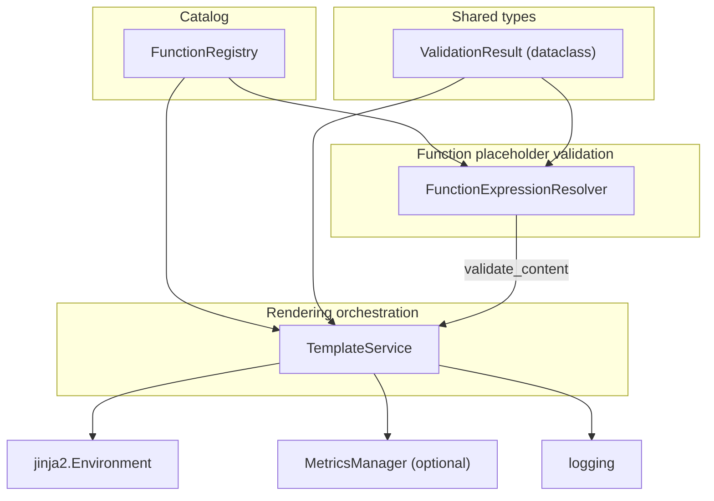

# PYPOST-452: Separate validation of template function expressions

## Research

### Codebase context

- `TemplateService` (`pypost/core/template_service.py`) interleaves **Jinja environment
  lifecycle**, **metrics/logging**, **render orchestration**, and **function-placeholder
  parsing/validation** (regexes, `_validate_expression`, `_parse_function_expression`,
  `_validate_function_args`, `_extract_single_argument`).
- `FunctionRegistry` (`pypost/core/function_registry.py`) already centralizes catalog
  membership (`is_allowed`, `allowed_names`, `get`) and `register_into_env`; validation
  should depend on it but not duplicate catalog data.
- `doc/dev/template_expression_functions.md` documents nested calls as **currently
  allowed**; policy tightening is **PYPOST-453**, so this refactor must preserve that
  behavior.
- PYPOST-451 architecture (`ai-tasks/PYPOST-451/20-architecture.md`) established registry
  ownership; this ticket completes the **resolver slice** promised there.
- **Requirements glossary (mapping):** *field value with placeholders* maps to the full
  string **`content`**; *placeholder token* maps to each **`{{ ... }}`** inner span;
  *function-style placeholder* maps to any non-identifier expression treated as a call;
  *catalog entry* maps to **`FunctionRegistry`** bindings; *validation outcome* maps to
  **`ValidationResult`**.

### External pattern references (web)

- **Validation vs workflow orchestration:** layered validation treats syntactic and policy
  checks as distinct from coordinating side effects (rendering, telemetry). NILUS
  discusses validation layers in CQRS-style flows:
  https://www.nilus.be/blog/command_validation_layers_in_cqrs_architecture/
- **Where validation should live:** community guidance often frames validators as
  first-class collaborators that may access the same dependencies as handlers when rules
  require it—still distinct from unrelated orchestration:
  https://softwareengineering.stackexchange.com/q/448720
- **Parser-style decomposition in Python:** the standard library separates lexical
  structure from consumers via dedicated tokenizer APIs (`tokenize` module), illustrating
  the value of a focused parsing surface even when the grammar is small:
  https://docs.python.org/3/library/tokenize.html
- **Composable parsing objects (analogy only; no new dependency):** third-party libraries
  such as **pyparsing** illustrate composable parser elements; maintained docs:
  https://pyparsing.readthedocs.io/en/latest/

## Implementation Plan

1. Introduce **`FunctionExpressionResolver`** (class name as agreed) in a new module, e.g.
   `pypost/core/function_expression_resolver.py`, constructed with a **`FunctionRegistry`**
   dependency (required constructor argument; tests may pass a real or test registry).
2. **Move** from `TemplateService` into the resolver: `_IDENTIFIER_RE`,
   `_FUNCTION_SIGNATURE_RE`, `_validate_expression`, `_parse_function_expression`,
   `_validate_function_args`, `_extract_single_argument`, and the loop that discovers
   `{{ ... }}` inner expressions (same `re.findall` semantics as today).
3. Expose a **single public validation entry** on the resolver, e.g.
   `validate_content(content: str) -> ValidationResult`, mirroring current
   `validate_function_expressions` behavior for all supported and unsupported patterns.
4. Keep **`TemplateService`** responsible for: creating `Environment`, constructing or
   injecting `FunctionRegistry`, calling `register_into_env`, **`parse`**, and
   **`render_string`** orchestration (**resolver call → Jinja render → metrics/logging**).
5. Make **`validate_function_expressions`** a thin **delegate** to the resolver’s
   `validate_content` (preserve the public method name for callers and tests).
6. Extract **`ValidationResult`** to a small shared module (see interfaces below) so
   `TemplateService` and `FunctionExpressionResolver` both import it without circular
   imports; keep **message templates** (`_VALIDATION_MESSAGES`, `_validation_message`) on
   `TemplateService` because they format the `ValueError` used on the validation-failure
   path in `render_string`.
7. **Nested-call policy:** leave recursive validation semantics **unchanged** from the
   current implementation (still allow nested allow-listed calls) until **PYPOST-453**
   explicitly changes policy.
8. **Regression testing:** extend or add tests so **parity** is proven for valid templates,
   unknown functions, arity/syntax errors, nested calls, and **observable orchestration**
   (logging/metrics counters on validation failure vs success vs render error), matching
   pre-refactor expectations.
9. **STEP 2 bookkeeping:** roadmap markers and **user approval** before STEP 2 completion
   follow **`.cursor/rules/20-architecture.mdc`**; track status in
   **`ai-tasks/PYPOST-452/00-roadmap.md`** and the orchestration thread (not only this
   file).

## Architecture

### Module diagram



### Responsibilities

**`FunctionExpressionResolver`** (`pypost/core/function_expression_resolver.py`)

- Owns **regexes and parsing helpers** for function-style placeholders inside `{{ ... }}`.
- Owns **structural and catalog validation** for each inner expression (identifier vs
  call, arity, nested argument rules **as implemented today**).
- Depends only on **`FunctionRegistry`** for allow-list membership (and future catalog
  lookups if needed); **no** `Environment`, **no** metrics, **no** user-facing message
  formatting.

**`TemplateService`** (`pypost/core/template_service.py`)

- Owns **Jinja `Environment` lifecycle**, **`FunctionRegistry` construction/injection**,
  and **`register_into_env`** wiring.
- Owns **`render_string` orchestration**: call resolver → on invalid, log/metric and
  raise `ValueError` with **`_validation_message`** → on valid, `env.from_string` and
  `render` → success metrics/logging → **exception fallback returns original `content`**
  (unchanged behavior).
- Owns **`parse`** (AST parse via `self.env`).
- Exposes **`validate_function_expressions`** as a **delegate** to the resolver for
  external callers that already use this API.

**`FunctionRegistry`** (unchanged role from PYPOST-451)

- Continues to be the **single source of truth** for permitted names and callables.

**`ValidationResult`** (shared small module, e.g. `pypost/core/template_expression_types.py`)

- Frozen dataclass **`is_valid`**, **`code`**, **`function_name`** with `valid()` /
  `error()` factories—**same fields and codes** as today (`unknown_function`,
  `invalid_arity`, `invalid_argument`, `invalid_syntax`).

### Interaction flow

1. **`TemplateService.__init__`**: build `FunctionRegistry`, register into `self.env`,
   construct **`FunctionExpressionResolver(registry)`** and store it (private attribute).
2. **`validate_function_expressions(content)`** → **`resolver.validate_content(content)`**
   → returns **`ValidationResult`** without side effects.
3. **`render_string`**: `resolver.validate_content(content)`; if invalid, emit the same
   log fields and metric updates as today, then `raise ValueError(self._validation_message(
   validation))`; if valid, render via Jinja; on any exception in the render path, keep
   **fallback to original `content`** with the same warning metric/log pattern.

#### Observability parity

- **Structured signals:** **`ValidationResult.code`** and **`ValidationResult.function_name`**
  remain the **only** validation-derived fields used for **`INFO`** validation-failure logs
  and **`template_expression_validation_failures_total`** labels, together with
  **`render_path`** and the same **`{{...}}`** token count computed in **`TemplateService`**
  as today—no new ad hoc parsing outside **`validate_content`**.
- **Success vs fallback:** **`DEBUG`** success logs and **`WARNING`** fallback logs keep the
  same field sets (**`render_path`**, token count, **`error_type`** on fallback) and the
  same **`template_expression_render_attempts_total`** outcomes as the current code.
- **Resolver boundary:** **`FunctionExpressionResolver`** performs **no** logging or
  metrics; observability parity is owned by **`TemplateService`** after **`validate_content`**
  returns, matching **Definition of Done** expectations in **`10-requirements.md`**.

### Patterns and interfaces

- **Separation of concerns:** resolver = “**is this allowed?**”; template service =
  “**how do we execute and observe templates?**” Aligns with treating validation as a
  focused collaborator rather than embedding it in orchestration (see Research links).
- **Dependency injection:** resolver receives **`FunctionRegistry`** at construction;
  `TemplateService` remains the composition root for default wiring.
- **Python conventions (STEP 2 language gate):** implementation aligns with
  **`.cursor/lsr/do-python.md`**—imports, **PEP 8**-friendly layout, explicit type hints on
  public APIs, and tests colocated under the existing **`tests/`** conventions.

**`FunctionExpressionResolver` (proposed surface)**

```python
class FunctionExpressionResolver:
    def __init__(self, registry: FunctionRegistry) -> None: ...

    def validate_content(self, content: str) -> ValidationResult:
        """Scan {{...}} tokens and validate each inner expression."""
```

**`ValidationResult` placement (chosen approach)**

- **Dataclass in a tiny shared module** (e.g. `template_expression_types.py`) imported by
  both `TemplateService` and `FunctionExpressionResolver`.
- **Justification:** avoids **circular imports** (`template_service` ↔ `resolver`) if the
  type lived only in `template_service`; keeps the DTO **stable** for tests and metrics
  code that only need structured outcomes. **Human-readable templates** for
  `ValueError` messages stay in **`TemplateService`** because they couple validation
  **codes** to **operator-facing strings** on the render path, not to pure structural
  validation.
- **Public validation return shape:** **`validate_function_expressions`** keeps returning
  **`ValidationResult` only** (no embedded human-readable message in the return value),
  matching the current public API. **`_VALIDATION_MESSAGES` / `_validation_message`** run
  only on the **`render_string`** **`ValueError`** path, so integrators that call
  validation without rendering still receive **the same structured outcome** as today.

### Nested-call policy (explicit)

- **Unchanged** from current code: a single top-level argument may be **another**
  allow-listed function call; `_extract_single_argument` continues to respect **parenthesis
  depth** so commas inside nested calls do not split arity; recursive validation preserves
  the **`invalid_arity` → `invalid_argument` mapping** for the outer function when the
  inner failure is arity-related. **PYPOST-453** may revise this; this ticket does not.

### Testing expectations (architecture level)

- **`TemplateService` integration tests:** end-to-end parity for `render_string` and
  `validate_function_expressions` across representative **valid**, **invalid**, and
  **nested** placeholders; assert **metrics** and **log-relevant fields** where already
  covered today.
- **`FunctionExpressionResolver` unit tests (recommended):** direct tests for edge
  strings (multiple `{{ }}` tokens, whitespace inside delimiters, nested calls, unknown
  names) to lock validation behavior **without** spinning Jinja or metrics—fast
  regression signal when rules evolve.
- **Do not** reduce coverage relative to current tests; add focused cases if gaps appear
  during implementation.

### Requirements traceability

| Requirement theme (`10-requirements.md`) | Architecture anchor |
| --- | --- |
| Isolate “allowed?” vs orchestration | Resolver module; **Implementation Plan** §1–5 |
| Parity / observables / nested policy | **Observability parity**; **Nested-call policy** |
| Code layout boundary | **Module diagram**; **Responsibilities**; new modules §1–2 |
| Tests / coverage | **Testing expectations**; **Implementation Plan** §8 |

## Q&A

- **Why not move `_VALIDATION_MESSAGES` into the resolver?** Message formatting is tied to
  the orchestration path (`ValueError` in `render_string`); keeping it in
  `TemplateService` preserves a clear boundary: resolver emits **codes**, service maps
  them to **strings** for that path.
- **Can the resolver call Jinja for validation?** **No**—validation must remain
  deterministic structural/catalog checking only; rendering stays in `TemplateService`.
- **Does this ticket change nested-call rules?** **No**—behavior matches current code
  until **PYPOST-453**.
- **Does `validate_function_expressions` start returning formatted strings?** **No**—only
  **`ValidationResult`** is returned publicly; formatted text stays on the **`render_string`**
  **`ValueError`** path for parity with today.

## Links

- CQRS validation layers discussion:
  https://www.nilus.be/blog/command_validation_layers_in_cqrs_architecture/
- Validation dependencies and separation of concerns (Stack Exchange):
  https://softwareengineering.stackexchange.com/q/448720
- Python `tokenize` module documentation:
  https://docs.python.org/3/library/tokenize.html
- pyparsing documentation (analogy reference; no runtime dependency):
  https://pyparsing.readthedocs.io/en/latest/
