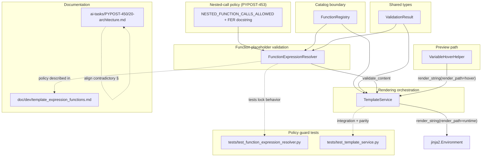

# PYPOST-453: Align and enforce nested-function policy

## Research

### Codebase context

- **`FunctionExpressionResolver`** (`pypost/core/function_expression_resolver.py`) already
  implements the **ALLOW** policy via recursive `_validate_expression`:
  - Plain identifiers pass immediately.
  - Top-level function calls are parsed with `_FUNCTION_SIGNATURE_RE`, checked against
    **`FunctionRegistry.is_allowed`**, and validated for a **single argument** via
    `_extract_single_argument` (parenthesis-depth tracking so commas inside nested calls
    do not split arity).
  - When the argument is another function-shaped expression, validation recurses into
    `_validate_expression(argument)`; inner `invalid_arity` is remapped to outer
    `invalid_argument` (preserves current UX).
- **`TemplateService`** (`pypost/core/template_service.py`) delegates all structural/catalog
  validation to the resolver; orchestration (Jinja render, metrics, logging, fallback) is
  unchanged. Its `validate_function_expressions` docstring still lists only two placeholder
  forms and omits nested chains — a documentation gap, not a behavior gap.
- **`FunctionRegistry`** (`pypost/core/function_registry.py`) remains the **single allow-list**
  for callable names; nesting does not introduce new names or bypass `is_allowed`.
- **`doc/dev/template_expression_functions.md`** documents nested calls as working behavior
  but retains a **"Known Deviation"** section pointing at PYPOST-453; that section must be
  removed once policy is aligned.
- **PYPOST-450 architecture** (`ai-tasks/PYPOST-450/20-architecture.md`, lines 225–226)
  states nested calls "must fail validation" — contradicts live product behavior and this
  ticket's agreed policy.
- **Existing tests** cover representative valid nested paths:
  - `tests/test_function_expression_resolver.py` — `test_nested_allowed_calls`
  - `tests/test_template_service.py` — `test_validate_allows_nested_allowed_calls`,
    `test_render_nested_function_with_allowed_catalog`
  - Gaps for STEP 3: policy-violation negatives at nested positions, deeper chains,
    explicit runtime/hover parity for nested **valid** inputs (malformed edge parity →
    PYPOST-454).
- **PYPOST-452** deliberately froze recursive semantics and deferred policy codification to
  this ticket; no resolver extraction rework is required.

### External pattern references (web)

- **Policy-as-code alignment:** industry practice treats governance rules as versioned,
  testable artifacts that bridge design docs and implementation — avoiding "human language
  drift" between architecture notes and runtime behavior. Palo Alto Networks describes
  policy-as-code as using code (Python, YAML, Rego, etc.) so policies are **shared via VCS,
  validated automatically, and enforced at scale** rather than interpreted differently by
  each reader:
  https://www.paloaltonetworks.com/cyberpedia/what-is-policy-as-code
- **Composable validation clauses:** AWS CloudFormation Guard models policies as
  **assertions that evaluate true/false**, combinable for nested structures — analogous to
  our recursive "argument must be identifier OR valid nested call" rule without adopting an
  external DSL:
  https://github.com/aws-cloudformation/cloudformation-guard/blob/main/README.md
- **Allow-list recursion security:** restricted execution libraries (e.g. `evalidate`,
  `sql-guard`) enforce **fail-closed allow-lists at every AST/call node**, recursively
  validating nested calls against the same permitted function set — matching our
  `FunctionRegistry` boundary; depth caps are optional hardening when untrusted input can
  drive unbounded recursion (Trail of Bits recommends validating/limiting depth for
  attacker-controlled recursion; pypost's grammar is small and catalog-bound, and
  requirements explicitly reject a fixed depth limit for valid chains):
  https://github.com/yaroslaff/evalidate/
  https://resources.trailofbits.com/hubfs/Resources/trailofbits-20241218-recursion-whitepaper.pdf

## Implementation Plan

1. **Codify the ALLOW policy in code (minimal artifact):** add a module-level named constant
   (e.g. `NESTED_FUNCTION_CALLS_ALLOWED = True`) and expand the **`FunctionExpressionResolver`**
   class docstring to state the recursive grammar rule in one place. **Do not** introduce a
   separate `nested_call_policy` module — the policy is a single boolean decision already
   embodied by the recursive `_validate_expression` / `_validate_function_args` path; a new
   module would add indirection without new behavior.
   **Constant semantics (STEP 3):** `NESTED_FUNCTION_CALLS_ALLOWED` is a **declarative**
   policy artifact colocated with enforcement; it is **not** branched in validation logic
   in this ticket (no REJECT mode). Add a test that imports the constant and asserts
   `True`; behavioral tests are the enforcement guard against accidental recursion removal.
2. **Leave validation logic unchanged** unless a new policy-guard test exposes a real gap;
   recursive allow-list checks and `invalid_arity` → `invalid_argument` remapping stay as-is.
3. **Align `TemplateService.validate_function_expressions` docstring** to list nested
   allow-listed chains as a supported third form (no API or orchestration change).
4. **Add/strengthen policy-guard tests** (see **Testing expectations**): valid nested chains,
   invalid nested policy violations, runtime vs hover parity for representative valid nested
   inputs. Defer malformed/spacing/deep-edge cases to PYPOST-454.
5. **Documentation alignment (STEP 3 touch + STEP 7 completion):**
   - `doc/dev/template_expression_functions.md` — remove **Known Deviation**; promote nested
     calls to first-class supported pattern; update Architecture bullet for FER.
   - `ai-tasks/PYPOST-450/20-architecture.md` — replace lines 225–226 nested-rejection text
     with: nested allow-listed function calls **are supported**; a function's single
     argument may be a plain identifier or another allow-listed single-argument call,
     validated recursively with the same catalog and arity rules at each level. No fixed
     depth limit. Optional one-line historical note that policy was aligned in PYPOST-453.
   - `ai-tasks/PYPOST-450/60-tech-debt.md` — mark nested policy mismatch resolved when STEP 3
     lands (STEP 6 may formalize).
6. **Regression pass:** run existing `test_function_expression_resolver` and
   `test_template_service` suites; confirm `{{md5(urlencode(db))}}` and similar chains still
   validate and render identically.
7. **STEP 2 bookkeeping:** architecture approved; roadmap STEP 2 marked `[x]` per
   `.cursor/rules/20-architecture.mdc`.

## Architecture

### Module diagram



### Responsibilities

**`FunctionExpressionResolver`** — **policy owner (validation semantics)**

- Owns the **explicit nested-call policy artifact**: named constant + class docstring stating
  that a function argument may be a plain identifier **or** another allow-listed function call,
  validated **recursively** with the same rules at each level.
- Continues to own regex parsing, arity extraction (`_extract_single_argument` paren depth),
  and recursive `_validate_expression` — **no fixed depth limit** as long as each call satisfies
  catalog + single-argument rules.
- Consults **`FunctionRegistry.is_allowed`** at **every** function node in the chain (security
  boundary unchanged).
- Emits **`ValidationResult`** only; no logging/metrics.

**`FunctionRegistry`** — **catalog boundary (unchanged)**

- Single source of truth for permitted names (`urlencode`, `md5`, `base64` today).
- Nesting does not widen the catalog; unknown names at any depth → `unknown_function`.

**`ValidationResult`** (`pypost/core/template_expression_types.py`) — **shared outcome DTO
(unchanged)**

- Frozen dataclass returned by resolver and `validate_function_expressions`; no nested-policy
  ownership.

**`TemplateService`** — **orchestration (unchanged behavior)**

- Constructs registry + resolver; delegates `validate_function_expressions` and render-path
  validation to `FunctionExpressionResolver.validate_content`.
- Docstring update only for this ticket (list nested form explicitly).
- Maps validation codes to operator-facing strings on the render fallback path only.

**`VariableHoverHelper`** — **preview parity consumer**

- Reuses `TemplateService.render_string(..., render_path="hover")`; nested policy applies
  identically to runtime when placeholders are valid (no helper changes expected).

**Documentation artifacts**

- `doc/dev/template_expression_functions.md` — remove deviation callout; document nested chains
  as supported product behavior.
- `ai-tasks/PYPOST-450/20-architecture.md` — remove contradictory "must fail validation"
  language for nested calls.

### Nested-call policy (explicit rules)

| Rule | Decision |
| --- | --- |
| Allow or reject nested allow-listed calls? | **ALLOW** |
| Maximum depth | **No fixed limit**; each level must pass the same rules |
| Permitted argument forms | Plain identifier `[a-zA-Z_][a-zA-Z0-9_]*` **or** nested `func(arg)` where `func` ∈ catalog |
| Catalog check | `FunctionRegistry.is_allowed` at **each** call node, recursively |
| Multi-argument | **Rejected** at any level (`invalid_arity` / remapped `invalid_argument`) |
| Literals, arbitrary expressions | **Rejected** (`invalid_argument` / `invalid_syntax`) |
| Unknown function in chain | **Rejected** (`unknown_function` on the offending name) |
| Behavior change for valid nested templates | **None** |

**Recursive validation flow (unchanged implementation):**

1. `validate_content` scans each `{{ ... }}` inner expression.
2. `_validate_expression`: identifier → valid; else parse as `func(args)`.
3. `_validate_function_args`: extract single top-level argument (paren-depth aware).
4. If argument is identifier → valid for this call.
5. If argument matches function signature → recurse to step 2; propagate errors except
   remap inner `invalid_arity` to outer `invalid_argument`.

### Interaction flow

1. User writes `{{md5(urlencode(db))}}` in a request field.
2. **Runtime:** `TemplateService.render_string` → `resolver.validate_content` → recursive
   checks (`md5` allowed, argument `urlencode(db)` recurses → `urlencode` allowed, argument
   `db` is identifier) → Jinja renders with registry callables.
3. **Hover:** `VariableHoverHelper` calls the same `TemplateService.render_string` with
   `render_path="hover"` → identical validation outcome and resolved value for valid chains.
4. **Invalid nested example** `{{md5(badfn(db))}}`: inner recurse hits `unknown_function` for
   `badfn` → validation fails → same fallback as single-level invalid (original content,
   validation observability).

### Patterns and interfaces

- **Policy-as-code (minimal):** one named constant + authoritative docstring colocated with
  the recursive validator — testable, versioned, no parallel human-only rule in architecture
  docs (aligns with PaC "single source of truth" guidance without new dependencies).
- **Fail-closed allow-list recursion:** same pattern as whitelist AST validators — each nested
  call node must pass catalog membership before deeper validation proceeds.
- **Separation preserved from PYPOST-452:** resolver answers "is this allowed?"; template
  service answers "how do we render and observe?"; registry answers "what may be called?"
- **Python conventions:** PEP 8 layout, type hints on public APIs, tests under `tests/` per
  `.cursor/lsr/do-python.md`.

**`FunctionExpressionResolver` (surface — unchanged signatures)**

```python
NESTED_FUNCTION_CALLS_ALLOWED: bool = True  # module-level policy constant

class FunctionExpressionResolver:
    """Validates {{...}} expressions.

    Nested policy: when NESTED_FUNCTION_CALLS_ALLOWED is True, a function argument may be
    a plain identifier or another allow-listed single-argument function call, validated
    recursively via FunctionRegistry.
    """

    def __init__(self, registry: FunctionRegistry) -> None: ...

    def validate_content(self, content: str) -> ValidationResult: ...
```

**`TemplateService` (surface — unchanged signatures; docstring only)**

```python
class TemplateService:
    def validate_function_expressions(self, content: str) -> ValidationResult:
        """Allow: {{identifier}}, {{func(id)}}, {{func(nested_func(id))}} (recursive allow-list)."""
```

**Why not a separate `nested_call_policy` module?**

- The policy is a **single product decision** (ALLOW) with **no alternate modes** or
  runtime switching.
- Enforcement already lives in `_validate_function_args` recursion; extracting a module would
  duplicate the grammar description without reducing coupling.
- Tests + constant provide auditable guardrails; if future tickets add REJECT mode or depth
  caps, a dedicated policy module can be introduced then.

### Security boundary

- **No `eval` / arbitrary Python:** unchanged; only Jinja globals registered from
  `FunctionRegistry`.
- **Recursive catalog enforcement:** every parsed `func` name must pass `is_allowed` before
  arguments are inspected; nesting cannot reference builtins or user-defined callables.
- **No depth cap (per requirements):** acceptable because grammar is restricted to
  cataloged unary functions over identifiers/nested calls — not general expression trees;
  PYPOST-454 may add abuse-edge tests separately.
- **Negative policy cases to guard in tests:** unknown nested function, literal nested
  argument, multi-arg inside nested call (e.g. `{{md5(urlencode(a, b))}}`).

### Testing expectations (architecture level — STEP 3)

**`tests/test_function_expression_resolver.py` (unit / policy guard)**

| Case | Example | Expected |
| --- | --- | --- |
| Valid two-level chain | `{{md5(urlencode(db))}}` | valid (exists) |
| Valid three-level chain | `{{base64(md5(urlencode(db)))}}` | valid |
| Unknown function nested | `{{md5(unknown(db))}}` | `unknown_function` / `unknown` |
| Invalid nested literal arg | `{{md5(urlencode('db'))}}` | `invalid_argument` / `md5` |
| Multi-arg inside nested | `{{md5(urlencode(a, b))}}` | `invalid_argument`, `function_name="md5"` (inner `invalid_arity` remapped) |

**`tests/test_template_service.py` (integration / parity)**

| Case | Context | Expected |
| --- | --- | --- |
| Render nested chain | `render_path="runtime"` | resolved hash/encode output (exists) |
| Validate allows nested | `validate_function_expressions` | valid (exists) |
| Runtime/hover parity (nested valid) | `{{md5(urlencode(db))}}`, `variables={"db": "a b"}` | identical resolved output for `render_path="runtime"` and `render_path="hover"` (one test, `subTest` or parametrization) |
| Render rejects nested unknown | `{{md5(bad(db))}}` | original content fallback |
| Validate rejects nested unknown | same | `unknown_function` |

**Hover integration note:** `TemplateService`-level paired parity is sufficient for DoD;
`VariableHoverHelper` is a thin caller of `render_string(..., render_path="hover")`. A
nested `resolve_text` test in `tests/test_variable_hover.py` is optional hardening, not
required for this ticket.

**Explicitly out of scope (PYPOST-454):** malformed nesting, spacing variants, unbalanced
parens at depth, exhaustive hover/runtime matrix for edge strings.

### Documentation alignment map

| Artifact | STEP 3 action | STEP 7 action |
| --- | --- | --- |
| `pypost/core/function_expression_resolver.py` | Add constant + class docstring | — |
| `pypost/core/template_service.py` | Update `validate_function_expressions` docstring | — |
| `doc/dev/template_expression_functions.md` | Remove "Known Deviation"; state ALLOW policy | Final polish if needed |
| `ai-tasks/PYPOST-450/20-architecture.md` | Fix nested rejection lines 225–226 | — |
| `ai-tasks/PYPOST-450/60-tech-debt.md` | Note mismatch resolved | STEP 6 formal closure |

### Requirements traceability

| Requirement theme (`10-requirements.md`) | Architecture anchor |
| --- | --- |
| Explicit ALLOW policy | **Nested-call policy** table; **Implementation Plan** §1 |
| Artifacts aligned | **Documentation alignment map** |
| No breakage for valid nested | **Implementation Plan** §2, §6; unchanged recursion |
| Invalid forms rejected | **Security boundary**; **Testing expectations** |
| Runtime/hover parity | **Interaction flow**; hover test row |
| Security / catalog-only | **FunctionRegistry** responsibility; recursive `is_allowed` |
| PYPOST-454 boundary | **Testing expectations** out-of-scope note |

## Q&A

- **Why ALLOW instead of rejecting per PYPOST-450 architecture?** Product decision: chaining
  is useful, live product already supports it, rejection would break valid templates.
- **Why no separate policy module?** Single boolean decision with enforcement already in FER;
  constant + docstring + tests satisfy policy-as-code goals with minimal diff.
- **Does this ticket change resolver algorithms?** **No** unless a policy-guard test finds a
  gap; focus is codification, docs, and tests.
- **Is there a nesting depth limit?** **No** fixed limit per requirements; each call must
  satisfy catalog + unary argument rules.
- **What changes for end users?** **None** for valid nested chains; invalid forms keep current
  fallback UX.
- **Who owns malformed nesting edge tests?** **PYPOST-454**, not this ticket.

## Links

- Policy-as-code overview (Palo Alto Networks):
  https://www.paloaltonetworks.com/cyberpedia/what-is-policy-as-code
- CloudFormation Guard — composable policy clauses:
  https://github.com/aws-cloudformation/cloudformation-guard/blob/main/README.md
- evalidate — whitelist recursive expression validation:
  https://github.com/yaroslaff/evalidate/
- Trail of Bits — recursion and untrusted input:
  https://resources.trailofbits.com/hubfs/Resources/trailofbits-20241218-recursion-whitepaper.pdf
