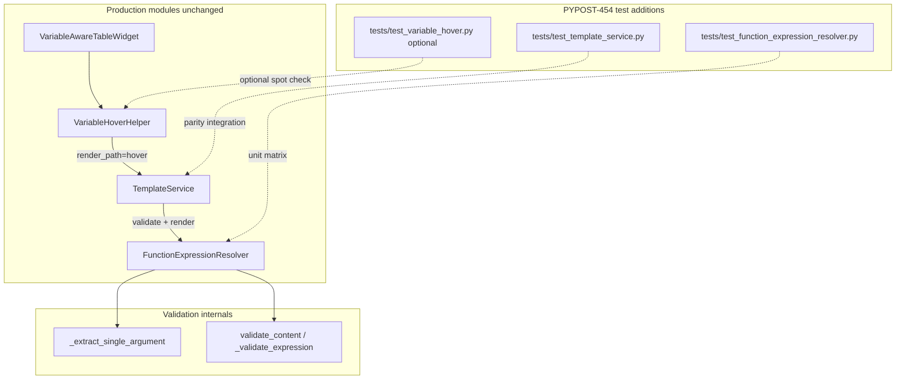
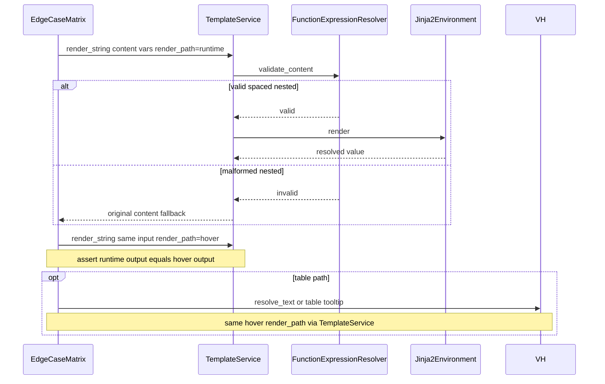

# PYPOST-454: Add edge-case tests for expression variants

## Research

### Codebase context

- **`FunctionExpressionResolver`** (`pypost/core/function_expression_resolver.py`) owns
  structural validation for `{{ ... }}` function placeholders. PYPOST-453 added recursive
  allow-list policy; behavior is unchanged for this ticket unless a parity bug is found.
- **`_extract_single_argument`** (lines 79–92) implements **parenthesis-depth tracking** so
  commas inside nested calls do not split arity. It returns `args.strip()` when no top-level
  comma is found; it does **not** independently verify balanced parentheses — malformed
  nesting is surfaced when the inner argument fails `_FUNCTION_SIGNATURE_RE.fullmatch` or
  recursive `_validate_expression` returns `invalid_syntax` / `invalid_argument`.
- **`validate_content`** strips inner expressions via `re.findall(r"\{\{\s*(.*?)\s*\}\}", ...)`
  then `expression.strip()` before validation — delimiter and inner whitespace are tolerated
  for forms the grammar already accepts.
- **`TemplateService`** (`pypost/core/template_service.py`) delegates validation to the
  resolver; `render_string(..., render_path="runtime"|"hover")` is the parity surface for
  integration tests. Invalid expressions fall back to **original content** (PYPOST-450
  backward-compatible behavior).
- **`VariableHoverHelper`** calls `TemplateService.render_string(..., render_path="hover")`
  from `resolve_text`; table-cell tooltips use the same resolution path via
  `VariableAwareTableWidget`.

### Current test coverage vs gaps (PYPOST-450 tech debt)

| PYPOST-450 missing-test item | Existing coverage | Gap |
| --- | --- | --- |
| Deeply nested **malformed** expressions (unbalanced depth) | Resolver: `test_invalid_syntax_unclosed_call` (`{{ urlencode(db }}`) — **single-level** only. TemplateService: `test_render_function_with_malformed_parenthesis_returns_original_content` (`{{urlencode(db}}`) — **single-level** render fallback only. | No nested malformed cases (e.g. missing inner `)`, extra depth paren) in resolver or integration suites. |
| **Whitespace-heavy** variants in all contexts | Resolver: `test_whitespace_inside_delimiters` (`{{  md5( db )  }}`) — **single-level validation only**. | No nested spacing matrix; no `TemplateService` render/hover parity for spaced forms; no table-cell hover for spaced edge forms. |
| **Runtime/hover parity** for edge forms | TemplateService: `test_runtime_hover_parity_nested_valid` — **valid nested only** (`{{md5(urlencode(db))}}`, `subTest` over `runtime` / `hover`). | No paired parity for spacing variants or malformed nested fallbacks. |
| Table-cell hover parity for edge forms | `test_mouse_over_variant_b_function_in_table_cell_shows_runtime_value` — valid `{{base64(path)}}` only. | No table spot check for covered edge-case strings. |

**PYPOST-453 baseline (not re-tested here):** policy constant, valid/invalid nested policy
violations, runtime/hover parity for **valid** nested chains. PYPOST-454 extends the matrix
to **malformed nesting**, **spacing variants**, and **parity for those forms**.

### Production-code change expectation

Requirements and PYPOST-450 tech debt assume **tests-only** delivery. Resolver and
`TemplateService` are stable after PYPOST-453; edge-case tests document and lock current
behavior. A **minimal fix** in `function_expression_resolver.py` or `template_service.py` is
allowed only if a new parity test proves runtime ≠ hover (or table ≠ hover) for a covered
edge form.

### External pattern references (web)

- **`unittest.TestCase.subTest()`** — standard library parametrization: loop over case tables
  inside one test method; failures are isolated and labeled with `**params` (Python docs,
  "Distinguishing test iterations using subtests"):
  https://docs.python.org/3/library/unittest.html#distinguishing-test-iterations-using-subtests
  PYPOST-453 already uses this for `test_runtime_hover_parity_nested_valid`; PYPOST-454
  extends the same pattern to edge-case matrices (no new test framework).
- **Table-driven case lists** — maintain a list of `(label, content, variables, expected)`
  or dict rows; iterate with `subTest` so one failure does not abort the matrix (Ganssle,
  "Subtests in Python"):
  https://blog.ganssle.io/articles/2020/04/subtests-in-python.html
- **Parity / differential testing** — run the **same input** through multiple execution
  paths (runtime render, hover render, optional table resolve) and assert **identical
  user-visible output**; differences indicate a defect in one path (differential testing
  overview):
  https://www.soliditytestingbook.com/advanced/differential-tests
  LocalStack parity-testing docs describe the same equivalence principle across contexts:
  https://github.com/localstack/localstack/blob/master/docs/testing/parity-testing/README.md

## Implementation Plan

Test additions only — **no production changes** unless parity bug discovered (see §4).

### Phase 1 — Resolver unit tests (`tests/test_function_expression_resolver.py`)

1. **Malformed nested expressions** — table-driven `validate_content` cases where nesting
   structure is syntactically broken at depth (not empty-args or standalone closing-paren
   patterns owned by PYPOST-461). Representative examples:
   - `{{ md5(urlencode(db) }}` — missing inner closing paren
   - `{{ md5(urlencode(db))) }}` — extra closing paren inside nested argument
   - `{{ md5((urlencode(db))) }}` — unbalanced extra open paren at nested level
   Assert predictable rejection codes (`invalid_syntax` and/or `invalid_argument` per
   today's behavior) and **lock** them — do not change codes unless parity fix requires it.
2. **Nested spacing variants** — extend beyond `test_whitespace_inside_delimiters`:
   - Valid: `{{  md5( urlencode( db ) )  }}` → `is_valid`
   - Valid: spaced delimiter + nested chain variants that product already accepts
   - Invalid spaced forms that today fail (if any discovered during research) → same codes as
     tight equivalents
3. **Regression guard** — run full `TestFunctionExpressionResolver`; existing PYPOST-453 cases
   must remain green.

### Phase 2 — TemplateService integration (`tests/test_template_service.py`)

1. **Runtime/hover parity — valid spacing** — new test (or extend parity class) using
   `subTest(render_path=...)` pattern from `test_runtime_hover_parity_nested_valid`:
   - Input: `{{  md5( urlencode( db ) )  }}`, variables `{"db": "a b"}`
   - Assert identical resolved hash in `runtime` and `hover`
2. **Runtime/hover parity — malformed nested fallback** — `subTest` over `runtime` / `hover`
   for each malformed nested string from Phase 1:
   - Assert **original content** returned in both paths (same as single-level malformed test)
3. **Validation alignment** — paired `validate_function_expressions` assertions for malformed
   nested rows (codes match resolver unit expectations)
4. **No new observability tests** unless a fix changes metric/logging paths (out of scope per
   requirements).

### Phase 3 — VariableHoverHelper spot check (optional)

Per PYPOST-453 precedent: **`TemplateService`-level paired parity is sufficient for DoD**.
An optional hardening test in `tests/test_variable_hover.py`:

- `resolve_text` with one **valid spaced nested** expression → same resolved value as
  `render_string(..., render_path="hover")`
- Optionally one **malformed nested** → token preserved in resolved text (matches invalid
  variant-b behavior in `test_resolve_text_invalid_variant_b_function_keeps_token`)

**Table-cell path (requirements DoD #3):** requirements include table-cell hover. Approach:

- **Required (DoD 3):** parity proven at `TemplateService` `render_path="hover"` satisfies
  table-cell hover because `VariableAwareTableWidget` → `VariableHoverHelper.resolve_text` →
  `TemplateService.render_string(..., render_path="hover")` — no separate table parsing path.
- **Optional:** one `TestVariableAwareTableWidgetTooltips` test with a spaced or malformed
  nested cell string if STEP 3 wants explicit UI-path confirmation (same precedent as
  PYPOST-453 optional `resolve_text`).

### Phase 4 — Fix-on-discovery (conditional)

If Phase 2 parity tests fail (runtime ≠ hover for same input):

1. Reproduce with minimal case; identify diverging path in resolver vs orchestration only.
2. Apply **smallest fix** in `function_expression_resolver.py` or `template_service.py` —
   no new modules, no policy change, no catalog change.
3. Extend test to lock fixed parity; document fix in STEP 6 tech-debt note.

### Explicitly out of scope

- **PYPOST-461:** empty-argument calls (`{{md5()}}`), multi-placeholder first-failure
  stability, standalone malformed closing-paren / arity patterns not primarily about
  **nested structure** or **spacing**.
- New functions, nesting policy changes, resolver extraction, caching, observability.
- New test infrastructure (pytest, snapshot frameworks, custom runners).

### STEP 2 bookkeeping

Architecture artifact complete; roadmap STEP 2 remains `[/]` until user approval per
`.cursor/rules/20-architecture.mdc`.

## Architecture

### Module diagram



### Test module responsibilities

**`tests/test_function_expression_resolver.py`** — **structural edge-case unit guard**

- Owns malformed nested validation matrix (unbalanced / incomplete nesting at depth).
- Owns nested and single-level spacing validation matrix.
- Fast, no Jinja render — asserts `ValidationResult` codes only.
- Does **not** assert runtime/hover outcomes (delegated to integration).

**`tests/test_template_service.py`** — **orchestration + parity guard**

- Owns runtime vs hover `subTest` parity for valid spaced nested expressions.
- Owns runtime vs hover parity for malformed nested fallback (original content).
- Owns `validate_function_expressions` alignment for malformed nested rows.
- Reuses existing test classes (`TestTemplateServiceRenderString`,
  `TestTemplateServiceValidationOutcomes`) — add methods, do not restructure suites.

**`tests/test_variable_hover.py`** — **optional thin-path confirmation**

- Not required for DoD if Phase 2 parity tests land (PYPOST-453 precedent).
- If added: at most one `resolve_text` spaced-valid case and/or one table tooltip spot check.

### Malformed nested test matrix (resolver + integration)

| ID | Example content | Resolver expectation | Render runtime / hover |
| --- | --- | --- | --- |
| M1 | `{{ md5(urlencode(db) }}` | `invalid_argument`, `function_name="md5"` | original content, both paths |
| M2 | `{{ md5(urlencode(db))) }}` | `invalid_argument`, `function_name="urlencode"` | original content, both paths |
| M3 | `{{ md5((urlencode(db))) }}` | `invalid_argument`, `function_name="md5"` | original content, both paths |
| M4 | `{{ base64(md5(urlencode(db) }}` | `invalid_argument`, `function_name="base64"` | original content, both paths |

Codes are **observed and locked** (verified against current `FunctionExpressionResolver`
behavior in STEP 3). M1, M2, M4 initially assumed `invalid_syntax` or outer `function_name`
for M2 in STEP 2; tests corrected to the table above. STEP 6 updated this matrix to match
`MALFORMED_NESTED_EXPRESSION_CASES` in `tests/test_function_expression_resolver.py`.

### Spacing variant test matrix

| ID | Example content | Valid? | Resolver | Parity render runtime + hover |
| --- | --- | --- | --- | --- |
| S1 | `{{  md5( db )  }}` | yes | valid (exists) | same hash as `{{md5(db)}}` |
| S2 | `{{  md5( urlencode( db ) )  }}` | yes | valid | same hash as tight nested form |
| S3 | `{{md5( urlencode(db))}}` | yes | valid | parity with tight form |
| S4 | `{{ md5 ( urlencode ( db ) ) }}` | no | `invalid_syntax` | original content, both paths |
| S5 | `{{md5(urlencode (db))}}` | no | `invalid_argument`, `function_name="md5"` | original content, both paths |

Invalid spacing rows (S4, S5) satisfy DoD 2 **invalid with consistent fallback**; valid rows
(S1–S3) satisfy DoD 2 **valid where accepted today**.

### Parity interaction flow



1. Test defines case row (content, variables, expected outcome type: resolved vs fallback).
2. Loop `render_path in ("runtime", "hover")` with `subTest`.
3. Compare outputs — **equality** is the parity assertion.
4. Table coverage: same hover pipeline; optional UI test duplicates one row.

### Patterns and conventions

| Pattern | Use in PYPOST-454 | Rationale |
| --- | --- | --- |
| `subTest(**params)` | Parity loops over `render_path`, malformed rows, spacing rows | Matches PYPOST-453; stdlib only |
| Table-driven `cases` list | Resolver and integration matrices | One place to add rows; clear labels on failure |
| Parity assertion | `assertEqual(runtime, hover)` per case | Differential-testing equivalence principle |
| No new infrastructure | `unittest.TestCase` only | Project convention; avoids pytest dependency |
| Fix-on-discovery | Conditional minimal prod patch | Requirements allow parity restore only |

**Interfaces under test (unchanged signatures):**

```python
# Resolver — validation only
resolver.validate_content(content: str) -> ValidationResult

# TemplateService — parity surface
svc.render_string(content, variables, render_path="runtime"|"hover") -> str
svc.validate_function_expressions(content) -> ValidationResult

# Optional hover spot check
VariableHoverHelper.resolve_text(text, variables) -> str
```

### Security boundary (unchanged — tests confirm)

- Malformed and spaced forms must not bypass `FunctionRegistry.is_allowed` or single-argument
  rules.
- Nested malformed cases use only catalog names (`md5`, `urlencode`, `base64`) — no new
  callable surface through formatting quirks.
- Tests are **negative guards** as much as parity guards: invalid edge forms stay invalid.

### Requirements traceability

| Requirement / DoD (`10-requirements.md`) | Architecture anchor |
| --- | --- |
| DoD 1 — Malformed nested acceptance checks | **Phase 1**; **Malformed nested matrix** |
| DoD 2 — Spacing variants valid/invalid | **Phase 1–2**; **Spacing variant matrix** |
| DoD 3 — Runtime/hover/table parity for edge forms | **Phase 2**; **Parity interaction flow**; table via hover pipeline |
| DoD 4 — No behavior change unless parity bug | **Production-code change expectation**; **Phase 4** |
| DoD 5 — Trace to PYPOST-450 tech debt | **Research** gaps table |
| DoD 6 — Jira / follow-up chain | This artifact; PYPOST-461 boundary in **Q&A** |
| NFR consistency | **Parity interaction flow** |
| NFR stability | **Phase 1** regression guard |
| NFR maintainability | Table-driven matrices, focused test methods |
| NFR security | **Security boundary** section |

## Q&A

- **Why no production changes by default?** PYPOST-453 aligned policy and happy paths; edge
  behavior already exists in production. This ticket closes **missing-test** debt from
  PYPOST-450 without risking regressions for valid templates.
- **What is the boundary with PYPOST-461?** PYPOST-454 owns **nested-structure** malformation
  (unbalanced/incomplete nesting at depth) and **whitespace-heavy** variants plus parity for
  those forms. PYPOST-461 owns **empty-argument** calls, **multi-placeholder first-failure**
  behavior, and standalone **closing-paren / arity** patterns not primarily nesting-structure
  cases. Overlap (e.g. nested call missing one close paren): PYPOST-454 asserts
  runtime/hover/table parity for the nesting/spacing dimension; PYPOST-461 owns the broader
  empty-arg and multi-token matrix unless explicitly coordinated.
- **Are table cells required in tests?** **Yes** per requirements DoD 3 — satisfied by proving
  parity at `TemplateService` `render_path="hover"` because table widgets delegate through
  `VariableAwareTableWidget` → `resolve_text` → `render_string(..., hover)`. An explicit
  `VariableAwareTableWidget` tooltip test is **optional** hardening (PYPOST-453 precedent).
- **Why `subTest` instead of pytest parametrization?** Project uses stdlib `unittest`;
  PYPOST-453 established `subTest` for parity; no new dependencies.
- **What if resolver and render disagree on a malformed case?** Treat as parity bug; **Phase 4**
  minimal fix. Tests should use integration assertions as source of truth for user-visible
  outcome.
- **Does `_extract_single_argument` need its own tests?** Malformed nested cases **exercise**
  paren-depth parsing indirectly; no separate private-method test module — keep assertions on
  public `validate_content` and `render_string` outcomes.
- **Who is the audience?** Maintainers; tests guard future validation changes against silent
  runtime/hover drift on edge forms.

## Links

- Python `unittest` subtests:
  https://docs.python.org/3/library/unittest.html#distinguishing-test-iterations-using-subtests
- Subtests in Python (Ganssle):
  https://blog.ganssle.io/articles/2020/04/subtests-in-python.html
- Differential testing overview:
  https://www.soliditytestingbook.com/advanced/differential-tests
- LocalStack parity testing:
  https://github.com/localstack/localstack/blob/master/docs/testing/parity-testing/README.md
- PYPOST-450 tech debt (source of missing tests):
  `ai-tasks/PYPOST-450/60-tech-debt.md`
- PYPOST-453 architecture (sibling style / parity precedent):
  `ai-tasks/PYPOST-453/20-architecture.md`
