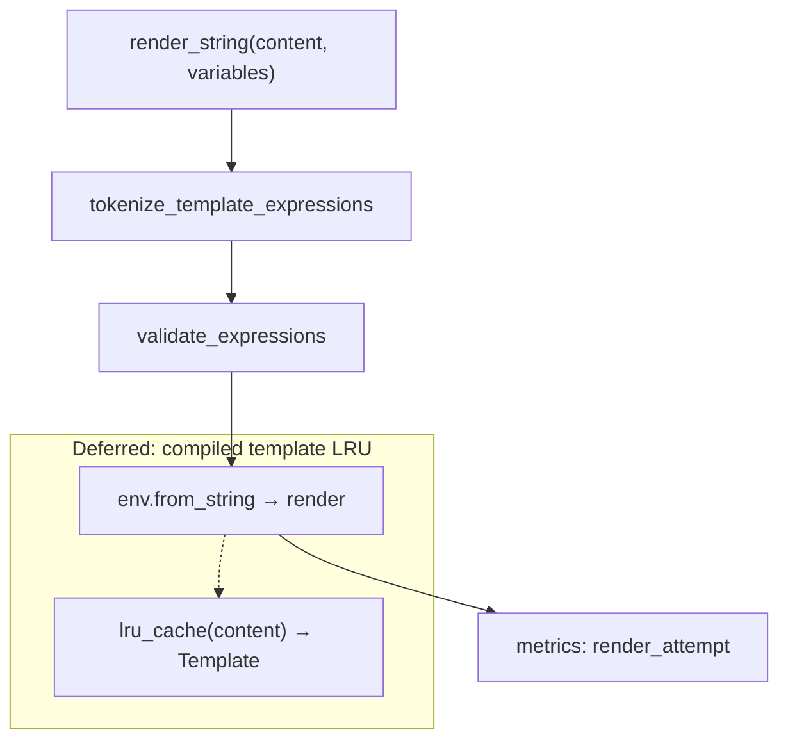

# PYPOST-455: Template render caching evaluation

## Research

### Current render pipeline

`TemplateService.render_string` (post-PYPOST-460):

1. Tokenize once (`tokenize_template_expressions`)
2. Validate expressions (`FunctionExpressionResolver.validate_expressions`)
3. Compile + render (`Environment.from_string` → `template.render`)
4. Emit metrics/logs on success or fallback

Callers per HTTP request (`HTTPClient._prepare_request_kwargs`):

- URL: 1× (or reused when pre-rendered)
- Headers: 2× per header (key + value)
- Params: 2× per param (key + value)
- Body: 1×

Additional paths: MCP (`RequestService`), hover (`VariableHoverHelper`), masking
(`SensitiveDataMaskingPolicy`), cURL export.

### Jinja2 caching behavior

- A single shared `Environment` is reused (PYPOST-21, PYPOST-144 DI).
- `from_string` compiles a new `Template` each call; Jinja2 does **not** cache compiled bytecode
  for `from_string` by default ([Jinja2 API — BytecodeCache](https://jinja.palletsprojects.com/en/stable/api/#bytecode-cache)).
- `env.get_template` with filesystem loaders benefits from internal caching; pypost uses inline
  strings only.

### Micro-benchmark (local, 2026-06-11, CPython 3.x, 10k iterations)

| Scenario | µs/render | Notes |
| --- | ---: | --- |
| Plain `{{host}}/{{id}}` | ~130 | Two simple placeholders |
| Function `{{urlencode(host)}}` | ~152 | Validation + one catalog call |
| Nested `{{base64(md5(token))}}` | ~182 | Deepest supported chain |
| Large (50 placeholders) | ~1360 | Stress; uncommon in practice |
| Simulated HTTP request | ~708 µs | URL + 5 headers + 3 params + body |

Full request render cost is **sub-millisecond** on developer hardware. Network I/O dominates.

### Observability (existing)

`MetricsManager.track_template_expression_render_attempt(render_path, outcome)`:

- `outcome`: `success`, `validation_error`, `render_error`, `empty_content`
- Label `render_path`: `runtime`, `hover`, etc.

`track_template_expression_validation_failure` adds `code` and `function_name`.

No render-duration histogram exists today; counters are sufficient for volume signals.

### Caching options considered

| Strategy | Key | Benefit | Risk / cost |
| --- | --- | --- | --- |
| A. Compiled template LRU | `content` str | Skip `from_string` compile | Memory bound; catalog/env changes rare but possible |
| B. Validation result LRU | `content` str | Skip resolver on repeats | Must invalidate if catalog changes |
| C. BytecodeCache on `Environment` | Jinja-internal | Standard Jinja path | Setup + eviction policy; `from_string` still allocates Template |
| D. Full render memo | `(content, frozenset(vars))` | Maximum reuse | Low hit rate (vars change); masking/hover diversity |

**PYPOST-460** already removed duplicate tokenization — the remaining redundant work is
compile + validation per identical `content`.

## Implementation Plan

**Decision: defer caching implementation.**

Rationale:

1. Measured cost is negligible vs network latency for typical desktop usage.
2. Observability counters exist to detect volume growth before optimizing.
3. Cache adds invalidation complexity (catalog growth, testing burden) with no current user pain.
4. Large multi-placeholder templates are rare; if they appear, optimize that case specifically.

**Deliverables (this task):**

1. Document benchmark summary and decision in `doc/dev/template_expression_functions.md`.
2. Add guard tests (`tests/test_template_service_caching_eval.py`) for idempotency properties
   required by any future cache.
3. Record revisit criteria in `60-tech-debt.md`.

**If revisiting later (not in scope now):**

- Prefer **Strategy A** — `functools.lru_cache` on `_compile_template(content)` with
  `maxsize=256` (bounded; template strings are small in number per session).
- Add `cache_info()` debug logging behind DEBUG level only.
- Do **not** cache rendered output across variable sets without profiling proof.

## Architecture

### Revisit triggers

| Signal | Action |
| --- | --- |
| Hover lag reports with function templates | Profile hover path; consider compile cache |
| `template_expression_render_attempts` sustained high rate | Add duration metric; evaluate LRU |
| Templates with 20+ placeholders in production | Targeted optimization or user guidance |

## Q&A

- **Q:** Why not add cache now if it's cheap?
  **A:** Sub-ms cost does not justify new code paths, tests, and invalidation rules for a
  desktop client with no reported performance issues.
- **Q:** Did PYPOST-460 make caching unnecessary?
  **A:** It removed duplicate scans; compile-per-call remains the largest repeatable cost.
