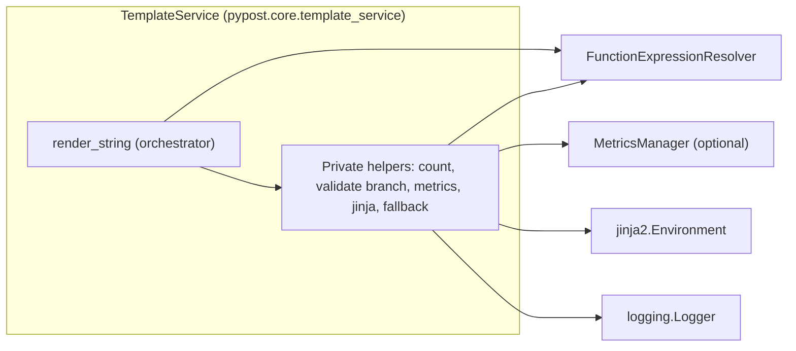

# PYPOST-459: Template rendering orchestration refactor (staged helpers)

## Research

- **Extract Method (Extract Function)** breaks a long routine into named units so readers can
  follow orchestration without re-reading implementation details. See Martin Fowler’s catalog
  entry: [Extract Method](https://refactoring.com/catalog/extractMethod.html).
- **Extract Method** (step-by-step motivation and mechanics) is also summarized for quick
  reference at:
  [Extract Method — Refactoring Guru](https://refactoring.guru/extract-method).
- **Compose Method** (keep high-level methods reading like a summary of steps) complements
  extraction when the goal is orchestration clarity:
  [Compose Method](https://refactoring.com/catalog/composeMethod.html).
- **PEP 8** and explicit typing keep extracted helpers consistent and reviewable in Python:
  [PEP 8 — Style Guide for Python Code](https://peps.python.org/pep-0008/), and
  [typing — Support for type hints](https://docs.python.org/3/library/typing.html).
- **Project Python rules:** follow `.cursor/lsr/do-python.md` for layout, typing, and tests.

## Implementation Plan

1. **Inventory current behavior** in `TemplateService.render_string` (empty short-circuit,
   expression token count, validation, success path, `ValueError` fallback, generic exception
   fallback, and all metric and log emissions). Treat this as the parity contract; no semantic
   changes.
2. **Extract pure or near-pure helpers** first (for example, placeholder counting) so unit
   tests can lock regex and counting behavior without mocking metrics.
3. **Extract validation-phase observability** (info log plus `validation_error` and
   `validation_failure` metrics) into a dedicated private method invoked only when
   `ValidationResult.is_valid` is false, immediately before raising `ValueError` with
   `_validation_message`.
4. **Extract render execution** into a small method that performs `Environment.from_string` and
   `render`, letting exceptions propagate to the existing outer `try`/`except` structure.
5. **Extract success and failure observability** so `render_string` reads as a short sequence:
   validate → render → record success; on failure, delegate to a helper that preserves today’s
   `ValueError` vs other-exception split (`render_error` only for non-`ValueError`).
6. **Keep `FunctionExpressionResolver` unchanged** (no nested-call policy or grammar redesign;
   defer duplicate scanning optimizations to PYPOST-460).
7. **Run and extend tests** so stages remain covered by existing integration tests and any new
   focused tests for extracted helpers.
8. **Document stages at the orchestrator** — extend the `render_string` docstring (or a short
   adjacent comment block) with a numbered list of stages matching the implementation so
   maintainers can map code to troubleshooting steps (per requirements: tests and docs align
   with stages).

## Architecture

### Module diagram



Only validation-stage code paths call `FunctionExpressionResolver`; the diagram collapses
helpers for readability.

### Responsibilities

| Component | Responsibility |
| --- | --- |
| `render_string` | Orchestrate stages; keep public API, returns, and fallback semantics |
| Placeholder counting helper | Compute `expression_count` for logs/metrics (same regex as today) |
| Validation branch helper | Run `validate_content`; on invalid, emit validation observability |
| Render helper | Build template from string and render with variables |
| Success observability helper | Emit success metric and debug log |
| Fallback helper | Map exceptions to warnings; optional `render_error` metric; return original |
| `FunctionExpressionResolver` | Unchanged validation semantics (out of scope for this ticket) |
| `MetricsManager` | Unchanged metric names and outcome strings |

### Interaction flow

1. **Empty content**: if falsy `content`, record `empty_content` attempt (when metrics present),
   return `""`. (Preserve current handling of `None` if tests rely on it.)
2. **Count**: compute `expression_count` via the same `re.findall` pattern as today.
3. **Validate**: call `_function_expression_resolver.validate_content(content)`.
4. **Invalid**: log at INFO with render path, code, function name, token count; record
   `validation_error` and `validation_failure`; raise `ValueError` with `_validation_message`
   **inside the same `try`** as rendering (callers do not see an escaping exception).
5. **Valid render**: `from_string` + `render`; on success record `success` and DEBUG log.
6. **`ValueError`**: WARNING log with `error_type=ValueError`, return original `content` (no
   `render_error` metric for this case in current code). **Parity note:** any `ValueError`
   raised inside that `try`—including validation failure before `from_string`—hits this
   handler; none of these propagate from `render_string` today; preserving that is in scope.
7. **Other exceptions**: WARNING log; record `render_error` when metrics present; return original
   `content`. Only `Exception` subclasses are caught (not `BaseException`), matching current
   `except Exception` behavior.

### Patterns

- **Extract Method / Compose Method**: orchestrator stays thin; helpers carry single reasons to
  change (counting, validation-side effects, Jinja execution, outcome recording).
- **Composition over “god method”**: avoid growing `render_string`; prefer private methods on
  the same class to limit blast radius and keep resolver/registry wiring unchanged.
- **Parity-first refactor**: behavior and observability fields match existing messages and metric
  keys; refactors are structural only unless a test gap is discovered.

### Proposed private helpers (names and signatures)

Exact names may be adjusted during implementation; signatures reflect typing and stage
boundaries.

```python
def _count_placeholder_expressions(self, content: str) -> int:
    """Return count of `{{ ... }}` matches using the same regex as today."""


def _record_empty_render_attempt(self, render_path: str) -> None:
    """Emit `empty_content` template render attempt when metrics are configured."""


def _validate_template_content(self, content: str) -> ValidationResult:
    """Delegate to `_function_expression_resolver.validate_content` (no policy change)."""


def _emit_validation_failure_observability(
    self,
    validation: ValidationResult,
    render_path: str,
    expression_count: int,
) -> None:
    """INFO log plus validation metrics; caller raises ValueError afterward."""


def _render_with_jinja(self, content: str, variables: dict) -> str:
    """`Environment.from_string` and `render`; does not catch exceptions."""


def _emit_render_success_observability(
    self,
    render_path: str,
    expression_count: int,
) -> None:
    """Success metric (if configured) and DEBUG log."""


def _fallback_content_after_render_exception(
    self,
    exc: Exception,
    content: str,
    render_path: str,
    expression_count: int,
) -> str:
    """
    WARNING log always; `render_error` metric only for non-ValueError.
    Returns original `content`. Type `Exception` matches outer `except Exception`, not
    `BaseException` (parity for KeyboardInterrupt / SystemExit).
    """
```

**Note:** PYPOST-460 may later replace `_count_placeholder_expressions` with a shared
tokenization utility shared with the resolver; this ticket keeps the existing regex and does not
deduplicate scans.

### Parity checklist (implementer)

Tick after extraction; any drift needs explicit ticket scope.

| Signal | Expected parity |
| --- | --- |
| Empty content | `outcome=empty_content` when metrics on; return `""` |
| Invalid validation | INFO + validation metrics; internal `ValueError`; then WARNING fallback;
  return original `content` |
| Success | `outcome=success`; DEBUG log fields |
| `ValueError` in try | WARNING fallback; **no** `render_error` |
| Other `Exception` | WARNING fallback; `outcome=render_error` when metrics on |
| Regex for token count | Same pattern as pre-refactor `re.findall` |

## Testing expectations

- **Regression**: existing `tests/test_template_service.py` cases for `render_string`, validation
  outcomes, and observability (metrics mock) must pass unchanged in behavior.
- **Stage-oriented tests (recommended for DoD):** add or extend tests that are named or
  parameterized by stage (empty, invalid, success, valueerror fallback, render_error) so CI
  output maps to orchestration steps.
- **Unit tests for helpers:** direct tests for `_count_placeholder_expressions` and
  `_fallback_content_after_render_exception` are **recommended** to lock regex counting and
  metric gating without full Jinja paths.
- **No changes** to `FunctionExpressionResolver` contract tests beyond what existing suites
  already assert; nested-call policy remains owned by PYPOST-453 and related tickets.
- **Manual verification** not required if CI green; parity is the acceptance bar.
- **Types at call sites:** confirm whether any caller passes non-`str` `content` besides empty
  or `None` before tightening type hints; parity first.

## Requirements traceability

| Requirement (10-requirements.md) | Architecture coverage |
| --- | --- |
| Preserve user-visible rendering behavior | Parity on branches/fallbacks; resolver unchanged |
| Clear orchestration stages | Helpers plus thin `render_string`; see module diagram |
| Maintainability / smaller review units | Extract Method; responsibility table |
| Tests protect behavior | See `tests/test_template_service.py`; helper tests recommended |
| Python implementation | Typed helpers; PEP 8 per `.cursor/lsr/do-python.md` |
| Out of scope: new features / policy | Non-goals listed; PYPOST-460 for shared tokenization |

## Q&A

- **Will metric names or log message strings change?** No; this is a structural refactor unless
  an existing inconsistency is found and fixed under a separate ticket.
- **Why not merge validation into fewer calls?** The resolver stays the single authority;
  `TemplateService` only orchestrates and records outcomes.
- **Why defer token sharing?** PYPOST-460 tracks shared tokenization; doing it here would expand
  scope and risk parity.

## Independent peer review

Third-party review (unfocused): parity-first plan is sound and implementable; gaps were
documentation of stages vs requirements story, `BaseException` vs `Exception` in helper
signature, optional helper tests vs “tests map to stages,” and a concrete parity checklist for
logs/metrics. Recommendation: **approve with notes** — small doc revisions, not a full
rewrite.

**Status after revisions:** findings above were folded into Implementation Plan step 8, parity
checklist, `Exception` typing, test stance, `ValueError` parity note, and Architect response.

## Architect response

- **Stage documentation:** Implementation Plan step 8 plus parity checklist; `render_string`
  docstring lists stages.
- **`Exception` typing:** Fallback helper uses `Exception`, not `BaseException`; flow notes
  `except Exception` parity.
- **Tests vs stages:** Stage-named or parameterized tests are **recommended for DoD**; helper
  unit tests are **recommended** (not “optional only”).
- **Parity checklist:** New table covers outcomes and log/metric expectations.
- **`ValueError` vs `render_error`:** Documented quirk: render-path `ValueError` skips
  `render_error` today; parity preserved.
- **`_validate_template_content`:** Kept as a thin “Validate” stage; acceptable indirection.
- **`variables` typing:** Align with `TemplateService` / project conventions at implement time.
- **Diagram:** `H1 --> FER` stays simplified; only orchestration touches the resolver.
- **LSR:** Research references `.cursor/lsr/do-python.md`.
- **`doc/dev` updates:** This ticket targets **code-level** stage docs; `doc/dev` changes only
  if STEP 7 or a follow-up asks for them.

## Links

- Jira: [PYPOST-459](https://pypost.atlassian.net/browse/PYPOST-459)
- Requirements: `ai-tasks/PYPOST-459/10-requirements.md`
- Related tech-debt notes: `ai-tasks/PYPOST-452/60-tech-debt.md`
- Future optimization: [PYPOST-460](https://pypost.atlassian.net/browse/PYPOST-460) (shared
  tokenization; out of scope here)
- Implementation target: `pypost/core/template_service.py`
