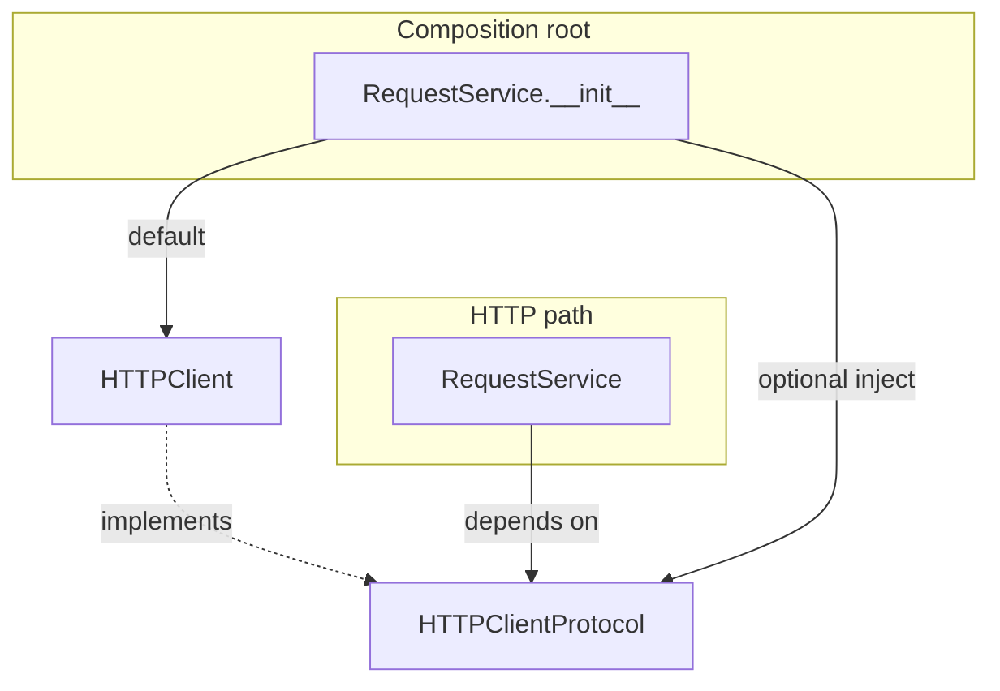

# PYPOST-46: HTTPClientProtocol architecture

## Research

- PYPOST-382 added constructor `http_client` injection typed as concrete `HTTPClient`.
- PYPOST-73 established `MetricsTrackerProtocol` as the pattern for consumer-facing seams.
- `RequestService` calls only `http_client.send_request(...)` on the HTTP path.

## Implementation Plan

1. Add `pypost/core/http_client_protocol.py` with `@runtime_checkable HTTPClientProtocol`.
2. Mirror `send_request` signature from `HTTPClient`.
3. Change `RequestService` parameter and attribute typing to `HTTPClientProtocol`.
4. Keep default `HTTPClient(...)` construction when `http_client is None`.
5. Add `tests/test_http_client_protocol.py` with `isinstance` and mock tests.
6. Update `doc/dev/testability.md` — move PYPOST-46 from "out of scope" to documented pattern.

## Architecture

### Type boundaries

| Layer | Type | Rationale |
| --- | --- | --- |
| `RequestService` | `HTTPClientProtocol` | Orchestration depends on send surface only |
| Default path | `HTTPClient` | Production transport with templates and metrics |
| Tests | `MagicMock(spec=HTTPClientProtocol)` | Focused fake without subclassing |

### Alternatives considered

| Option | Verdict |
| --- | --- |
| `Protocol` on `send_request` | **Selected** — matches PYPOST-73, minimal diff |
| ABC base class | Rejected — structural typing fits duck-typed client |
| Rename class to `HTTPClientImpl` | Rejected — unnecessary churn |
