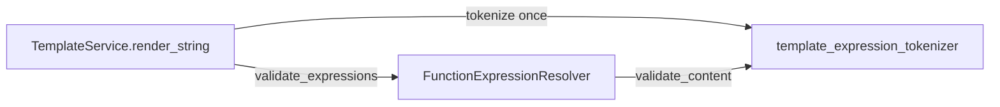

# PYPOST-460: Shared template expression tokenization

## Research

- **DRY for regex contracts:** one compiled pattern avoids divergent placeholder detection
  between counting and validation ([PEP 8](https://peps.python.org/pep-0008/) module layout).
- **Single pass on hot path:** `render_string` tokenizes once, passes `list[str]` to
  `validate_expressions`, and uses `len` for metrics — same outcome as count + validate with
  two scans.

## Implementation Plan

1. Add `pypost/core/template_expression_tokenizer.py` with
   `tokenize_template_expressions(content) -> list[str]` using the existing non-greedy inner
   capture pattern.
2. Add `FunctionExpressionResolver.validate_expressions(expressions)`; keep
   `validate_content` as tokenizer + delegate.
3. Update `TemplateService.render_string` to tokenize once, count via `len`, validate via
   `validate_expressions`.
4. Remove `_count_placeholder_expressions` and unused `re` import from `template_service`.
5. Add focused tokenizer unit tests; run existing resolver and template service tests.

## Architecture

### Responsibilities

| Component | Responsibility |
| --- | --- |
| `tokenize_template_expressions` | Canonical `{{ ... }}` inner extraction |
| `validate_expressions` | Validate pre-tokenized inner strings |
| `validate_content` | Tokenize + validate (standalone API) |
| `render_string` | Single tokenization for count + validation |

### Parity contract

- Pattern: `\{\{\s*(.*?)\s*\}\}`
- Inner strings passed to validation are `.strip()`-ped per expression (unchanged).
- `token_count` in logs/metrics = number of placeholders (unchanged).
