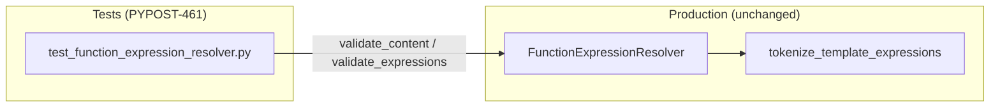

# PYPOST-461: Expand FunctionExpressionResolver edge-case test matrix

## Research

### Codebase context

- **`FunctionExpressionResolver`** (`pypost/core/function_expression_resolver.py`) validates
  inner `{{ ... }}` expressions via `validate_content` → `validate_expressions` → per-expression
  `_validate_expression`. PYPOST-454 locked malformed **nested-structure** and **spacing**
  matrices; PYPOST-461 closes the remaining PYPOST-450 missing-test debt.
- **`_extract_single_argument`** returns `args.strip()` when no top-level comma is found. An
  empty argument list (`md5()`) yields `""`, which fails identifier and function-signature
  checks → **`invalid_argument`** with the outer function name (not `invalid_arity`).
- **`validate_expressions`** iterates the pre-tokenized expression list in order and returns the
  **first** non-valid `ValidationResult` — this is the **first-failure** contract.
- **`tokenize_template_expressions`** (`pypost/core/template_expression_tokenizer.py`) extracts
  placeholders left-to-right; ordering is stable for multi-placeholder content.

### Current test coverage vs gaps

| Requirement | Existing coverage | Gap |
| --- | --- | --- |
| Empty-argument calls (`md5()`) | None | Add table-driven resolver cases |
| Malformed nested parenthesis | `MALFORMED_NESTED_EXPRESSION_CASES` M1–M4 (PYPOST-454) | Retain; add standalone extra-closing-paren rows |
| Multi-placeholder first-failure | `test_multiple_placeholders_all_valid` only | Add mixed valid/invalid left-to-right matrix |
| First-failure documentation | Boundary note in `template_expression_functions.md` | Document semantics and test locations |

### Production-code change expectation

**Tests-only delivery.** Resolver behavior is stable; tests lock observed codes. A minimal fix
is allowed only if a new test proves incorrect first-failure ordering or wrong error codes.

## Implementation Plan

### Phase 1 — Resolver unit tests (`tests/test_function_expression_resolver.py`)

1. **`EMPTY_ARGUMENT_CASES`** — `{{ md5() }}`, `{{ urlencode() }}`, `{{ base64() }}` →
   `invalid_argument` + function name.
2. **`STANDALONE_MALFORMED_CLOSING_PAREN_CASES`** — extra closing paren at top level (not
   primarily nested-structure): `{{ urlencode(db)) }}`, `{{ md5(x)) }}` → observed codes.
3. **`MULTI_PLACEHOLDER_FIRST_FAILURE_CASES`** — mixed valid/invalid placeholders; assert the
   leftmost failing expression wins (via `validate_content` and `validate_expressions`).
4. **Regression guard** — full `TestFunctionExpressionResolver` and project suite remain green.

### Phase 2 — Dev documentation (`doc/dev/template_expression_functions.md`)

1. Add **First-failure validation ordering** subsection under resolver contract.
2. Update PYPOST-461 boundary — mark empty-args, first-failure, and standalone closing-paren
   coverage **completed**; reference new test constants and methods.

### Explicitly out of scope

- Production changes to resolver grammar, nesting policy, or catalog.
- TemplateService integration / runtime-hover parity (PYPOST-454 precedent applies).
- New observability hooks (`FunctionExpressionResolver` remains log-free).

## Architecture

### Module diagram

### Observed error semantics (locked by tests)

| Pattern class | Example | Observed code | function_name |
| --- | --- | --- | --- |
| Empty argument | `{{ md5() }}` | `invalid_argument` | `md5` |
| Standalone extra `)` | `{{ urlencode(db)) }}` | `invalid_argument` | `urlencode` |
| Multi-placeholder | `{{ host }} {{ md5() }}` | `invalid_argument` | `md5` (second token) |
| Multi-placeholder | `{{ urlencode(x) }} {{ mystery(y) }}` | `unknown_function` | `mystery` |

Nested malformed M1–M4 remain owned by PYPOST-454 (`MALFORMED_NESTED_EXPRESSION_CASES`).

## Q&A

- **Why test `validate_expressions` directly?** It is the first-failure entry used by
  `TemplateService._validate_template_expressions` after a single tokenization pass
  (PYPOST-460). Direct tests document the contract without TemplateService coupling.
- **Boundary with PYPOST-454?** PYPOST-454 owns nested-structure malformation and spacing
  variants. PYPOST-461 owns empty-args, multi-placeholder first-failure, and standalone
  extra-closing-paren patterns at the top level.
