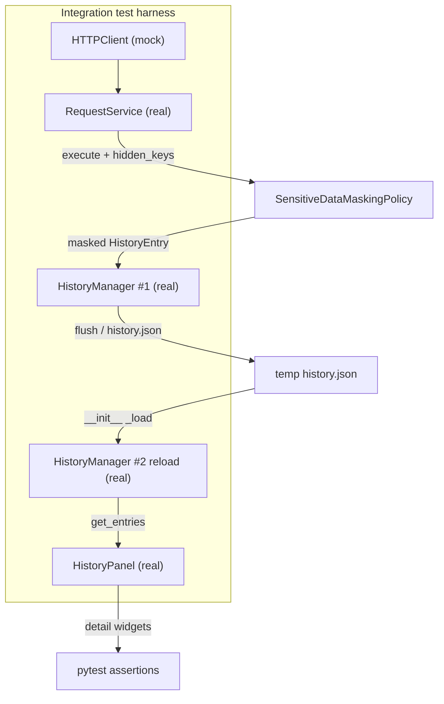

# PYPOST-462: Integration test for hidden-value masking across save/reload history flow

## Research

### Production wiring under test (PYPOST-446)

Hidden-variable masking for history is already implemented and spans four stages:

| Stage | Component | Responsibility |
| --- | --- | --- |
| 1 | `RequestService.execute` | Renders request, applies `SensitiveDataMaskingPolicy`, builds `HistoryEntry` |
| 2 | `SensitiveDataMaskingPolicy` | Masks hidden-derived values in URL, headers, body (`HIDDEN_PLACEHOLDER = "***"`) |
| 3 | `HistoryManager` | Appends entry, async-saves to `history.json`, reloads on init |
| 4 | `HistoryPanel` | Reads entries via `get_entries()`, displays URL/headers/body in detail widgets |

Key code paths:

- `RequestService.execute(..., variables=..., hidden_keys=...)` calls
  `_masking_policy.build_history_safe_fields(...)` before `HistoryEntry` creation
  (`pypost/core/request_service.py`).
- `HistoryManager.append` triggers `_save_async`; `flush()` blocks until the save thread
  completes — intended for tests (`pypost/core/history_manager.py`).
- `HistoryPanel.refresh()` loads from `HistoryManager`; `_on_selection_changed` sets
  `_detail_url`, `_detail_headers`, and `_detail_body` from stored entry fields
  (`pypost/ui/widgets/history_panel.py`).

The debt item in [PYPOST-446 technical-debt analysis](ai-tasks/PYPOST-446/60-tech-debt.md)
names the missing link explicitly: **execution → history save → reload → History panel
display** with masking intact.

### Existing test coverage (gaps)

| File | What it covers | Gap |
| --- | --- | --- |
| `tests/test_sensitive_data_masking_policy.py` | Policy rules for URL/headers/body | No `RequestService` or persistence |
| `tests/test_request_service.py` (`TestRequestServiceHistory`) | Masking at `append` call; uses `MagicMock` history | No disk persistence or reload |
| `tests/test_history_manager.py` | Save/reload round-trip for plain entries | No masking or execution wiring |
| `tests/test_history_panel.py` | Copy-as-cURL, context menu | Mocked manager; no masking scenarios |

No single test follows the connected user journey from request execution through persisted
history reload to History panel display.

### Test infrastructure patterns in this repo

- **Temp storage:** `tempfile.TemporaryDirectory` + explicit `history_path` on
  `HistoryManager` — proven in `tests/test_history_manager.py`.
- **Async save sync:** call `history_manager.flush()` before reload or teardown.
- **Reload simulation:** construct a second `HistoryManager` at the same `history_path`
  (mirrors app restart) — `TestHistoryManagerPersistence.test_save_and_reload`.
- **Qt widget tests:** module-scoped `qapp` fixture (`tests/test_env_persistence_e2e.py`,
  `tests/test_history_panel.py`).
- **HTTP isolation:** replace `RequestService.http_client` with `MagicMock` returning a
  canned `ResponseData` — `tests/test_request_service.py`.
- **Journey-style integration:** single module with helpers and explicit step comments —
  `tests/test_settings_hidden_toggle_logging_e2e.py` (PYPOST-490 pattern).
- **Env persistence e2e:** real core components + temp dir, minimal mocks at boundaries —
  `tests/test_env_persistence_e2e.py`.

### Out-of-scope behaviors (confirmed)

- Masking metric with empty vs non-empty `hidden_keys` ([PYPOST-464](https://pypost.atlassian.net/browse/PYPOST-464)).
- Refactoring `RequestService` history block ([PYPOST-463](https://pypost.atlassian.net/browse/PYPOST-463)).
- Settings-to-toggle-log wiring ([PYPOST-490](https://pypost.atlassian.net/browse/PYPOST-490)).
- Environment encryption at rest ([PYPOST-447](https://pypost.atlassian.net/browse/PYPOST-447)).
- Response-body masking (PYPOST-446 scope is request URL, headers, body in history records).

## Implementation Plan

1. **Add** `tests/test_history_masking_e2e.py` — focused acceptance module traceable to
   PYPOST-462 / PYPOST-446 debt.
2. **Reuse** request fixture data and expected masked values from
   `TestRequestServiceHistory.test_history_masks_hidden_variable_values`; do not duplicate
   policy unit scenarios.
3. **Implement one primary test case** covering the full journey:
   1. Create `HistoryManager` with `history_path` under a temp directory.
   2. Create `RequestService` with real `HistoryManager`, `TemplateService`, and mocked HTTP.
   3. Execute a POST request referencing hidden (`token`) and non-hidden (`host`) variables.
   4. Call `flush()` on the manager to persist `history.json`.
   5. Instantiate a fresh `HistoryManager` at the same path (simulated restart).
   6. Build `HistoryPanel` with the reloaded manager; select the first list row.
   7. Assert detail widgets and list label show masked hidden values and visible non-hidden
      values; assert the raw secret never appears.
4. **No production code changes** unless a wiring defect is discovered during Step 3
   (minimal fix only).
5. **Run** the new module plus existing PYPOST-446-related tests to confirm no regressions.

## Architecture

### Module Diagram



### Test Approach

**Style:** core-service integration test with real persistence and a real History panel —
not full MainWindow automation.

**Why not full MainWindow / click-through?**

- The regression risk is wiring between execution, persistence, reload, and History display.
- Unit tests already cover policy rules and isolated `RequestService.append` masking.
- A focused chain using real `HistoryManager` + `HistoryPanel` detects breaks at each
  boundary without slow GUI navigation.

**Why include `HistoryPanel` instead of only reloading `HistoryManager`?**

- Requirements and PYPOST-446 debt explicitly require History panel display after reload.
- The panel reads stored fields directly; a break in `refresh()` / selection rendering would
  not be caught by storage-only assertions.

**Why simulate restart with a second `HistoryManager`?**

- Matches user story: close and reopen app, or otherwise reload persisted history.
- Exercises JSON serialization/deserialization of masked fields — the persistence boundary
  unit tests do not combine with masking or execution.

**Why mock HTTP only?**

- Network I/O is unrelated to history masking; mocking keeps the test deterministic and fast.
- Real values are still resolved at execution time; only the stored/displayed history is masked.

### Fixtures and Mocks

| Piece | Real or mock | Notes |
| --- | --- | --- |
| `QApplication` | Real (`qapp` fixture) | Required for `HistoryPanel` |
| `RequestService` | Real | Inject real `HistoryManager`, `TemplateService`; mock HTTP |
| `TemplateService` | Real | Same as production default inside `RequestService` |
| `SensitiveDataMaskingPolicy` | Real (via `RequestService`) | Not constructed directly in test |
| `HistoryManager` | Real (two instances) | Shared `history_path` under `TemporaryDirectory` |
| `HistoryPanel` | Real | Constructed with reloaded manager; call `refresh()` implicitly via `__init__` |
| `HTTPClient.send_request` | Mock | Return canned `ResponseData` (status 200) |
| `MetricsManager` | Mock or `None` | Metrics behavior owned by PYPOST-464 |
| `MCPClientService` | Unused | Request uses HTTP method |

**Shared test data constants** (aligned with `test_history_masks_hidden_variable_values`):

- `HIDDEN_KEY = "token"`, `HIDDEN_VALUE = "supersecret"`
- `VISIBLE_KEY = "host"`, `VISIBLE_VALUE = "myserver.com"`
- Request templates in URL, headers, and body referencing both variables

### Files to Create / Modify

| File | Action |
| --- | --- |
| `tests/test_history_masking_e2e.py` | **Create** — primary acceptance test + helpers |
| `pypost/**` | **No change** expected (test-only task) |
| `ai-tasks/PYPOST-462/20-architecture.md` | This document |

No changes to existing test files unless a small shared helper extraction proves necessary
during Step 3 (prefer local helpers first to minimize scope).

### Key Assertions

After reload and History panel selection, assert on displayed surfaces:

**Hidden-derived values must not be readable:**

- `HIDDEN_VALUE` (`supersecret`) must not appear in:
  - `panel._detail_url.text()`
  - `panel._detail_headers.toPlainText()`
  - `panel._detail_body.toPlainText()`
  - list item label text for the selected row (URL line includes masked query param)

**Non-hidden values remain visible:**

- `VISIBLE_VALUE` (`myserver.com`) appears in URL and body detail widgets.

**Expected masked content** (same contract as `test_history_masks_hidden_variable_values`):

- URL contains `http://myserver.com/api?token=***`
- Headers contain `Bearer ***`
- Body equals `'{"token":"***","host":"myserver.com"}'`

**Persistence sanity:**

- Reloaded manager has exactly one entry.
- Stored entry fields on disk match masked values (optional direct read of
  `get_entries()[0]` before panel assertions — strengthens persistence check without
  duplicating policy tests).

### Helper Sketch (Step 3 reference)

```python
HIDDEN_KEY = "token"
HIDDEN_VALUE = "supersecret"
VISIBLE_KEY = "host"
VISIBLE_VALUE = "myserver.com"


def _make_request() -> RequestData:
    return RequestData(
        method="POST",
        url="http://{{host}}/api?token={{token}}",
        headers={"Authorization": "Bearer {{token}}"},
        body='{"token":"{{token}}","host":"{{host}}"}',
        post_script="",
    )


def _execute_and_persist(history_path: Path) -> None:
    hm = HistoryManager(history_path=history_path)
    svc = RequestService(history_manager=hm, template_service=TemplateService())
    svc.http_client = MagicMock()
    svc.http_client.send_request.return_value = _make_response(200)
    svc.execute(
        _make_request(),
        variables={HIDDEN_KEY: HIDDEN_VALUE, VISIBLE_KEY: VISIBLE_VALUE},
        hidden_keys={HIDDEN_KEY},
    )
    hm.flush()


def _reloaded_panel(history_path: Path) -> HistoryPanel:
    hm = HistoryManager(history_path=history_path)
    panel = HistoryPanel(history_manager=hm)
    panel._list_widget.setCurrentRow(0)
    return panel


def _assert_no_secret_leak(text: str) -> None:
    assert HIDDEN_VALUE not in text
```

### Test Cases

| ID | Name | Journey |
| --- | --- | --- |
| T-1 | `test_hidden_values_stay_masked_after_history_reload_in_panel` | execute → save → reload → History panel |

Single test is sufficient: requirements define one connected-flow acceptance check. Split
only if Step 3 discovers a useful negative sub-case (e.g. assert raw secret in reloaded
`HistoryEntry` fields before panel — redundant if T-1 covers both storage and UI).

### Module Interaction Scheme

1. Test arranges temp `history_path` and builds `RequestService` wired to `HistoryManager`.
2. `execute()` runs HTTP (mocked), applies masking policy, appends masked `HistoryEntry`.
3. `HistoryManager.flush()` completes async JSON write.
4. New `HistoryManager` loads `history.json` — simulates application restart.
5. `HistoryPanel` consumes reloaded entries and renders detail pane for selected row.
6. Assertions verify masking contract on all PYPOST-446 history surfaces after the full
   persistence-reload cycle.

### Architectural Patterns

- **Integration test over end-to-end UI test:** real components in sequence; mock only
  network and optional metrics.
- **Arrange–Act–Assert with explicit journey comments:** test documents the six user-journey
  steps from requirements for traceability.
- **Reuse over duplication:** request payload and expected masked strings align with
  `test_request_service.py`; do not re-test policy edge cases owned by
  `test_sensitive_data_masking_policy.py`.
- **Test double at boundary:** HTTP mock follows existing `RequestService` test convention.

### Main Interfaces Exercised

| From | To | Contract under test |
| --- | --- | --- |
| `RequestService` | `SensitiveDataMaskingPolicy` | Only masked fields enter `HistoryEntry` |
| `RequestService` | `HistoryManager.append` | Entry persisted via manager API |
| `HistoryManager` | `history.json` | Masked values survive serialize/deserialize |
| `HistoryManager` | `HistoryPanel.get_entries` | Reloaded entries available to UI |
| `HistoryPanel` | detail widgets | Stored masked values shown without re-masking |

### Boundaries with Existing Tests

| Concern | Owner |
| --- | --- |
| Policy masking rules | `test_sensitive_data_masking_policy.py` |
| Masking at execute/append (mocked history) | `test_request_service.py` |
| Plain persistence round-trip | `test_history_manager.py` |
| History panel cURL/context menu | `test_history_panel.py` |
| Env hidden-key persistence | `test_env_persistence_e2e.py` |
| Settings toggle logging chain | `test_settings_hidden_toggle_logging_e2e.py` |
| **Connected execution → save → reload → panel** | **`test_history_masking_e2e.py` (new)** |

## Q&A

| Question | Answer |
| --- | --- |
| Why a new file instead of extending `test_history_manager.py`? | Keeps PYPOST-462 traceable; manager tests focus on storage mechanics, not execution or UI. |
| Why not extend `test_request_service.py`? | That module uses mocked `HistoryManager`; adding persistence there would blur unit vs integration scope. |
| Is `MainWindow` required? | No. Requirements require the connected flow through execution, persistence, reload, and History panel — not full app shell. |
| Must we assert metrics? | No. Empty vs non-empty `hidden_keys` metric behavior is PYPOST-464 scope. |
| Placeholder `***` vs UI mask `********`? | History uses `SensitiveDataMaskingPolicy.HIDDEN_PLACEHOLDER` (`***`); env UI uses `HIDDEN_MASK` — different surfaces. |
| What if wiring is broken? | Fix minimally in production code; document in Step 6 tech-debt if unexpected. |
| Source tickets? | [PYPOST-462](https://pypost.atlassian.net/browse/PYPOST-462), parent [PYPOST-446](https://pypost.atlassian.net/browse/PYPOST-446) |
