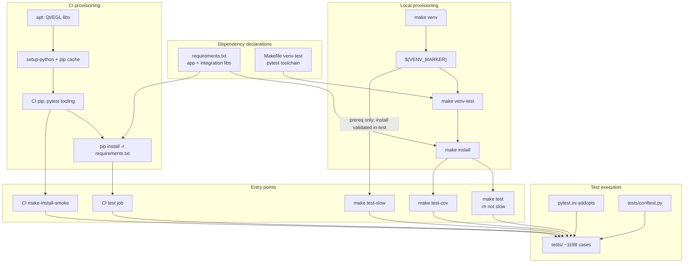

# PYPOST-465: Provision full test dependencies and run complete regression

## Research

### PYPOST-446 debt context

[PYPOST-446 technical-debt analysis](ai-tasks/PYPOST-446/60-tech-debt.md) recorded that full
project regression could not run because the **working environment** lacked `pytest`, `pydantic`,
`PySide6`, `requests`, `jinja2`, and `platformdirs`. That was an **execution-environment gap**
during feature delivery, not necessarily missing project declarations.

### Current dependency declarations (verified)

| Dependency class | Source | Packages |
| --- | --- | --- |
| Application runtime | `requirements.txt` | PySide6, requests, PyYAML, jinja2, pydantic≥2, platformdirs, mcp, starlette, uvicorn, prometheus_client, sseclient-py, cryptography, keyring |
| Test tooling (local) | `Makefile` `venv-test` | pytest, flake8, pytest-cov, pytest-timeout |
| Test tooling (CI main job) | `.github/workflows/test.yml` | pytest, pytest-cov, flake8, pytest-timeout |
| Test tooling (CI slow job) | `.github/workflows/test.yml` `make-install-smoke` | pytest, pytest-timeout only |

`make install` chains `venv` → `venv-test` → `pip install -r requirements.txt`, so a clean
checkout following the documented path gets both app and test packages.

### Local environment probe (this workspace)

- `.venv` present with all PYPOST-446-listed packages plus test tooling.
- `pytest tests/ --co -q` collects **1197/1198** tests (1 deselected by `-m "not slow"`).
- `tests/conftest.py` enforces per-test `timeout` markers; `pytest-timeout` must be installed
  for markers to interrupt hung tests (not only for marker presence checks).

### CI workflow (verified)

- **Main `test` job**: Python 3.11 and 3.13 matrix; installs Qt/EGL system libraries for
  headless PySide6; installs test tools + `requirements.txt`; runs fast suite with coverage,
  guardrails, and duration audit.
- **`make-install-smoke` job**: runs `-m slow` Makefile install smoke on Python 3.11.
- Uncommitted PYPOST-311 edits reorder `make-install-smoke` and add explicit
  `cache-dependency-path: requirements.txt` — orthogonal to PYPOST-465 but improves CI
  reproducibility.

### Documentation entry points (verified)

| Document | Install path | Test path |
| --- | --- | --- |
| `README.md` | `make install` | `make test` |
| `doc/dev/setup.md` | `make install` (notes `run`/`test` do not auto-install) | `make test`, CI reference |
| `doc/dev/testing.md` | cross-links `make venv-test` / `make install` | `make test`, `make test-slow`, `make test-cov`, CI guardrails |

### Architectural pattern: split dependency model

The project intentionally separates **application** dependencies (`requirements.txt`) from **test
tooling** (`Makefile venv-test` + CI pip install). This matches existing conventions
(PYPOST-252, PYPOST-548, PYPOST-311) and keeps runtime images lean, but requires both layers
for a reproducible test-ready environment.

Web sources were consulted for pytest-timeout behavior and GitHub Actions pip caching (see
Q&A Sources).

## Implementation Plan

High-level plan for Step 3 (no code changes in Step 2):

### Phase 1 — Dependency parity audit

1. Build a **dependency parity matrix** comparing three paths:
   - `make install` (canonical local)
   - CI main `test` job install steps
   - CI `make-install-smoke` job install steps
2. Confirm every import used under `tests/` resolves from the union of `requirements.txt` +
   test tooling (no hidden optional deps).
3. Document any intentional divergence (e.g. CI omits flake8 execution in main job but installs
   it; slow job skips app deps until `make install` inside the test).

### Phase 2 — Close provisioning gaps (if audit finds any)

Likely candidates from research:

| Gap | Risk | Remediation direction |
| --- | --- | --- |
| CI main job lacks `pytest-timeout` | Timeout markers do not interrupt hung tests in CI; parity with local `make install` | Add `pytest-timeout` to CI "Install test tools" step |
| `make test` depends on `$(VENV_MARKER)` only, not `venv-test` | `make venv` + `make test` without `make install` fails with missing pytest/modules | Document only (by design per PYPOST-307) or add soft prerequisite — prefer **document + audit**, not Makefile chain change, unless audit proves recurring contributor pain |
| Manual `pip install -r requirements.txt` (README alternative) | Skips test tooling | Ensure `doc/dev/setup.md` / `testing.md` state test tools require `make install` or explicit `make venv-test` |
| Python version messaging | README says 3.11+; setup/requirements say 3.10+; CI runs 3.11/3.13 | Align docs in Step 7 if needed; out of scope unless blocking regression |

Only apply changes that the parity audit confirms; avoid expanding scope beyond provisioning.

### Phase 3 — Execute and record full regression

1. **Local fast suite**: `make clean && make install && make test` (or equivalent on macOS
   with `QT_QPA_PLATFORM=offscreen`).
2. **Local slow suite**: `make test-slow` (Makefile install smoke with real `requirements.txt`).
3. **Local coverage gate**: `make test-cov` (validates `--cov-fail-under=70` from `pytest.ini`).
4. **Optional lint**: `make lint` (flake8; not part of PYPOST-446 debt but standard quality).
5. **CI validation**: push branch or rely on existing green CI; capture job summary artifact
   counts as evidence.
6. Record pass evidence in Step 6 tech-debt artifact and link back to PYPOST-446 debt item.

### Phase 4 — Dev docs touch-up (Step 7 scope, noted here)

If audit finds doc gaps, update `doc/dev/testing.md` / `doc/dev/setup.md` with a concise
"reproducible test environment" checklist — no new doc files unless Step 7 requires it.

## Architecture

### System module diagram

### Module responsibilities

| Module | Responsibility |
| --- | --- |
| `requirements.txt` | Declares all runtime and integration libraries imported by `pypost/` and `tests/` (PySide6, HTTP, templating, MCP stack, metrics, crypto). |
| `Makefile` (`venv`, `venv-test`, `install`) | Creates version-scoped `.venv`, installs test toolchain, installs app requirements; exposes `test`, `test-slow`, `test-cov`, `lint` targets. |
| `.github/workflows/test.yml` | Mirrors local dependency install on `ubuntu-latest`, adds headless Qt system packages, runs fast matrix + slow install smoke, enforces coverage and log guardrails. |
| `pytest.ini` | Default pytest options: verbosity, coverage fail-under 70%, exclude `slow` marker. |
| `tests/conftest.py` | Qt offscreen `qapp` fixture; **mandatory** `timeout` marker gate at setup. |
| `doc/dev/setup.md`, `doc/dev/testing.md` | Contributor-facing install and test workflow; CI behavior and Makefile contract tests. |

### Module interactions

1. **Contributor local path**: clone → `make install` → `make test` produces the same fast
   suite selection as CI (`-m "not slow"`).
2. **CI path**: checkout → system Qt libs → pip test tools → `requirements.txt` → pytest with
   same `pytest.ini` defaults plus explicit coverage/XML flags.
3. **Slow path**: `make test-slow` depends only on `$(VENV_MARKER)` (not `install` or
   `venv-test`); the slow test runs and validates end-to-end `make install` with real
   requirements in an isolated workspace (PYPOST-559). CI `make-install-smoke` follows the
   same pattern.
4. **Regression evidence chain**: local pass + CI pass → closes PYPOST-446 debt item → Jira
   PYPOST-465 Done.

### Selected patterns and justification

| Pattern | Justification |
| --- | --- |
| **Makefile-as-orchestrator** | Project standard (`.cursor/lsr/do-python.md`); single entry point for venv lifecycle. |
| **Split app vs test dependencies** | Keeps `requirements.txt` runtime-focused; test tools versioned via Makefile/CI pip lines (existing PYPOST-52/548 precedent). |
| **Fast/slow test partitioning** | `slow` marker excludes network-heavy Makefile smoke from default `make test` and main CI job; full confidence requires both jobs green. |
| **Headless Qt testing** | `QT_QPA_PLATFORM=offscreen` in Makefile and CI; CI adds Ubuntu EGL/XCB packages — local macOS generally works without apt step. |
| **Validation-only deliverable** | No product behavior change; architecture is environment parity + regression execution, not new features. |

### Main interfaces / contracts

| Interface | Contract |
| --- | --- |
| `make install` | After success, `.venv` contains all packages needed for `make test`, `make test-cov`, `make lint`, and `make test-slow`. |
| `make test` | Depends on `$(VENV_MARKER)` only — **not** `venv-test` or `install`; `make venv && make test` fails without pytest/app deps (use `make install` first). Exit 0 when fast suite passes; respects `pytest.ini` `addopts` and conftest timeout gate. |
| CI `test` job | Exit 0 on Python 3.11 and 3.13; coverage ≥ 70%; guardrail scripts pass on `pytest.log`. |
| CI `make-install-smoke` | Exit 0 when slow Makefile install test passes on 3.11. |
| Full regression (DoD) | Fast local + slow local (or CI slow job) + CI matrix green = PYPOST-446 validation debt closed. |

## Q&A

- **Is `requirements.txt` missing test deps?** By design. Test tooling lives in `Makefile
  venv-test` and CI pip install. The PYPOST-446 debt listed runtime imports (`pydantic`,
  `PySide6`, etc.) that are already in `requirements.txt`; `pytest` is provisioned via
  `venv-test`.
- **What counts as "full regression"?** Fast suite (~1197 tests, default `make test` / CI main
  job) plus slow Makefile install smoke (`make test-slow` / CI `make-install-smoke`). Coverage
  gate via `make test-cov` or CI `--cov-fail-under` alignment.
- **Why might CI differ from local?** Ubuntu Qt system libraries (CI only), Python version matrix
  (3.11/3.13 vs developer's local), and the **pytest-timeout gap** in CI main job.
- **Does this task change masking behavior?** No — requirements explicitly exclude PYPOST-446
  product changes.
- **Sources**: [PYPOST-446 tech debt](ai-tasks/PYPOST-446/60-tech-debt.md),
  [pytest-timeout README](https://github.com/pytest-dev/pytest-timeout/blob/main/README.rst),
  [actions/setup-python caching](https://github.com/actions/setup-python#caching-packages-dependencies).
