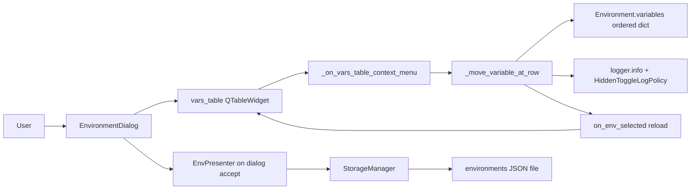

# PYPOST-466: Manual variables order

## Research

### Current codebase findings

1. `EnvironmentDialog` (`pypost/ui/dialogs/env_dialog.py`) owns `vars_table`, a
   three-column `QTableWidget` (Variable, Value, Hidden). Populated rows mirror
   `env.variables` insertion order; a trailing empty row supports add
   (`on_env_selected` sets `rowCount = len(variables) + 1`).
2. `on_var_changed` rebuilds `env.variables` and `env.hidden_keys` by iterating table
   rows top-to-bottom. Table row order is therefore the source of truth after edits;
   assigning a new ordered dict updates the model.
3. `Environment.variables` is `Dict[str, str]` (`pypost/models/models.py`). Python 3.7+
   preserves dict insertion order, so reordering keys in `env.variables` is sufficient
   for in-memory and serialized order — no schema change.
4. `StorageManager._serialize_environment` iterates `variables.items()` when encrypting;
   load reconstructs dict from JSON key order. Order round-trips through save/load
   without storage changes.
5. `clone_environment` (`pypost/core/environment_ops.py`) copies via `dict(source.variables)`,
   preserving source order — copy-environment inherits order automatically.
6. `vars_table` already has a custom context menu (`_on_vars_table_context_menu`) with
   **Delete** (PYPOST-467). Same handler uses `rowAt(pos.y())` and checks populated
   `COL_VAR` because the Hidden column uses `setCellWidget` (no `QTableWidgetItem`).
7. Delete uses **model-first + full reload**: mutate `env.variables`, then
   `on_env_selected(env_row)` to refresh checkboxes, masked values, and trailing add
   row. Reorder should follow the same pattern.
8. Persistence path unchanged: `EnvPresenter` passes in-memory environments by reference;
   `StorageManager` saves on dialog close.

### PySide6 / Qt reorder options

| Approach | Fit for `vars_table` |
|----------|----------------------|
| **Context menu Move Up / Move Down** | Strong — matches existing Delete menu; one row at a time; easy to disable at boundaries and on trailing add row ([Qt Centre row-move pattern](https://www.qtcentre.org/threads/4438-QTableWidget-row-swapping-and-insertion)). |
| **Drag-and-drop (`InternalMove`)** | Weak — Hidden column uses per-row `QCheckBox` cell widgets; DnD with `setCellWidget` requires manual widget recreation and is error-prone ([Qt Centre takeItem/setItem + manual widget swap](https://www.qtcentre.org/threads/3386-QTableWidget-move-row)). |
| **Swap table rows in place** | Avoid — duplicating checkbox/masking logic already centralized in `on_env_selected`. |

**Decision:** extend `_on_vars_table_context_menu` with **Move Up** and **Move Down**
actions. Reorder by swapping adjacent entries in an ordered `env.variables` dict, then
reload the table via `on_env_selected` (same as delete).

## Implementation Plan

### Phase 1 — Context menu extension

1. In `_on_vars_table_context_menu`, after validating populated `row`:
   - Compute `var_count = len(env.variables)` for the selected environment.
   - Add **Move Up** (enabled when `0 < row < var_count`).
   - Add **Move Down** (enabled when `0 <= row < var_count - 1`).
   - Keep **Delete** after move actions (separator optional).
2. Wire menu choices to `_move_variable_at_row(row, direction)` where `direction` is
   `"up"` or `"down"`.

### Phase 2 — Reorder orchestration (dialog-local)

1. Add `_move_variable_at_row(self, row: int, direction: str) -> None`:
   - Guard: valid `env_list.currentRow()`, `row` in `0 .. len(variables)-1`.
   - Build `items = list(env.variables.items())`.
   - Swap `items[row]` with `items[row - 1]` (up) or `items[row + 1]` (down).
   - Assign `env.variables = dict(items)` — values and hidden_keys unchanged.
   - Log `env_variable_moved` with env name, masked key, and direction.
   - Call `self.on_env_selected(env_row)` to refresh UI.
2. Do **not** add confirmation (requirements).
3. Do **not** add a new core module — two-dict-swap orchestration stays in the dialog,
   consistent with PYPOST-467 delete.

### Phase 3 — Tests (`tests/test_env_dialog.py`)

Add Qt-level tests consistent with `TestEnvironmentDialog`:

| Test | Asserts |
|------|---------|
| `test_move_variable_up_reorders_model` | `list(env.variables.keys())` reflects swap |
| `test_move_variable_down_reorders_model` | Second key moves below third |
| `test_move_up_at_first_row_is_noop` | Handler returns without change (or menu disabled) |
| `test_move_down_at_last_populated_row_is_noop` | No change on last variable |
| `test_move_hidden_variable_preserves_hidden_keys_and_mask` | Hidden flag and masked cell intact |
| `test_move_variable_keeps_trailing_add_row` | `rowCount == len(variables) + 1` after move |
| `test_move_variable_switch_env_and_back` | Order kept after `on_env_selected` on another env |
| `test_move_variable_logs_masked_key_by_default` | Log shows masked key |
| `test_vars_table_context_menu_ignores_trailing_row_for_move` | Trailing row: no move menu (existing ignore test covers no menu) |

Direct handler calls (`_move_variable_at_row`) suffice for model assertions; context menu
wiring can use mocked `QMenu.exec` (same style as delete trailing-row test).

### Phase 4 — Documentation touchpoints (Step 7 preview)

- Update `doc/dev/environments_dialog.md` context-menu section with Move Up/Down.

## Architecture

### System module diagram



### Modules and responsibilities

| Module | Responsibility | Changes |
|--------|----------------|---------|
| `EnvironmentDialog` | Context menu, reorder orchestration, table reload | **Yes** (primary) |
| `Environment` | Ordered `variables`, `hidden_keys` | No schema change |
| `HiddenToggleLogPolicy` | Mask key names in logs | Reuse only |
| `clone_environment` | Copy env with variable order | No change (inherits order) |
| `EnvPresenter` | Open dialog, persist on accept | No change |
| `StorageManager` | Serialize/deserialize environments | No change |

### Dependencies

- `EnvironmentDialog` → `Environment` (reorder `variables` insertion order).
- `EnvironmentDialog` → `HiddenToggleLogPolicy` (log formatting).
- `EnvironmentDialog` → Qt widgets (`QTableWidget`, `QMenu`, signals).
- Persistence: `UI → EnvPresenter → StorageManager` after dialog close (unchanged).

### Selected patterns

1. **Dialog-local orchestration** (PYPOST-467, PYPOST-53): UI maps intent to in-memory
   model updates; no new application-layer module for single-row reorder.
2. **Custom context menu on `vars_table`** (PYPOST-467): extend existing menu rather than
   new toolbar or drag-drop.
3. **Model-first adjacent swap + full reload** (`on_env_selected`): avoids manual
   `takeItem` / `setCellWidget` row surgery and keeps hidden checkboxes and masked
   values correct.
4. **Python dict insertion order** as the order carrier: table display, copy-environment,
   and JSON persistence align without a separate `variable_order` list.
5. **Policy object for observability** (`HiddenToggleLogPolicy`): consistent key
   redaction with delete and hidden-toggle logs.

### Main interfaces

Presentation (`EnvironmentDialog`):

```python
def _on_vars_table_context_menu(self, pos) -> None:
    """Show Move Up, Move Down, Delete for populated variable rows."""

def _move_variable_at_row(self, row: int, direction: str) -> None:
    """Swap variable with neighbour in env.variables and reload table."""
```

Log contract (new event):

```
env_variable_moved env_name=<name> key=<masked_or_plain> direction=up|down
```

- `key` via `HiddenToggleLogPolicy.format_key_name(...)`.
- No variable values logged.

Model (`Environment` — unchanged):

- `variables: Dict[str, str]` (insertion order significant for display/persistence)
- `hidden_keys: Set[str]` (order-independent)

### Edge cases

| Case | Behaviour |
|------|-----------|
| Move Up on first populated row (`row == 0`) | Menu action disabled; handler no-op if called |
| Move Down on last populated row | Menu action disabled; handler no-op if called |
| Right-click trailing add row | No menu (existing guard: empty key) |
| Move hidden variable | `hidden_keys` unchanged; reload shows masked value |
| Single variable in environment | Both move actions disabled |
| After move | `on_env_selected` restores trailing add row |
| Switch environment and return | Order read from `env.variables` on reload |
| Other environments | Unaffected |
| `on_var_changed` after manual reorder | Rebuild from table preserves new order |
| Copy environment | `clone_environment` copies dict order from source |

## Q&A

- **Q:** Why context menu Move Up/Down instead of drag-and-drop?  
  **A:** `vars_table` uses per-row checkbox cell widgets; DnD requires fragile manual
  widget moves. Context menu matches PYPOST-467 Delete, satisfies one-row-at-a-time
  requirements, and matches established pypost right-click patterns.

- **Q:** Why model swap + `on_env_selected` instead of swapping table rows?  
  **A:** Same rationale as PYPOST-467 delete reload — centralizes trailing add row,
  hidden widgets, and masked values. Avoids `takeItem`/widget swap bugs documented in
  Qt forums.

- **Q:** Why no `environment_ops.reorder_variable` helper?  
  **A:** Reorder is a two-index swap in an ordered dict; no reuse outside this dialog.
  Dialog-local orchestration matches delete scope.

- **Q:** Does JSON storage preserve order?  
  **A:** Yes — Python 3.7+ dict order is preserved in `json` dump/load used by
  `StorageManager`; serialization iterates `.items()` in insertion order.

- **Q:** Confirmation dialog?  
  **A:** No — requirements; reversible layout change inside Manage Environments.

- **Q:** Pending design items?  
  **A:** None. Ready for STEP 3 implementation.
