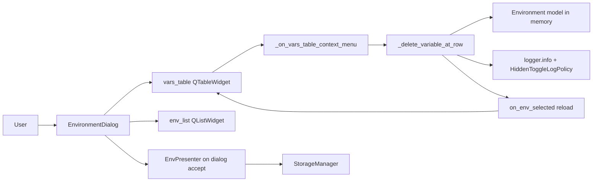

# PYPOST-467: Delete variables from environments

## Research

### Current codebase findings

1. `EnvironmentDialog` (`pypost/ui/dialogs/env_dialog.py`) owns the variables
   `QTableWidget` (`vars_table`). Populated rows mirror `env.variables`; a trailing
   empty row supports add (`on_env_selected` sets `rowCount = len(variables) + 1`).
2. Variable edits already sync in-memory state via `on_var_changed`: it rebuilds
   `env.variables` and `env.hidden_keys` from table rows with non-empty keys. Clearing
   a name removes the variable (alternate delete path — must remain unchanged).
3. The environment list (`env_list`) already uses a custom context menu (PYPOST-53):
   `setContextMenuPolicy(Qt.ContextMenuPolicy.CustomContextMenu)` and
   `customContextMenuRequested` → `_on_env_list_context_menu`, mapping position with
   `itemAt(pos)` and showing `QMenu` via `mapToGlobal(pos)`.
4. `HistoryPanel` (`pypost/ui/widgets/history_panel.py`) is the reference for
   immediate single-item delete: context menu with **Delete**, no confirmation, mutate
   backing store, `info` log, then UI refresh.
5. `HiddenToggleLogPolicy` (`pypost/core/hidden_toggle_log_policy.py`) masks key names
   in env hidden-toggle logs; same policy applies to delete logs.
6. Persistence is unchanged: `EnvPresenter` passes `self._environments` by reference into
   `EnvironmentDialog`; the dialog mutates that list in place. After `dialog.exec()`
   returns (dialog close), the presenter saves via `StorageManager` — no presenter or
   storage changes for this task.

### PySide6 / Qt context menu pattern (QTableWidget)

- Set `contextMenuPolicy` to `Qt.ContextMenuPolicy.CustomContextMenu` on `vars_table`.
- Connect `customContextMenuRequested` to a dialog handler (same pattern as `env_list`
  and [Qt QWidget contextMenuPolicy](https://doc.qt.io/qt-6/qwidget.html#contextMenuPolicy-prop)).
- `QTableWidget.itemAt(pos)` returns the item under the cursor, or `None` for blank
  areas and for cells that use `setCellWidget` only (the Hidden checkbox column has no
  item). Use `rowAt(pos.y())` to resolve the row, then read `item(row, COL_VAR)` to
  confirm the row is populated
  ([QTableWidget.itemAt](https://doc.qt.io/qtforpython-6/PySide6/QtWidgets/QTableWidget.html)).
- Show the menu with `menu.exec(self.vars_table.mapToGlobal(pos))` (consistent with
  `env_list` and `history_panel`).

## Implementation Plan

### Phase 1 — Context menu wiring (`init_ui`)

1. On `vars_table`, set `CustomContextMenu` policy and connect
   `customContextMenuRequested` to `_on_vars_table_context_menu`.
2. In the handler:
   - `row = self.vars_table.rowAt(pos.y())`; return if `row < 0` (blank click).
   - Read `k_item = self.vars_table.item(row, COL_VAR)`; return if missing or
     `not k_item.text()` (trailing add row or empty-name row).
   - Build `QMenu` with action **Delete**; on choice, call `_delete_variable_at_row(row)`.

### Phase 2 — Delete orchestration (dialog-local)

1. Add `_delete_variable_at_row(self, row: int) -> None`:
   - Guard: valid `env_list.currentRow()`, row in range, populated key on row.
   - Capture `key` from the name cell before mutation.
   - Remove from `env.variables` (`pop`) and `env.hidden_keys` (`discard`).
   - Emit `logger.info` with env name and masked key via `HiddenToggleLogPolicy`.
   - Reload the table with `self.on_env_selected(self.env_list.currentRow())` so the
     trailing add row and hidden checkboxes stay correct.
2. Do **not** add a confirmation dialog (requirements; matches history entry delete).
3. Do **not** add a new core module — deletion is a thin UI orchestration over the
   in-memory `Environment` list already owned by the dialog.

### Phase 3 — Optional refactor (only if it simplifies Phase 2)

- The rebuild loop inside `on_var_changed` (lines ~319–356) could be extracted to
  `_sync_env_from_table(self, env: Environment, *, editing_item=None)` if delete and
  edit paths should share one sync function.
- **Preferred for minimal scope:** model mutation + `on_env_selected` reload avoids
  duplicating trailing-row logic and matches the full-reload pattern used after env
  copy (`load_list` + reselect).

### Phase 4 — Tests (`tests/test_env_dialog.py`)

Add Qt-level tests consistent with existing `TestEnvironmentDialog` patterns:

| Test | Asserts |
|------|---------|
| `test_delete_variable_via_handler_removes_from_model` | Key removed; others kept |
| `test_delete_hidden_variable_clears_hidden_keys` | Hidden key removed from `env.hidden_keys` |
| `test_delete_variable_keeps_trailing_add_row` | `rowCount == len(variables) + 1` after delete |
| `test_vars_table_context_menu_ignores_trailing_row` | No model change for trailing empty row |
| `test_delete_variable_logs_masked_key_by_default` | Log shows masked key, not raw name |
| `test_delete_variable_logs_readable_key_when_enabled` | Log shows key when `log_hidden_key_names=True` |
| `test_clear_name_still_removes_variable` | Empty-name rebuild path unchanged (regression) |

Context menu wiring can be smoke-tested by calling `_on_vars_table_context_menu` with a
mocked `QMenu.exec` returning the delete action, or by calling `_delete_variable_at_row`
directly for model assertions (same style as hidden-toggle tests invoking handlers).

## Architecture

### System module diagram



### Modules and responsibilities

| Module | Responsibility | Changes |
|--------|----------------|---------|
| `EnvironmentDialog` | Context menu, delete orchestration, table reload | **Yes** (primary) |
| `Environment` | `variables`, `hidden_keys` in-memory state | No schema change |
| `HiddenToggleLogPolicy` | Mask key names in logs | Reuse only |
| `EnvPresenter` | Open dialog, persist on accept | No change |
| `StorageManager` | Serialize environments | No change |

### Dependencies

- `EnvironmentDialog` → `Environment` (mutate selected env's `variables` / `hidden_keys`).
- `EnvironmentDialog` → `HiddenToggleLogPolicy` (log formatting).
- `EnvironmentDialog` → Qt widgets (`QTableWidget`, `QMenu`, signals).
- Persistence path unchanged: `UI → EnvPresenter → StorageManager` after dialog close.

### Selected patterns

1. **Dialog-local orchestration** (PYPOST-53 style): UI event handler maps user intent
   to in-memory model updates; no new application-layer module for a single-row delete.
2. **Custom context menu policy** (PYPOST-53, `HistoryPanel`, collections tree): uniform
   pypost pattern for right-click actions.
3. **Immediate destructive action without confirmation** (`HistoryPanel` delete entry):
   appropriate for reversible, single-item edits inside a settings dialog.
4. **Full table reload after mutation** (`on_env_selected`): preserves trailing add row,
   hidden checkboxes, and masked values without reimplementing row bookkeeping.
5. **Policy object for observability** (`HiddenToggleLogPolicy`): consistent key redaction
   with hidden-toggle logs (PYPOST-448).

### Main interfaces

Presentation (`EnvironmentDialog`):

```python
def _on_vars_table_context_menu(self, pos) -> None:
    """Show Delete menu for populated variable rows only."""

def _delete_variable_at_row(self, row: int) -> None:
    """Remove variable from selected environment and reload table."""
```

Log contract (new event):

```
env_variable_deleted env_name=<name> key=<masked_or_plain>
```

- `key` formatted via `HiddenToggleLogPolicy.format_key_name(key, log_hidden_key_names=...)`.
- No variable values logged.

Model (`Environment` — unchanged):

- `variables: Dict[str, str]`
- `hidden_keys: Set[str]`

### Edge cases

| Case | Behaviour |
|------|-----------|
| Right-click trailing add row (empty key) | No menu action; handler returns early |
| Right-click blank table area | `rowAt` < 0; no-op |
| Right-click Hidden checkbox column | `rowAt` resolves row; key check passes for populated rows |
| Delete only populated row | Single row removed; model updated |
| Delete hidden variable | Key removed from `variables` and `hidden_keys` |
| After delete | `on_env_selected` restores `len(variables) + 1` rows with empty last row |
| Clear variable name (existing) | `on_var_changed` still drops empty-key rows — unchanged |
| Other environments | Unaffected; only `env_list.currentRow()` env is mutated |
| Dialog close | In-memory mutations are immediate (same as add/edit/hidden); persistence on
  dialog close via presenter; dismiss does not revert prior edits (pre-existing behaviour) |

## Q&A

- **Q:** Why no new `environment_ops` helper (unlike PYPOST-53 `clone_environment`)?  
  **A:** Delete is two dict/set operations on an object the dialog already owns. A core
  helper would add indirection without reuse elsewhere. Dialog-local orchestration is
  sufficient.

- **Q:** Why reload via `on_env_selected` instead of only `removeRow`?  
  **A:** `on_env_selected` already enforces the trailing add row, hidden widgets, and
  masked value cells. Full reload after model mutation avoids duplicating that logic and
  prevents row-count drift.

- **Q:** Why `rowAt(pos.y())` instead of only `itemAt(pos)`?  
  **A:** The Hidden column uses `setCellWidget` (checkbox) with no `QTableWidgetItem`.
  `itemAt` returns `None` there; `rowAt` still identifies the populated row.

- **Q:** Should delete go through `on_var_changed` / table rebuild instead?  
  **A:** Possible via `removeRow` + extracted sync helper, but model-first +
  `on_env_selected` is fewer moving parts for this scope. The clear-name alternate path
  continues to use `on_var_changed` unchanged.

- **Q:** Confirmation dialog?  
  **A:** No — requirements and `HistoryPanel` precedent for single-item reversible delete.

- **Q:** Persistence timing?  
  **A:** Unchanged — dialog mutates the shared in-memory environment list live; `EnvPresenter`
  saves when Manage Environments closes (`dialog.exec()` returns), same as add/edit/rename/hidden
  toggle today.

- **Q:** Pending design items?  
  **A:** None. Ready for STEP 3 implementation.
