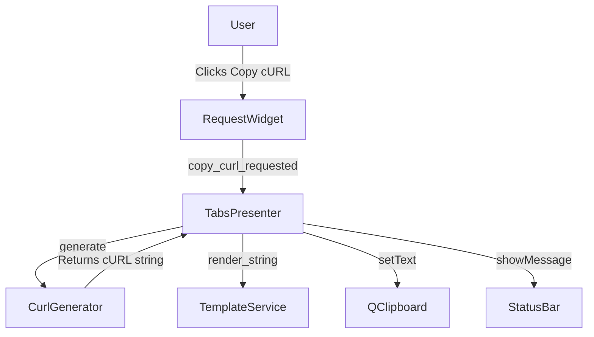

# PYPOST-468: Add action 'Copy cURL'

## Research

1. **Current Request Actions**: The `RequestWidget` (`pypost/ui/widgets/request_editor.py`) has an `Actions` menu (`self.actions_menu`) which currently contains "Save" and "Save As...". This is the ideal location to add the "Copy cURL" action.
2. **Variable Resolution**: The application uses `TemplateService` to resolve Jinja2-style variables (`{{ var }}`) in URLs, headers, parameters, and bodies. `TabsPresenter` holds the current environment variables (`self._current_variables`) and has access to `TemplateService`.
3. **Clipboard Operations**: Qt provides `QApplication.clipboard().setText()` for system clipboard operations. This is already used in `ResponseView` for copying response text.
4. **URL and Params Handling**: `HTTPClient` resolves URL and params separately and relies on `requests` to merge them. For cURL generation, we need to manually merge the resolved `params` into the resolved `url` query string.
5. **Command Escaping**: To generate a valid shell command, we need to properly escape arguments (especially the JSON body and URL). Python's `shlex.join()` is the standard way to safely quote command-line arguments for Unix-like shells.

## Implementation Plan

1. **Core Logic**: Create a new module `pypost.core.curl_generator` with a `CurlGenerator` class. It will expose a static method `generate` that takes a `RequestData`, a variables dictionary, and a `TemplateService`, and returns the formatted cURL string.
2. **UI Action**: Add a `QAction` named "Copy cURL" to the `Actions` menu in `RequestWidget`. When triggered, it will emit a new `copy_curl_requested` signal with a snapshot of the current request data.
3. **Orchestration**: Connect the `copy_curl_requested` signal in `TabsPresenter` to a new handler `_handle_copy_curl_request`.
4. **Execution**: In `_handle_copy_curl_request`, invoke `CurlGenerator.generate`, copy the result to the clipboard using `QApplication.clipboard().setText()`, and show a success message using the main window's status bar (`self._tabs.window().statusBar().showMessage(...)`).

## Architecture

### Module Diagram



### Module Descriptions and Responsibilities

1. **`pypost.core.curl_generator.CurlGenerator` (New)**
   - **Responsibility**: Encapsulates the logic for converting a `RequestData` object and a dictionary of variables into a valid `curl` command string.
   - **Details**: Uses `TemplateService` to resolve variables in the URL, headers, params, and body. Uses `urllib.parse` to append query parameters to the URL. Uses `shlex.join` to ensure all arguments are safely escaped for command-line execution.

2. **`pypost.ui.widgets.request_editor.RequestWidget` (Modified)**
   - **Responsibility**: Provides the UI action for the user.
   - **Details**: Adds a "Copy cURL" `QAction` to `self.actions_menu`. Emits `copy_curl_requested(RequestData)` when the action is triggered, passing a snapshot of the current UI state.

3. **`pypost.ui.presenters.tabs_presenter.TabsPresenter` (Modified)**
   - **Responsibility**: Orchestrates the action by connecting the UI event to the core logic and system services.
   - **Details**: Listens to `copy_curl_requested`. Invokes `CurlGenerator.generate` with the request data, `self._current_variables`, and `self._template_service`. Copies the resulting string to the system clipboard and notifies the user via the status bar.

### Module Interaction Scheme

1. The user clicks "Copy cURL" in the `Actions` menu of the `RequestWidget`.
2. `RequestWidget` captures the current UI state into a `RequestData` snapshot (using `get_request_data_from_ui()`) and emits `copy_curl_requested(request_data)`.
3. `TabsPresenter` receives the signal in `_handle_copy_curl_request`.
4. `TabsPresenter` calls `CurlGenerator.generate(request_data, self._current_variables, self._template_service)`.
5. `CurlGenerator` resolves all templates (URL, headers, params, body) using `TemplateService`.
6. `CurlGenerator` constructs the command list (`["curl", "-X", method, url, ...]`) and safely escapes it using `shlex.join`.
7. `TabsPresenter` sets the clipboard text to the generated cURL string via `QApplication.clipboard().setText()`.
8. `TabsPresenter` shows a brief success message in the main window's status bar.

### Selected Architectural Patterns and Justification

- **Separation of Concerns**: The logic for generating the cURL command is separated into a pure utility class (`CurlGenerator`) in the `core` layer. This keeps the UI components clean and makes the generation logic easily testable without UI dependencies.
- **Event-Driven UI**: The UI (`RequestWidget`) communicates with the presenter (`TabsPresenter`) via Qt Signals (`copy_curl_requested`). This maintains the existing decoupling between the view and business orchestration, consistent with the rest of the application's architecture.

### Main Interfaces/APIs

- **`CurlGenerator`**:
  ```python
  def generate(request: RequestData, variables: dict, template_service: TemplateService) -> str:
      """Generates a valid cURL command string from the request data and variables."""
  ```
- **`RequestWidget`**:
  ```python
  copy_curl_requested = Signal(RequestData)
  ```
- **`TabsPresenter`**:
  ```python
  def _handle_copy_curl_request(self, request_data: RequestData) -> None:
      """Handles the copy cURL request by generating the string and updating the clipboard."""
  ```

## Q&A

- **Q:** How are query parameters handled if the URL already contains some?
  - **A:** `urllib.parse.urlparse` and `urllib.parse.parse_qsl` will be used to extract existing query parameters from the URL, merge them with the resolved `params` from the `RequestData`, and reconstruct the URL.
- **Q:** How is the cURL command formatted for multi-line bodies?
  - **A:** `shlex.join` will wrap the body in single quotes, preserving newlines. This is standard and works well in bash/zsh.
- **Q:** Should we include default headers like `User-Agent`?
  - **A:** No, we should only include the headers explicitly defined by the user in the PyPost request to ensure the cURL command accurately reflects their configuration.
