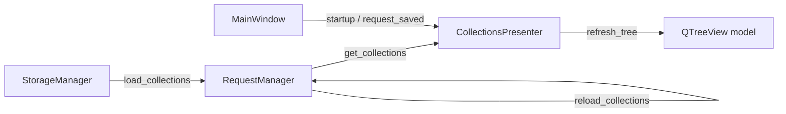
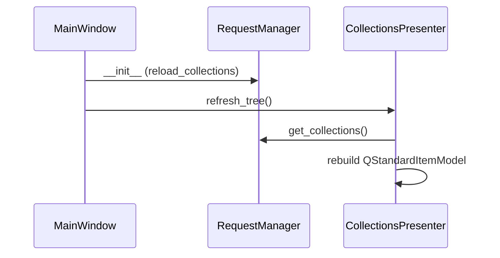
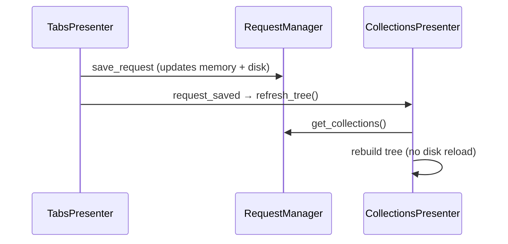

# PYPOST-47: Unify collection loading via RequestManager

## Research

- **PYPOST-40 R5:** MainWindow historically called `storage.load_collections()` directly
  (audit F10). PYPOST-43 moved tree logic to `CollectionsPresenter` and removed one redundant
  storage call before `reload_collections()`.
- **Current gap:** `CollectionsPresenter.load_collections()` always called
  `reload_collections()` then rebuilt the tree. MainWindow used that on startup (double reload
  after `RequestManager.__init__`) and after tab save (redundant disk read after
  `save_request` updated memory).
- **RequestManager:** `__init__` loads once; CRUD methods update memory and persist, then
  rebuild the index. `get_collections()` returns the live list.

## Implementation Plan

1. Extract `CollectionsPresenter.refresh_tree()` — rebuild `QStandardItemModel` from
   `get_collections()` only.
2. Keep `load_collections()` as `reload_collections()` + `refresh_tree()` for explicit disk sync.
3. Replace internal post-CRUD `load_collections()` calls with `refresh_tree()` where memory is
   already current.
4. MainWindow startup: `collections.refresh_tree()` (RequestManager already loaded).
5. MainWindow wiring: `request_saved` → `refresh_tree` (not `load_collections`).
6. Tests: refresh without reload; startup calls `refresh_tree`; `load_collections` still reloads.
7. Docs: `doc/dev/collection_loading.md`; mark R5 resolved in `doc/dev/tech-debt/PYPOST-40.md`.

## Architecture

### Problem summary

Collection data had two read paths: RequestManager (CRUD) and implicit storage reload inside
tree refresh. Hot paths re-read disk unnecessarily and obscured the single-source-of-truth
contract from audit R5.

### Module diagram

### Sequence: startup

### Sequence: tab save

### Component changes

| Module | Change |
|--------|--------|
| `collections_presenter.py` | Add `refresh_tree()`; slim `load_collections()`; post-CRUD uses refresh |
| `main_window.py` | Startup `refresh_tree()`; `request_saved` → `refresh_tree` |
| `tests/test_collections_presenter.py` | Refresh without reload; load still reloads |
| `tests/test_main_window.py` | Startup wiring test |
| `doc/dev/collection_loading.md` | New dev doc |
| `doc/dev/tech-debt/PYPOST-40.md` | R5 marked resolved |

### Interfaces

- `RequestManager.reload_collections()` — re-read disk, rebuild index.
- `RequestManager.get_collections()` — return in-memory list (UI read API).
- `CollectionsPresenter.refresh_tree()` — UI-only rebuild from manager.
- `CollectionsPresenter.load_collections()` — full disk resync + UI rebuild.

### Risks

- **External file edits** while app is open are not reflected until explicit reload — unchanged
  from prior behavior for manual JSON edits.

## Q&A

| Question | Answer |
|----------|--------|
| Why keep `load_collections()`? | Preserves explicit full-resync API for future use and existing tests. |
| Why not reload after save? | `save_request` already updates RequestManager memory; disk reload is redundant. |
