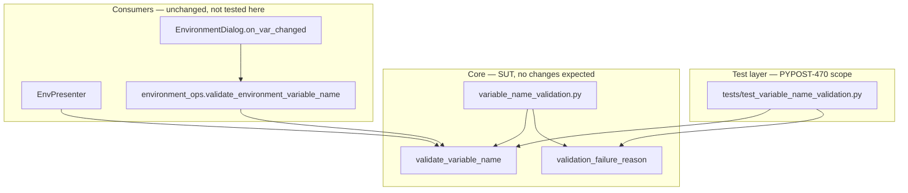

# PYPOST-470: Expand variable name validation tests (Unicode, boundaries, mixed strings)

## Research

### Current codebase findings

1. **Validation module** (`pypost/core/variable_name_validation.py`):
   - `validate_variable_name(name) -> tuple[bool, str]` — pure rules, three failure messages.
   - `validation_failure_reason(name) -> ValidationFailureReason | None` — maps invalid
     input to metric keys (`empty`, `starts_with_digit`, `invalid_chars`).
   - Rule order: empty → first char digit → all chars `isalnum()` or `_`.
   - Uses `str.isalnum()` / `str.isdigit()`, which accept Unicode letters and digits per
     Python's Unicode classification, not ASCII-only.

2. **Baseline tests** (`tests/test_variable_name_validation.py`, PYPOST-477):
   - `test_valid_names` — happy path including `a`, `_`, `Z9`, and `"a" * 200`.
   - `test_invalid_names` — empty, digit-start, hyphen/space/period/punctuation cases with
     error message and failure-reason assertions.
   - `test_unicode_letters_allowed_by_isalnum_policy` — three valid Unicode letter names
     (`café`, `变量`, `über`).
   - Gaps called out in PYPOST-163 tech debt (item 163-1): rejected Unicode inputs,
     mixed valid/invalid strings, boundary matrix, and explicit policy vs docs.

3. **Consumers** (unchanged by this task):
   - `EnvPresenter._is_valid_variable_name` — UI flow + metrics/logging.
   - `validate_environment_variable_name` in `environment_ops.py` — Manage Environments
     table key validation (`env_dialog.py` line ~538).
   - Tests target the core module directly; no presenter or Qt dependencies.

4. **Documentation mismatch** (`doc/dev/variable_validation.md`):
   - Describes ASCII-only examples (`a-z, A-Z, 0-9, _`) while implementation accepts
     Unicode letters via `isalnum()`. Step 7 may reconcile docs if tests confirm policy.

### Jinja2 and Python identifier policy

| Check | Scope | Relevance |
|-------|-------|-----------|
| `str.isalnum()` | Unicode letters + decimal digits | **Current validator** |
| `str.isidentifier()` | Full Python identifier (UAX-31, NFKC) | **Jinja2 lexer** (Python 3) |
| ASCII `[a-zA-Z_][a-zA-Z0-9_]*` | Docs wording | **Outdated product docs** |

- [Jinja2 API — Notes on Identifiers](https://jinja.palletsprojects.com/en/3.1.x/api/#notes-on-identifiers):
  variables follow Python naming rules; on Python 3 with Unicode support the lexer uses
  `str.isidentifier()` during tokenization ([Jinja commit 47ef6a3](https://github.com/pallets/jinja/commit/47ef6a3baab14dfaa9f3f5d087855e0824f50965)).
- [Python lexical analysis — Identifiers](https://docs.python.org/3/reference/lexical_analysis.html#identifiers):
  identifiers allow Unicode letter categories; combining marks and many symbols are excluded
  from `id_continue`.
- **Implication**: `isalnum()` is a *subset superset mismatch* — it accepts some strings
  Jinja2 would reject (e.g. names with characters that are alphanumeric but not valid in
  identifiers) and may differ on edge Unicode. This task **documents actual validator
  behavior** via tests; tightening rules to `isidentifier()` is out of scope unless a test
  proves user-visible breakage.

### Failure-reason precedence (canonical single reason)

The validator returns one primary reason. Order in code:

1. `empty` — falsy string (`""`).
2. `starts_with_digit` — `name[0].isdigit()` (includes Unicode decimal digits).
3. `invalid_chars` — any character not `isalnum()` and not `_`.

Mixed strings must assert this precedence (e.g. `9abc!` → `starts_with_digit`, not
`invalid_chars`).

## Implementation Plan

### Phase 1 — Unicode test groups

Add parametrized cases to `tests/test_variable_name_validation.py`:

| Group | Examples (illustrative) | Expected |
|-------|-------------------------|----------|
| Valid Unicode letters | `naïve`, `Ελληνικά`, `变量名` | accept |
| Unicode digit start | `１abc` (fullwidth), `٩test` | reject, `starts_with_digit` |
| Symbols / emoji | `api🔑`, `key❤`, `café!` | reject, `invalid_chars` |
| Combining / non-letter | zero-width space, soft hyphen in name | reject, `invalid_chars` |
| Underscore + Unicode | `_变量`, `api_über` | accept |

Reuse existing `test_unicode_letters_allowed_by_isalnum_policy` where overlap exists; add
new methods rather than duplicating the three baseline cases.

### Phase 2 — Mixed valid/invalid strings

Extend `test_invalid_names` or add `test_mixed_valid_invalid_rejects_with_canonical_reason`:

| Input | Canonical reason |
|-------|------------------|
| `api_key!` | `invalid_chars` |
| `valid-name` | `invalid_chars` |
| `a b` | `invalid_chars` |
| `letter1@domain` | `invalid_chars` |
| `9valid_prefix` | `starts_with_digit` |
| `0_underscore` | `starts_with_digit` |

Each case asserts `(is_valid, error, validation_failure_reason)` triple.

### Phase 3 — Boundary conditions

Add `test_boundary_names` (valid and invalid):

| Input | Expected |
|-------|----------|
| `a`, `_` | accept (already in valid list — do not duplicate) |
| `___`, `____` | accept (underscore-only names) |
| `"a" * 500` or similar | accept (long valid; extend beyond 200 if not redundant) |
| `"_" + "x" * 999` | accept (long with underscore prefix) |
| `""` | reject, `empty` (already covered — reference only) |
| Single Unicode letter | accept |
| `__` | accept |

Skip re-asserting cases already in `test_valid_names` / `test_invalid_names`; add only
net-new boundaries.

### Phase 4 — Verification

1. Run `pytest tests/test_variable_name_validation.py -v`.
2. Run full project test suite.
3. If any new test fails against current rules, treat as defect discovery — fix validation
   only with explicit product decision (requirements: out of scope unless proven wrong).

### Phase 5 — Documentation (Step 7 preview)

If tests confirm Unicode acceptance, update `doc/dev/variable_validation.md` valid examples
and rule wording. Record policy in requirements Q&A if ASCII-only is rejected.

## Architecture

### System module diagram



### Modules and responsibilities

| Module | Responsibility | Changes |
|--------|----------------|---------|
| `tests/test_variable_name_validation.py` | Edge-case contract tests for validation | **Yes** (primary) |
| `pypost/core/variable_name_validation.py` | Pure Jinja2-compatible name rules | No (unless defect) |
| `pypost/core/environment_ops.py` | Thin wrapper for env dialog | No |
| `pypost/ui/presenters/env_presenter.py` | UI validation + observability | No |
| `doc/dev/variable_validation.md` | Dev documentation | Step 7 if policy clarified |

### Dependencies

- Tests import only `pypost.core.variable_name_validation` — no Qt, no metrics, no I/O.
- Validation module has zero dependencies beyond stdlib `typing`.
- Consumers depend on core module; expanded tests guard the shared contract all flows use.

### Selected patterns

1. **Table-driven unit tests** (`pytest.mark.parametrize`): matches PYPOST-477 style;
   keeps policy readable in test data tables.
2. **Pure-function testing**: no mocks; direct calls to `validate_variable_name` and
   `validation_failure_reason`.
3. **Dual assertion contract**: every invalid case checks both user-facing `error` string
   and machine-facing `validation_failure_reason` — preserves metrics/logging alignment.
4. **Test-only change set**: requirements exclude UI/integration scope; architecture stays
   minimal — no new helpers, fixtures, or test utilities unless duplication forces a local
   constant for shared error messages.

### Main interfaces (test contract)

System under test — unchanged signatures:

```python
def validate_variable_name(name: str) -> tuple[bool, str]:
    """Returns (True, "") when valid; (False, error_message) when invalid."""

def validation_failure_reason(name: str) -> ValidationFailureReason | None:
    """Returns None when valid; otherwise 'empty' | 'starts_with_digit' | 'invalid_chars'."""
```

Test assertion pattern (invalid):

```python
is_valid, error = validate_variable_name(name)
assert is_valid is False
assert error == expected_error
assert validation_failure_reason(name) == expected_reason
```

Error message constants (must match production):

| Reason | Message |
|--------|---------|
| `empty` | `Variable name cannot be empty.` |
| `starts_with_digit` | `Variable name cannot start with a digit.` |
| `invalid_chars` | `Variable name can only contain letters, numbers, and underscores.` |

### Proposed test class layout

```
TestValidateVariableName          # existing — keep baseline cases
  test_valid_names
  test_invalid_names
  test_unicode_letters_allowed_by_isalnum_policy

TestValidateVariableNameUnicode   # new — rejected Unicode / symbol cases
  test_unicode_invalid_names

TestValidateVariableNameMixed     # new — canonical reason precedence
  test_mixed_strings_reject_with_canonical_reason

TestValidateVariableNameBoundaries  # new — net-new boundary cases only
  test_boundary_valid_names
  test_boundary_invalid_names
```

Grouping by class improves readability without new test infrastructure.

### Edge-case decision table

| Case | Expected outcome | Notes |
|------|------------------|-------|
| Unicode letter name (`café`) | Accept | Baseline + extended samples |
| Fullwidth digit start (`１x`) | Reject, `starts_with_digit` | `isdigit()` is Unicode-aware |
| Emoji in name | Reject, `invalid_chars` | Not `isalnum()` |
| Valid prefix + `!` | Reject, `invalid_chars` | Single canonical reason |
| Digit start + invalid char (`9!`) | Reject, `starts_with_digit` | Precedence over `invalid_chars` |
| Only underscores (`___`) | Accept | Underscore allowed throughout |
| Very long valid name | Accept | Extend length beyond 200 if useful |
| Whitespace-only (`" "`, `"\t"`) | Reject, `invalid_chars` | Validator receives raw string; UI may strip separately |

## Q&A

- **Q:** Why test the core module instead of `EnvPresenter`?  
  **A:** PYPOST-478 centralized rules; presenter adds metrics/logging only. Core tests give
  full branch coverage without Qt and cover both ResponseView and Manage Environments flows.

- **Q:** Should validation switch from `isalnum()` to `isidentifier()`?  
  **A:** Not in this task. Requirements scope is test expansion. If tests show Jinja2
  incompatibility for accepted names, record as follow-up; do not change rules silently.

- **Q:** Why separate test classes for Unicode/mixed/boundary?  
  **A:** Keeps PYPOST-477 baseline intact, makes policy groups scannable in CI output, and
  avoids one enormous parametrize table.

- **Q:** Does whitespace trimming belong in these tests?  
  **A:** Tests pass strings directly into `validate_variable_name`. Whitespace-only inputs
  document validator behavior; UI strip behavior stays in presenter/dialog scope (PYPOST-475).

- **Q:** What if a Unicode case fails unexpectedly?  
  **A:** Treat as defect discovery — investigate whether rule or test expectation is wrong;
  rule changes require explicit product decision per requirements out-of-scope clause.

- **Q:** Pending design items?  
  **A:** None. Ready for STEP 3 implementation.
