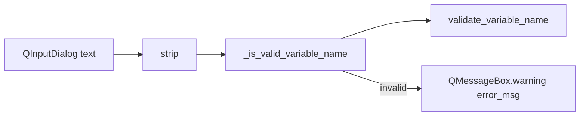

# PYPOST-472: Architecture

## Research

`EnvPresenter.handle_variable_set_request` had two validation paths after strip:

1. Inline `if not target_key` → hardcoded `"Variable name cannot be empty."`
2. `_is_valid_variable_name` → `validate_variable_name` → same message for empty

Path 1 duplicated the core module string and used a different dialog title
(`"Invalid Name"` vs `"Invalid Variable Name"`).

`env_dialog._sync_env_variables_from_table` already calls
`validate_environment_variable_name` without hardcoded duplicate strings.

## Implementation Plan

1. Remove the inline empty-name branch in `handle_variable_set_request`.
2. Route stripped input through `_is_valid_variable_name` for every failure.
3. Update `doc/dev/variable_validation.md` UI vs core section.

## Design

## Decisions

| Decision | Rationale |
| --- | --- |
| Single validation call after strip | Empty string hits core `empty` reason and message |
| Keep QMessageBox title in UI | Titles are presentation; messages are domain |
| No new constants module | Core function already returns canonical strings |
