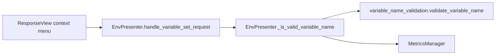

# PYPOST-478: Centralize environment variable name validation

## Research

### Current codebase findings

1. **Validation in presenter** (`pypost/ui/presenters/env_presenter.py`):
   `EnvPresenter._is_valid_variable_name()` encodes three Jinja2-compatible rules and returns
   `(is_valid, error_message)`. Called from `handle_variable_set_request` for the ResponseView
   "New Variable..." flow.

2. **Observability coupling**: metrics (`track_variable_validation*`) and DEBUG logs live in the
   presenter wrapper, not in the rule logic. PYPOST-163 added these for the UI flow only.

3. **Related core modules**: `pypost/core/environment_ops.py` holds pure environment helpers;
   validation is a similar pure concern with no Qt dependency.

4. **Tests**: no automated coverage yet (PYPOST-477 / PYPOST-474 follow-ups). Extraction must
   expose a testable pure function.

5. **Documentation**: `doc/dev/variable_validation.md` references `EnvPresenter._is_valid_variable_name`.

## Implementation Plan

### Phase 1 — Core validation module

1. Add `pypost/core/variable_name_validation.py` with:
   - `validate_variable_name(name: str) -> tuple[bool, str]` — pure rules, same three messages.
   - `validation_failure_reason(name: str) -> str | None` — maps invalid input to metric reason
     keys (`empty`, `starts_with_digit`, `invalid_chars`) without duplicating rule checks.

### Phase 2 — Presenter delegation

1. Replace rule logic in `EnvPresenter._is_valid_variable_name` with calls to the core module.
2. Keep metrics and logging in the presenter method (preserves PYPOST-163 observability).

### Phase 3 — Documentation

1. Update `doc/dev/variable_validation.md` to list the core module as the rule source.

## Architecture

## Design decisions

| Decision | Rationale |
| --- | --- |
| Core module, not presenter static method | Callable from tests and future UI without importing Qt |
| Metrics stay in presenter | Requirements: preserve existing observability for UI flow |
| `validation_failure_reason` helper | Avoid duplicating rule branches for metric reason labels |
| No unit tests in this task | PYPOST-477 scope; module is structured for direct import |

## Risks

- **Behaviour drift**: mitigated by identical error strings and delegating all rule checks to one function.
- **PYPOST-471 overlap**: this task delivers the shared module; PYPOST-471 may close or narrow to
  adopting the helper in additional call sites.
