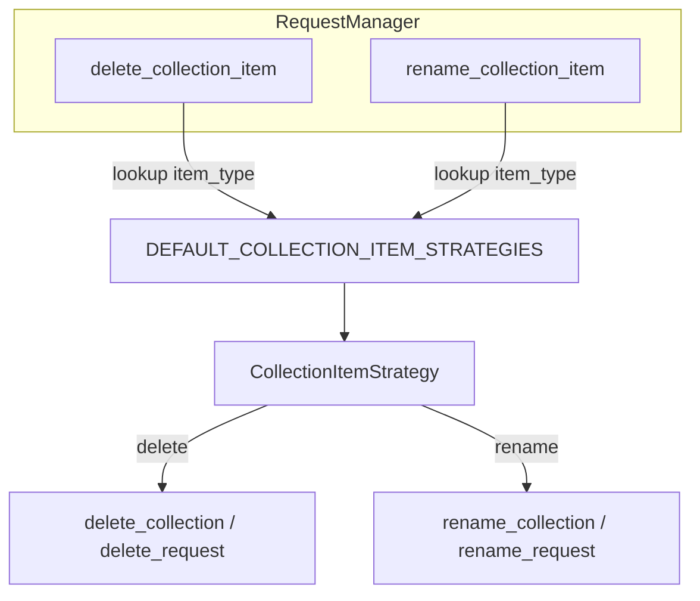

# PYPOST-48: Collection item strategy architecture

## Research

- PYPOST-40 audit R6 flagged `item_type` branching in `delete_collection_item` and
  `rename_collection_item` (OCP violation).
- PYPOST-46 established `@runtime_checkable` protocols for consumer seams; this task uses a
  lighter registry because dispatch is internal to `RequestManager`.
- Existing tests in `tests/test_request_manager_delete.py` assert routing for both types and
  unsupported types.

## Implementation Plan

1. Add `pypost/core/collection_item_strategies.py` with `CollectionItemStrategy` dataclass and
   `DEFAULT_COLLECTION_ITEM_STRATEGIES` registry.
2. Add optional `item_strategies` keyword to `RequestManager.__init__` for tests and future
   extension.
3. Replace inline `if item_type == ...` in dispatch methods with registry lookup.
4. Add `tests/test_collection_item_strategies.py` for custom strategy injection.
5. Update `doc/dev/testability.md` and mark PYPOST-48 resolved in `doc/dev/tech-debt/PYPOST-40.md`.

## Architecture

### Type boundaries

| Layer | Type | Rationale |
| --- | --- | --- |
| `RequestManager` | `dict[str, CollectionItemStrategy]` | Dispatch table owned by manager |
| Default registry | `DEFAULT_COLLECTION_ITEM_STRATEGIES` | Built-in collection + request handlers |
| Tests | Custom `item_strategies` dict | Prove OCP without subclassing manager |

### Alternatives considered

| Option | Verdict |
| --- | --- |
| Frozen dataclass + handler callables | **Selected** — minimal, testable, no ABC churn |
| `Protocol` per item type class | Rejected — two types do not justify class hierarchy |
| Subclass `RequestManager` per type | Rejected — breaks single manager instance model |
