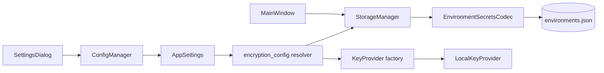

# PYPOST-481: Add user-facing configuration for environment encryption settings

## Research

- PYPOST-447 stores encryption policy in process env vars (`PYPOST_ENV_ENCRYPTION_ENABLED`,
  `PYPOST_ENV_ENCRYPTION_KEY`) read directly by `StorageManager` and `LocalKeyProvider`.
- Application settings already use `AppSettings` (Pydantic) persisted via `ConfigManager` to
  `settings.json`; `SettingsDialog` edits and `MainWindow.open_settings()` saves them.
- `StorageManager` is constructed in `MainWindow` and used by `EnvPresenter` for environment
  persistence; encryption must be reconfigured when settings change.
- Similar settings pattern: optional fields with defaults (e.g. `log_hidden_key_names`) and UI
  controls added to `SettingsDialog` with persistence tests in `tests/test_settings_*.py`.

## Implementation Plan

1. Extend `AppSettings` with optional encryption fields:
   - `env_encryption_enabled: Optional[bool] = None` (None = follow env var)
   - `env_encryption_key_source: Optional[str] = None` (None = `"environment"`)
2. Add `pypost/core/encryption_config.py`:
   - Resolve enabled flag and key source from settings with env-var fallback.
   - Factory `build_key_provider(source)` returning `LocalKeyProvider` for `"environment"`.
3. Update `StorageManager`:
   - Store optional settings reference via `apply_encryption_settings(settings)`.
   - Use resolver for `_is_encryption_enabled()` and rebuild codec/key provider on apply.
4. Update `SettingsDialog`:
   - Combo for encryption mode: default (env var) / enabled / disabled.
   - Combo for key source: environment variable (future sources disabled in UI).
   - Helper label describing secure key setup (key stays in env var, not settings file).
5. Update `MainWindow`:
   - Call `storage.apply_encryption_settings(settings)` on init and after settings save.
6. Tests:
   - Resolver unit tests, storage tests with settings-driven encryption, dialog/persistence tests.
7. Update `doc/dev/environment_encryption_at_rest.md` with app-settings configuration path.

## Architecture

### Modules

| Module | Responsibility |
| --- | --- |
| `AppSettings` | Persist encryption toggle and key source strategy |
| `encryption_config` | Resolve policy from settings + env fallback; build key provider |
| `StorageManager` | Apply resolved policy on save/load |
| `SettingsDialog` | User-facing encryption controls |
| `MainWindow` | Apply settings to storage on init and save |

### Interfaces

- `resolve_encryption_enabled(settings: AppSettings | None) -> bool`
- `resolve_key_source(settings: AppSettings | None) -> str`
- `build_key_provider(source: str) -> KeyProvider`
- `StorageManager.apply_encryption_settings(settings: AppSettings | None) -> None`

### Patterns

- **Strategy**: key source selection via factory (extensible for future providers).
- **Fallback chain**: explicit settings override, then process environment variables.
- **MVC**: settings model + dialog view + main window controller wiring storage.

## Q&A

- Q: Should changing encryption settings re-save all environments immediately?
  A: No. Policy applies on next save/load; avoids scope creep and surprise bulk re-encryption.
- Q: Where is the Fernet key stored?
  A: Unchanged — `PYPOST_ENV_ENCRYPTION_KEY` for the environment source strategy; never in
  `settings.json`.
