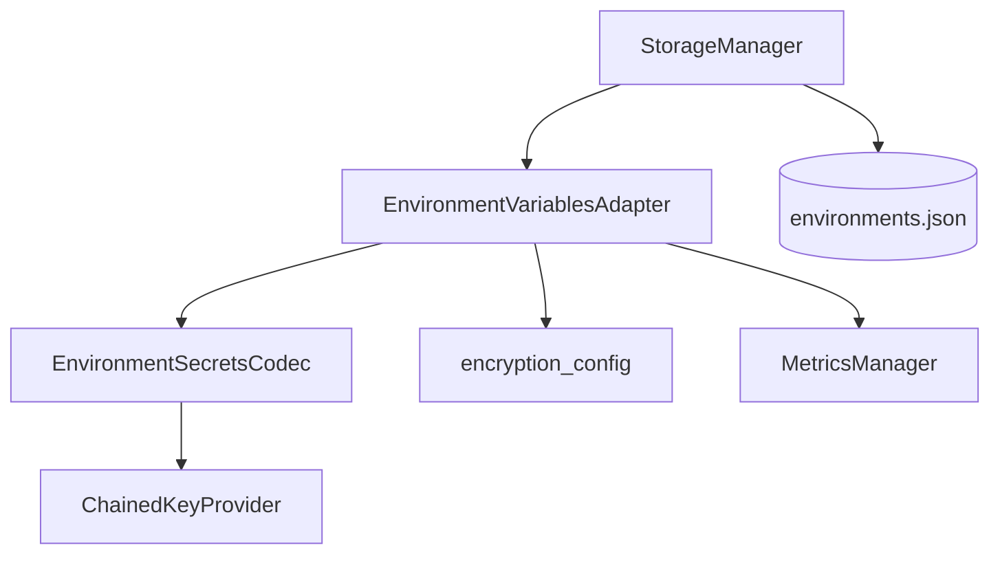

# PYPOST-482: Refactor StorageManager encryption responsibilities into adapter/service

## Research

### Current codebase findings

1. **`StorageManager` responsibilities** (`pypost/core/storage.py` before refactor):
   - Path bootstrap, collection CRUD, atomic `environments.json` write.
   - Encryption policy via `apply_encryption_settings` and `resolve_encryption_enabled`.
   - Per-environment serialize/deserialize loops with metrics and structured logs.
   - Delegation to `EnvironmentSecretsCodec` for Fernet envelope crypto.

2. **Existing split.** `EnvironmentSecretsCodec` (`pypost/core/environment_secrets_codec.py`)
   already isolates envelope encrypt/decrypt. Policy, variable iteration, metrics, and
   environment-level logging remained in `StorageManager`.

3. **Async integration (PYPOST-486).** `EnvironmentStorageWorker` calls synchronous
   `StorageManager.load_environments()` / `save_environments()` on a background thread.
   Refactor must not change the public `StorageManager` API or on-disk format.

4. **Tests.** `tests/test_storage_environments.py` covers end-to-end storage behavior including
   metrics. Adapter-level tests improve coverage without duplicating all storage scenarios.

5. **Prior debt references.** PYPOST-447, PYPOST-481, PYPOST-486 tech-debt files tracked this
   extraction as follow-up PYPOST-482.

## Implementation Plan

### Phase 1 — Adapter module (`pypost/core/environment_variables_adapter.py`)

1. Add `EnvironmentVariablesAdapter` with:
   - `apply_encryption_settings(settings)` — rebuild codec, log policy application.
   - `serialize_environment(env) -> dict` — model dump + variable encryption loop.
   - `deserialize_environment(raw_env) -> Environment` — decode variables + construct model.
2. Move `_decode_variable_value`, `_is_encryption_enabled`, metrics hooks, and related logs
   from `StorageManager`.

### Phase 2 — StorageManager slim-down

1. Construct `EnvironmentVariablesAdapter(metrics=metrics)` in `StorageManager.__init__`.
2. Delegate `apply_encryption_settings` and environment serialize/deserialize to the adapter.
3. Keep collection I/O and atomic environment file write/read unchanged.

### Phase 3 — Tests

| Area | File | Asserts |
| --- | --- | --- |
| Adapter unit | `tests/test_environment_variables_adapter.py` | Encrypt policy, round-trip, metrics |
| Storage regression | `tests/test_storage_environments.py` | Unchanged behavior via `StorageManager` |
| Async regression | `tests/test_environment_storage_*.py` | Gateway/worker still function |

## Architecture

### Module diagram



### Responsibilities

| Module | Responsibility | Changes |
| --- | --- | --- |
| `StorageManager` | Paths, collections, atomic env file I/O | Delegates variable encoding |
| `EnvironmentVariablesAdapter` | Policy, serialize/deserialize, metrics/logs | **New** |
| `EnvironmentSecretsCodec` | Fernet envelope crypto | No change |
| `EnvironmentStorageGateway` | Async orchestration | No change |
| `MetricsManager` | Encryption counters | No change |

### Main interfaces

```python
class EnvironmentVariablesAdapter:
    def __init__(self, metrics: MetricsManager | None = None) -> None: ...

    def apply_encryption_settings(self, settings: AppSettings | None) -> None: ...

    def serialize_environment(self, env: Environment) -> dict[str, Any]: ...

    def deserialize_environment(self, raw_env: dict[str, Any]) -> Environment: ...
```

### Patterns

1. **Adapter** — bridges domain `Environment` models and on-disk JSON variable shapes.
2. **Composition** — `StorageManager` owns adapter; no global singleton.
3. **Preserve observability** — metrics/logs stay in the encoding path (adapter), not file I/O.

## Q&A

- Q: Why adapter vs service?
  A: Adapter name reflects translation between in-memory models and persisted JSON variables;
  no network or separate process.
- Q: Should codec move into the adapter file?
  A: No — codec stays separate; adapter orchestrates policy and iteration.
- Q: Breaking change risk?
  A: Low — internal refactor only; public `StorageManager` methods unchanged.
