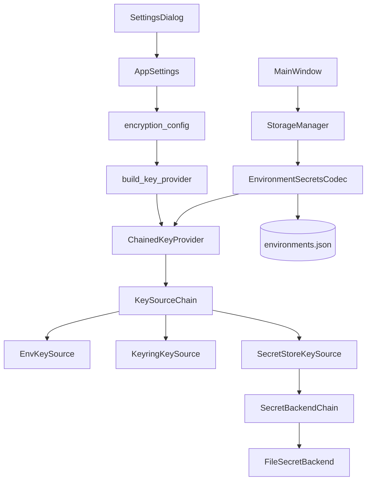
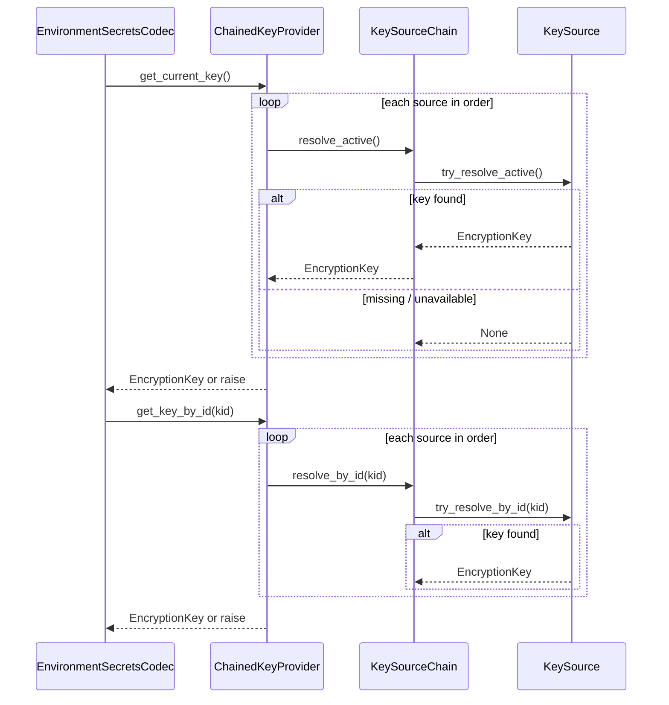
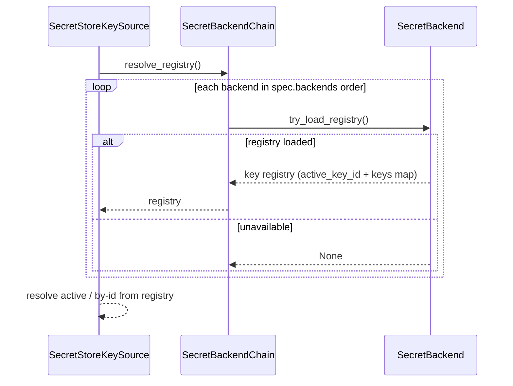

# PYPOST-483: Extend LocalKeyProvider to provider-chain and rotation workflow

## Programming Language

Python 3.10+ (union types such as `EncryptionKey | None`, `list[str]`, and `Optional[...]` usage
in this design assume 3.10+).

## Research

### Current implementation

- `KeyProvider` (`pypost/core/key_provider.py`) exposes `get_current_key()` and
  `get_key_by_id(key_id)`; `EnvironmentSecretsCodec` uses these for encrypt/decrypt without
  knowing the source.
- `LocalKeyProvider` reads a single Fernet key from `PYPOST_ENV_ENCRYPTION_KEY`, derives
  `key_id` as `sha256(key)[:16]`, and rejects decrypt when the stored `kid` does not match the
  current key — rotation is impossible today.
- `encryption_config.py` (PYPOST-481) resolves policy from `AppSettings` + env fallback and
  builds only `LocalKeyProvider` for `"environment"`.
- `StorageManager.apply_encryption_settings()` rebuilds `EnvironmentSecretsCodec` when settings
  change; the codec and envelope format (`kid`, Fernet) stay unchanged.
- Settings UI exposes key source combo with one option; `env_encryption_key_source` is the
  primary strategy field. No fallback-order field exists yet.
- `cryptography` is already a dependency; `keyring` is not — add as an optional runtime
  dependency with graceful failure when the backend is unavailable.
- PYPOST-447/481 architecture explicitly deferred keyring, external secret store, and provider
  chain to this task.

### External references

- Python [`keyring`](https://pypi.org/project/keyring/) integrates with macOS Keychain, Windows
  Credential Locker, and Freedesktop Secret Service on Linux. Use a fixed service namespace
  (e.g. `pypost/env-encryption`) and distinct entry names for active vs historical keys.
- Twelve-factor / env-var pattern remains valid for CI and backward-compatible deployments; it
  stays the last-resort fallback in configured chains.
- Secret-store “provider chain” is modeled as ordered `SecretBackend` implementations (v1: file
  only; env-indirection and vault backends deferred) rather than a single vendor API in this task.

## Implementation Plan

1. **Introduce key-source layer** under `pypost/core/key_sources/`:
   - `KeySource` protocol: resolve active key and lookup by `key_id` from one channel.
   - `EnvKeySource`, `KeyringKeySource`, `SecretStoreKeySource` implementations.
   - `KeySourceChain` composes ordered sources for fallback.
2. **Refactor `key_provider.py`**:
   - Keep `KeyProvider` as the existing abstract base class (subclass pattern with
     `NotImplementedError`; do not migrate to `Protocol`).
   - Keep `EncryptionKey`, `EnvironmentEncryptionError`, and stable `_build_key_id()`.
   - Add `ChainedKeyProvider(KeyProvider)` that delegates to `KeySourceChain`.
   - Retain `LocalKeyProvider` as a thin subclass of `ChainedKeyProvider` wired to an env-only
     `KeySourceChain` for backward-compatible imports and tests.
3. **Extend settings and resolver** (`AppSettings`, `encryption_config.py`):
   - Add `env_encryption_key_source_fallback: Optional[list[str]] = None`.
   - Expand `EncryptionKeySource` literal and `SUPPORTED_KEY_SOURCES`.
   - Retain `resolve_key_source(settings) -> EncryptionKeySource` for logging/telemetry (primary
     source label only).
   - Add `resolve_key_source_chain(settings) -> list[str]` — primary + configured fallback,
     deduped; used by `build_key_provider()` to construct the provider chain.
   - `build_key_provider(settings)` — build `ChainedKeyProvider` from resolved chain.
4. **Define rotation-friendly storage conventions** (outside `settings.json`):
   - Document operator provisioning for active + historical keys per source.
   - Env path: keep `PYPOST_ENV_ENCRYPTION_KEY` as active; optional
     `PYPOST_ENV_ENCRYPTION_KEYS_FILE` for operator-managed JSON registry.
   - Keyring path: service `pypost/env-encryption`, entry `active` + entries named by `key_id`.
   - Secret-store path: operator JSON spec file referenced by env var, with internal backend
     chain.
5. **Update Settings UI** (`settings_dialog.py`):
   - Enable keyring and secret-store primary options.
   - Add fallback-order control (ordered multi-select or preset chain reflecting settings list).
   - Update helper text per source; never persist key material.
6. **Tests**:
   - Unit tests per `KeySource`, chain fallback, rotation (mixed `kid` decrypt + new encrypt),
     backward-compat env-only path, missing historical key errors.
   - Extend `test_encryption_config.py`, `test_key_provider.py`, storage/settings tests.
7. **Documentation** (Step 7 artifact; outline now):
   - Update `doc/dev/environment_encryption_at_rest.md` with sources, fallback, rotation ops.

## Architecture

### Module diagram



### Modules and responsibilities

| Module | Responsibility |
| --- | --- |
| `KeyProvider` / `ChainedKeyProvider` | Stable facade for codec: active key + lookup by `kid` |
| `KeySource` (protocol) | Resolve keys from one configured channel; return `None` when unavailable |
| `EnvKeySource` | Active key from `PYPOST_ENV_ENCRYPTION_KEY`; historical keys from optional registry file |
| `KeyringKeySource` | Active + historical keys from OS credential store via `keyring` |
| `SecretStoreKeySource` | Load key registry from operator-managed spec; delegate to backend chain |
| `SecretBackend` (base class) | Read key registry entries from one secret-store channel (file in v1) |
| `SecretBackendChain` | Ordered fallback across `SecretBackend` implementations inside spec |
| `FileSecretBackend` | v1 backend: load `keys` map from local JSON path in spec |
| `KeySourceChain` | Ordered fallback across key sources for active and by-id resolution |
| `encryption_config` | Resolve primary source, fallback list, enabled flag; factory wiring |
| `AppSettings` | Persist primary strategy and fallback order only (no key material) |
| `StorageManager` | Unchanged contract: rebuild codec on `apply_encryption_settings()` |
| `EnvironmentSecretsCodec` | Unchanged: `get_current_key()` on encrypt, `get_key_by_id(kid)` on decrypt |
| `SettingsDialog` | Expose new sources and fallback configuration |

### Key resolution flow



### Secret-store backend resolution

When `SecretStoreKeySource` is in the key-source chain, it loads the operator spec from
`PYPOST_ENV_ENCRYPTION_SECRETS_FILE` and delegates registry lookup to `SecretBackendChain`:



### Key rotation model

Rotation does not change the envelope format. Compatibility relies on stable `key_id` derivation
and a registry that holds multiple keys:

| Role | Resolution | Storage (examples) |
| --- | --- | --- |
| Active key | `get_current_key()` | Env var, keyring `active` entry, registry `active_key_id` |
| Historical key | `get_key_by_id(kid)` | Registry map / keyring entry named `kid` |

Operator workflow mapping:

1. **Introduce new active key** — provision new Fernet material; set as active in the chosen
   source; new `key_id` is derived automatically.
2. **Retain historical keys** — keep prior key material registered under its `kid` in the same
   source (or a source reachable in the configured chain).
3. **Verify** — load environments; decrypt paths use `get_key_by_id`; encrypt paths use
   `get_current_key`.
4. **Complete** — mixed `kid` values in `environments.json` are expected until optional bulk
   re-encryption (PYPOST-487).

Backward compatibility: deployments with only `PYPOST_ENV_ENCRYPTION_KEY` behave as today — single
key serves as active and satisfies `get_key_by_id` when `kid` matches.

### Configuration model

**Application settings (`settings.json`) — policy only**

| Field | Purpose |
| --- | --- |
| `env_encryption_key_source` | Primary key source: `environment`, `keyring`, `secret_store` |
| `env_encryption_key_source_fallback` | Optional ordered list of additional sources to try |

When fallback is unset, only the primary source is attempted (preserves strict env-only setups).

**Process environment — source-specific (not in settings)**

| Variable | Used by |
| --- | --- |
| `PYPOST_ENV_ENCRYPTION_KEY` | `EnvKeySource` active key (existing) |
| `PYPOST_ENV_ENCRYPTION_KEYS_FILE` | `EnvKeySource` optional JSON key registry (env-channel only) |
| `PYPOST_ENV_ENCRYPTION_SECRETS_FILE` | `SecretStoreKeySource` path to secret-store spec file |
| `PYPOST_ENV_ENCRYPTION_ENABLED` | Encryption toggle fallback (unchanged) |

**Operator distinction — `KEYS_FILE` vs `SECRETS_FILE`**

- `PYPOST_ENV_ENCRYPTION_KEYS_FILE` supplements the **environment-variable key channel** when
  `env_encryption_key_source` (or fallback) includes `environment`. It points to a JSON registry of
  Fernet keys for rotation (active + historical `kid` entries). It does not select backends or
  drive `SecretStoreKeySource`.
- `PYPOST_ENV_ENCRYPTION_SECRETS_FILE` is used only by **`SecretStoreKeySource`**. It points to
  an operator-managed spec that names `active_key_id`, the `keys` map, and the ordered
  `backends` list consumed by `SecretBackendChain`. It is unrelated to direct env-var key lookup.

**Keyring conventions**

- Service: `pypost/env-encryption`
- Username `active`: current Fernet key string
- Username `{key_id}`: historical Fernet key string
- Missing `keyring` package or OS backend → source returns unavailable (chain continues)

**Env-channel key registry (`PYPOST_ENV_ENCRYPTION_KEYS_FILE`, optional)**

Used by `EnvKeySource` only. Minimal shape:

```json
{
  "active_key_id": "abc123def4567890",
  "keys": {
    "abc123def4567890": "<fernet-key-active>",
    "fedcba0987654321": "<fernet-key-historical>"
  }
}
```

When unset, env-only mode uses `PYPOST_ENV_ENCRYPTION_KEY` as active; historical lookup succeeds
only when `kid` matches that key.

**Secret-store spec (`PYPOST_ENV_ENCRYPTION_SECRETS_FILE`, operator file)**

Minimal v1 shape:

```json
{
  "active_key_id": "abc123def4567890",
  "keys": {
    "abc123def4567890": "<fernet-key-active>",
    "fedcba0987654321": "<fernet-key-historical>"
  },
  "backends": [
    {
      "type": "file",
      "path": "/secure/pypost-encryption-keys.json"
    }
  ]
}
```

v1 implements only the `file` backend (`FileSecretBackend`). The `env-indirection` backend
(resolving key material via env var names declared in the spec rather than inline values) is
**out of scope for v1**; reserve the `type` field for future backends (vault HTTP, env-indirection,
etc.) without changing the codec.

### Main interfaces

```python
class KeySource(Protocol):
    @property
    def name(self) -> str: ...

    def try_resolve_active(self) -> EncryptionKey | None: ...

    def try_resolve_by_id(self, key_id: str) -> EncryptionKey | None: ...


class KeyProvider:
    """Abstract base class (existing pattern); subclasses implement resolution."""

    def get_current_key(self) -> EncryptionKey: ...

    def get_key_by_id(self, key_id: str) -> EncryptionKey: ...


class ChainedKeyProvider(KeyProvider):
    """Delegates to KeySourceChain; default provider from build_key_provider()."""


class LocalKeyProvider(ChainedKeyProvider):
    """Backward-compatible env-only chain; preserves existing import path."""


class SecretBackend:
    """Abstract base class for one secret-store channel."""

    def try_load_registry(self, spec: dict) -> KeyRegistry | None: ...


class SecretBackendChain:
    def resolve_registry(self, spec: dict) -> KeyRegistry: ...


def resolve_key_source(settings: AppSettings | None) -> EncryptionKeySource: ...


def resolve_key_source_chain(settings: AppSettings | None) -> list[str]: ...


def build_key_provider(settings: AppSettings | None) -> KeyProvider: ...


def create_key_source(source: EncryptionKeySource) -> KeySource: ...


def create_secret_backend(backend_type: str) -> SecretBackend: ...
```

`KeyRegistry` is a typed structure (`active_key_id`, `keys: dict[str, str]`) shared by
`SecretStoreKeySource` and backends.

Error semantics (unchanged intent, extended labels):

- No source yields active key → `EnvironmentEncryptionError` (safe message, no key material).
- Unknown / removed historical `kid` → `EnvironmentEncryptionError` on decrypt.
- Log with structured fields: `source`, `key_id`, `reason` — never log key bytes.

### Architectural patterns

| Pattern | Application | Justification |
| --- | --- | --- |
| **Strategy** | `KeySource` implementations | Swap env / keyring / secret store without touching codec |
| **Chain of Responsibility** | `KeySourceChain` | Ordered fallback per requirements |
| **Facade** | `ChainedKeyProvider` | Preserves existing `KeyProvider` contract for PYPOST-447/481 |
| **Factory** | `build_key_provider(settings)` | Central wiring from settings + env |
| **Chain of Responsibility** | `SecretBackendChain` | Ordered fallback within secret-store spec |
| **Registry** | Per-source key maps | Supports rotation (active + historical by `kid`) |

### Integration points (unchanged boundaries)

- `EnvironmentSecretsCodec` — no API change; continues to depend on `KeyProvider` only.
- `StorageManager` — call `build_key_provider(settings)` (uses `resolve_key_source_chain`
  internally). Continue calling `resolve_key_source(settings)` separately where a single primary
  source label is needed for logging/telemetry.
- Runtime request path — no encryption awareness (PYPOST-447).

### Dependencies

- Add `keyring` to `requirements.txt` (optional import guarded in `KeyringKeySource`).
- No new network dependency for default paths; secret-store file backend stays local/offline.

## Q&A

- Q: Why not store historical keys in `settings.json`?
  A: Same security rule as PYPOST-481 — settings hold policy only; key material stays in env,
  keyring, or operator-managed secret files.

- Q: How does env-only backward compatibility work after refactor?
  A: Primary source `environment` with no fallback reproduces today’s single-var behavior.
  `LocalKeyProvider` remains a thin `ChainedKeyProvider` subclass; `get_key_by_id` succeeds when
  `kid` matches the env key.

- Q: Why keep `resolve_key_source()` alongside `resolve_key_source_chain()`?
  A: `resolve_key_source()` returns the primary strategy label for logs and telemetry; chain
  construction uses the ordered list from `resolve_key_source_chain()`.

- Q: What is the difference between `PYPOST_ENV_ENCRYPTION_KEYS_FILE` and
  `PYPOST_ENV_ENCRYPTION_SECRETS_FILE`?
  A: `KEYS_FILE` is an optional env-channel registry for `EnvKeySource`. `SECRETS_FILE` is the
  secret-store spec consumed by `SecretStoreKeySource` and its `SecretBackendChain`.

- Q: What if keyring is selected but not installed?
  A: `KeyringKeySource` treats that as unavailable; chain tries fallback sources or fails with a
  clear error if none succeed.

- Q: Where is bulk re-encryption handled?
  A: Out of scope (PYPOST-487). Mixed `kid` values in storage are valid after rotation.

- Q: How is active key identified in a multi-key registry?
  A: Explicit `active_key_id` in registry files / keyring `active` entry; env-only mode uses
  `PYPOST_ENV_ENCRYPTION_KEY` as active and optional registry file for historical entries only.

- Q: Does `key_id` format change?
  A: No — remain `sha256(key_material)[:16]` for compatibility with existing encrypted payloads.
