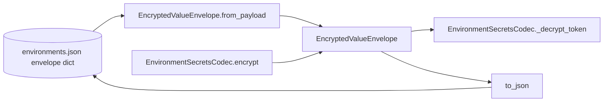

# PYPOST-484: Replace manual envelope validation with typed payload model

## Programming Language

Python 3.10+ (frozen dataclass, `ClassVar`, and type hints).

## Research

- Existing `EncryptedValueEnvelope` dataclass already models outbound encrypt results with
  `to_json()`.
- Inbound decrypt used imperative `_validate_payload` duplicating version/algorithm/field rules.
- Pydantic is available project-wide but default validation errors differ from established
  `EnvironmentEncryptionError` messages tested in PYPOST-447.
- v1 on-disk schema is documented in `doc/dev/environment_encryption_at_rest.md` (`enc`, `v`,
  `alg`, `kid`, `ct`).

## Implementation Plan

1. Add `VERSION` and `ALGORITHM` class constants on `EncryptedValueEnvelope`.
2. Implement `from_payload(cls, payload)` factory:
   - validate `enc`, `v`, `alg`
   - require `kid` and `ct`
   - coerce identifiers to `str`
   - raise `EnvironmentEncryptionError` with unchanged messages
3. Point `EnvironmentSecretsCodec.VERSION` / `.ALGORITHM` at envelope constants.
4. Replace `_validate_payload` usage in `decrypt` with `EncryptedValueEnvelope.from_payload`.
5. Add unit tests for `from_payload` acceptance and rejection cases.
6. Document typed model in dev docs payload section.

## Architecture

### Modules and Responsibilities

| Module | Change |
| --- | --- |
| `pypost/core/environment_secrets_codec.py` | Typed `from_payload`; remove `_validate_payload` |
| `tests/test_environment_secrets_codec.py` | Direct model validation tests |
| `doc/dev/environment_encryption_at_rest.md` | Document `from_payload` API |

### Interfaces

- `EncryptedValueEnvelope.from_payload(payload: dict[str, Any]) -> EncryptedValueEnvelope`
- `EncryptedValueEnvelope.to_json() -> dict[str, Any]` (unchanged output shape)
- `EnvironmentSecretsCodec.decrypt(payload)` — behavior unchanged, implementation delegates to model

### Future Extension

When v2 envelopes are introduced, add `from_payload` version dispatch or a dedicated v2 model
without changing adapter or storage layers.

## Q&A

- **Does the adapter change?** No — it still passes raw dicts to `decrypt` when `enc is True`.
