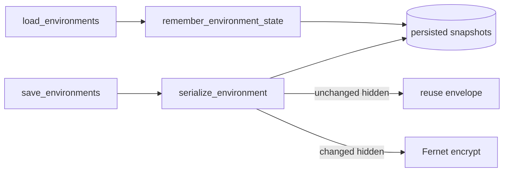

# PYPOST-485: Selective re-encrypt on environment save

## Research

1. **Hot path.** `StorageManager.save_environments()` calls
   `EnvironmentVariablesAdapter.serialize_environment()` per environment. Each hidden key
   invokes `EnvironmentSecretsCodec.encrypt()` unconditionally (PYPOST-482 adapter).
2. **Plaintext available.** In-memory `Environment.variables` holds decrypted strings after
   load; on-disk `environments.json` holds encrypted envelopes for hidden keys.
3. **No model dirty flags.** `Environment` is a plain Pydantic model; presenters call
   `save_environments` with full env list. Tracking dirty keys in UI would scatter policy.
4. **Cache location.** Adapter already owns serialize/deserialize; storage owns file I/O.
   Persisted-state snapshots fit the adapter with hooks from `StorageManager` on load/save.

## Implementation Plan

### Phase 1 — Persisted-state cache (`EnvironmentVariablesAdapter`)

1. Add in-memory maps keyed by `env.id`:
   - `_persisted_variables`: last serialized variable payloads (plain or envelope dicts).
   - `_persisted_plaintext`: last known plaintext per key (from last load/save).
2. `remember_environment_state(env_id, raw_variables, plaintext)` — update after load/save.
3. `clear_persisted_state()` — on `apply_encryption_settings()` so policy changes never reuse
   stale envelopes incorrectly.

### Phase 2 — Selective serialize

For each hidden key when encryption is enabled:

- **Reuse** prior envelope when:
  - `persisted_plaintext[key] == current plaintext`, and
  - `persisted_variables[key]` is a valid `enc: true` dict.
- **Encrypt** when value changed, key newly hidden, prior value was plaintext, or no cache.

Non-hidden keys always serialize as plain strings. Log `encrypted_count` and `reused_count`.

### Phase 3 — StorageManager wiring

- `load_environments`: after deserialize, call `remember_environment_state` with file raw
  variables and decrypted plaintext.
- `save_environments`: serialize (reads cache), then update cache from serialized output.

### Phase 4 — Tests

| File | Coverage |
| --- | --- |
| `tests/test_environment_variables_adapter.py` | Reuse on second save, re-encrypt on change |
| `tests/test_storage_environments.py` | End-to-end save/load preserves reuse behavior |

## Architecture

## Q&A

- Q: Why not decrypt previous envelope to compare?
  A: Plaintext snapshot from last load/save avoids decrypt-on-save entirely.
- Q: Fernet non-determinism?
  A: Reusing envelope for unchanged plaintext is correct; re-encrypt would change `ct` only.
