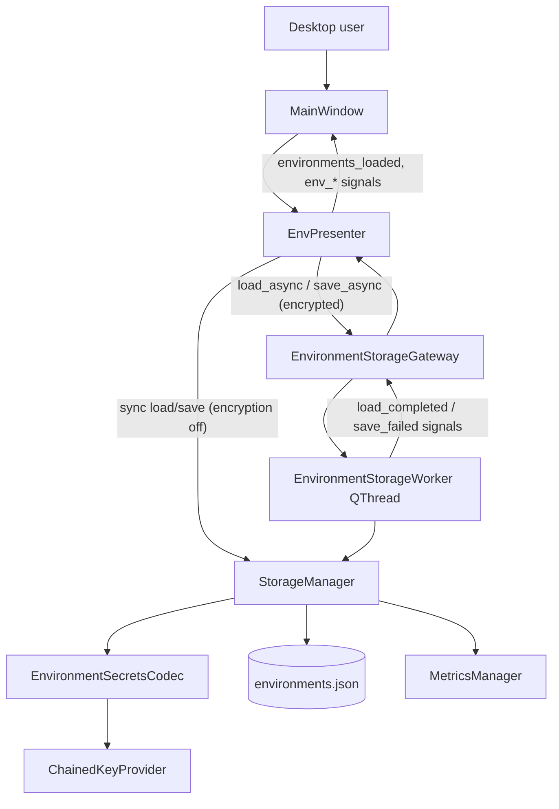
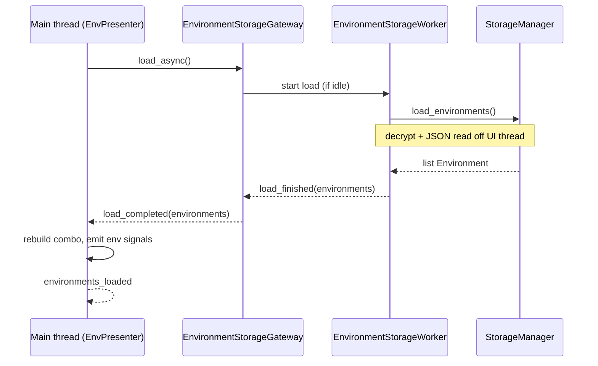

# PYPOST-486: Keep the desktop UI responsive during encrypted environment load and save

## Research

### Current codebase findings

1. **Blocking call path.** `EnvPresenter` calls `StorageManager.load_environments()` and
   `save_environments()` synchronously on the Qt main thread
   (`pypost/ui/presenters/env_presenter.py`). Call sites:
   - startup: `MainWindow.__init__` → `env.load_environments()`;
   - collection reload: `collections_changed` → `env.load_environments()`;
   - script env update: `on_env_update` → `save_environments`;
   - variable set: `handle_variable_set_request` → `save_environments`;
   - env manager close: `_open_env_manager` → `save_environments` then `load_environments`.

2. **Where time is spent.** `StorageManager` performs JSON I/O plus per-variable encrypt/decrypt
   loops in `_serialize_environment` / `_deserialize_environment`
   (`pypost/core/storage.py`). With many environments and hidden keys, Fernet operations dominate
   and block the event loop.

3. **Persistence guarantees (must preserve).** Save uses write-to-`.tmp` + `os.replace` for
   atomic replacement. Failed replace cleans up the temp file and re-raises. Load catches
   exceptions, logs, and returns `[]` (including decrypt failures). Metrics and structured logs
   are emitted inside the storage path via `MetricsManager`.

4. **Existing threading precedent.** Network execution already runs off the UI thread via
   `RequestWorker(QThread)` (`pypost/core/worker.py`) with Qt signals back to presenters.
   The project consistently uses subclassed `QThread` with `run()` rather than the
   worker-object + `moveToThread` pattern.

5. **Encryption settings lifecycle.** `MainWindow` calls
   `storage.apply_encryption_settings(settings)` on init and after settings save. The worker must
   see the latest policy snapshot before each operation; concurrent mutation of
   `_secrets_codec` during a background job would be unsafe without coordination.

6. **Out of scope (per requirements).** Per-value encryption reduction (PYPOST-485), storage
   adapter extraction (PYPOST-482), encryption policy/format changes, and new UI settings are
   not part of this task.

### External guidance (Qt / PySide6)

- Long-running or CPU-bound work must not run on the GUI thread; use a worker thread and return
  results via signals/slots ([Qt QThread docs](https://doc.qt.io/qt-6/qthread.html),
  [Real Python QThread guide](https://realpython.com/python-pyqt-qthread/)).
- Inter-thread communication should use Qt signals (thread-safe queued connections) rather than
  direct widget updates from the worker ([Python GUIs QThreadPool tutorial](
  https://www.pythonguis.com/tutorials/multithreading-pyside6-applications-qthreadpool/)).
- Serialize access to shared mutable state (settings snapshot, operation queue) to avoid save
  races and torn reads.

## Implementation Plan

### Phase 1 — Background worker module (`pypost/core/environment_storage_worker.py`)

1. Add `EnvironmentStorageWorker(QThread)` mirroring the `RequestWorker` pattern:
   - Input: operation kind (`load` | `save`), reference to `StorageManager`, and for saves a
     snapshot `list[Environment]`.
   - `run()` invokes the existing synchronous `StorageManager` methods on the worker thread.
   - Signals (all emitted from worker thread; Qt delivers slots on the main thread):
     - `load_finished(list)` — successful load result;
     - `load_failed(object)` — load exception (rare; most failures today return `[]` inside
       storage);
     - `save_finished()` — atomic save completed;
     - `save_failed(object)` — `EnvironmentEncryptionError` or I/O failure.
2. Do **not** change encrypt/decrypt logic, envelope format, or atomic write mechanics inside
   `StorageManager`.

### Phase 2 — Operation gateway (`pypost/core/environment_storage_gateway.py`)

1. Add `EnvironmentStorageGateway(QObject)` owned by `EnvPresenter`:
   - Holds the shared `StorageManager` reference.
   - Maintains a single active `EnvironmentStorageWorker` (one operation at a time).
   - Exposes imperative API:
     - `load_async() -> None`
     - `save_async(environments: list[Environment]) -> None`
   - Emits gateway-level signals consumed by the presenter:
     - `load_completed(list[Environment])`
     - `load_failed(object)`
     - `save_completed()`
     - `save_failed(object)`
2. **Operation serialization.** Queue pending load/save requests. If a save is in flight and
   another save arrives, replace the queued save payload with the latest environment list
   (coalesce). If a load arrives while work is running, enqueue it to run after the current
   operation finishes.
3. **Save snapshot.** Pass ` [env.model_copy(deep=True) for env in environments] ` to the worker
   so in-memory edits on the main thread during a slow save do not corrupt the serialized
   payload.
4. **Settings visibility.** Call `storage.apply_encryption_settings(...)` only from the main
   thread (existing `MainWindow` / presenter flow). The worker reads storage state at operation
   start; no concurrent `apply_encryption_settings` during an in-flight job (gateway rejects
   or queues settings-apply until idle — presenter already applies settings outside save/load
   hot paths).

### Phase 3 — Presenter integration (`pypost/ui/presenters/env_presenter.py`)

1. Inject or construct `EnvironmentStorageGateway` in `EnvPresenter`.
2. Replace direct `_storage.load/save_environments` calls with gateway async methods when
   encryption is enabled (`resolve_encryption_enabled(self._settings)`).
3. **Fast path when encryption disabled.** Keep synchronous storage calls — no measurable UI
   freeze expected, zero behavior change for plain-text deployments.
4. **Load completion handler** (main thread): assign `_environments`, rebuild combo box, restore
   selection, call `_on_env_changed` — extract today's body of `load_environments()` into
   `_apply_loaded_environments(environments)`.
5. **Save failure handler** (main thread): show `QMessageBox.warning` with the exception message
   (same user-visible class of feedback as today when encrypt/decrypt fails); do not mutate
   on-disk state (already guaranteed by storage).
6. **Load failure / empty result:** preserve current semantics — empty list, error logged inside
   storage, metrics incremented; optional non-blocking status-bar message only if an existing
   pattern exists (no new dialog requirement).
7. Add `environments_loaded = Signal()` emitted after load UI refresh completes so
   `MainWindow` can defer `tabs.restore_tabs()` until environments are available on startup.

### Phase 4 — Startup ordering (`pypost/ui/main_window.py`)

1. Change init sequence when encryption is enabled:
   - `collections.load_collections()` (unchanged);
   - `env.load_environments()` starts async load;
   - connect one-shot to `env.environments_loaded` → `tabs.restore_tabs()` +
     `collections.restore_tree_state()`;
   - `apply_settings()` after env load completes (or keep current order if tabs tolerate empty
     env vars until signal — verify during implementation).
2. When encryption is disabled, keep the current synchronous startup sequence unchanged.

### Phase 5 — Tests

| Area | File | Asserts |
| --- | --- | --- |
| Worker load/save | `tests/test_environment_storage_worker.py` | Worker calls storage; signals fire; errors propagate |
| Gateway queue/coalesce | `tests/test_environment_storage_gateway.py` | Single-flight ops; save coalescing; queued load after save |
| Presenter async | `tests/test_env_presenter.py` | Async load refreshes combo; save error shows message box |
| Persistence regression | `tests/test_storage_environments.py` | Unchanged — sync `StorageManager` API |
| Responsiveness | `tests/test_env_storage_responsiveness.py` | Large encrypted fixture: event loop processes events during load/save (e.g. `QEventLoop` + timer or `QSignalSpy` on zero-timeout timer fired from another slot) |

Large-environment test fixture: reuse patterns from existing storage encryption tests; scale
environment count and hidden-key count to reproduce blocking (implementation step defines exact
threshold from local profiling).

## Architecture

### System module diagram



### Module interaction (encrypted load)



### Modules and responsibilities

| Module | Responsibility | Changes |
| --- | --- | --- |
| `StorageManager` | Sync encrypt/decrypt, atomic save, metrics/logs | **No** crypto/I/O semantic changes |
| `EnvironmentStorageWorker` | Run one load or save job on a background thread | **New** |
| `EnvironmentStorageGateway` | Queue/coalesce ops, worker lifecycle, signal bridge | **New** |
| `EnvPresenter` | UI orchestration, error dialogs, env selector state | **Yes** |
| `MainWindow` | Startup ordering when async load is used | **Yes** (minimal) |
| `EnvironmentSecretsCodec` | Fernet envelope encode/decode | No change |
| `encryption_config` | Policy resolution | No change |
| `MetricsManager` | Encryption counters (thread-safe Counters) | No change |

### Dependencies

- `EnvPresenter` → `EnvironmentStorageGateway` → `EnvironmentStorageWorker` → `StorageManager`.
- `EnvPresenter` → `encryption_config.resolve_encryption_enabled` for fast-path routing.
- `MainWindow` → `EnvPresenter.environments_loaded` for startup gating.
- Persistence and runtime contract unchanged: `Environment.variables` remain plain `dict[str, str]`
  in memory after load completes on the main thread.

### Selected architectural patterns

1. **Background worker thread (QThread).** Matches `RequestWorker`; moves CPU-bound Fernet work
   and file I/O off the Qt event loop to satisfy responsiveness requirements.

2. **Gateway / façade with operation queue.** Single-flight execution prevents concurrent writes to
   `environments.json` and avoids overlapping codec use. Save coalescing ensures the latest
   in-memory state wins when users trigger rapid saves.

3. **Snapshot on save.** Deep copy of `Environment` models before handing data to the worker
   isolates the serialized payload from concurrent UI edits.

4. **Dual-path routing (encrypted vs plain).** When encryption is disabled, retain synchronous
   storage calls — simpler, no regression for non-encrypted users, aligns with FR "behavior unchanged
   when encryption is disabled."

5. **Signal-driven UI updates.** Worker never touches Qt widgets; presenter slots apply model
   state and emit existing `env_variables_changed` / related signals.

6. **Preserve repository boundaries.** Do not extract `StorageManager` into a separate service
   (PYPOST-482); keep changes localized to async orchestration around the existing API.

### Main interfaces

`EnvironmentStorageWorker` (`pypost/core/environment_storage_worker.py`):

```python
class EnvironmentStorageWorker(QThread):
    load_finished = Signal(list)
    load_failed = Signal(object)
    save_finished = Signal()
    save_failed = Signal(object)

    def __init__(
        self,
        storage: StorageManager,
        *,
        operation: Literal["load", "save"],
        environments: list[Environment] | None = None,
    ) -> None: ...

    def run(self) -> None: ...
```

`EnvironmentStorageGateway` (`pypost/core/environment_storage_gateway.py`):

```python
class EnvironmentStorageGateway(QObject):
    load_completed = Signal(list)
    load_failed = Signal(object)
    save_completed = Signal()
    save_failed = Signal(object)

    def __init__(self, storage: StorageManager, parent: QObject | None = None) -> None: ...

    def load_async(self) -> None: ...
    def save_async(self, environments: list[Environment]) -> None: ...
    def is_busy(self) -> bool: ...
```

`EnvPresenter` (additions):

```python
environments_loaded = Signal()

def load_environments(self) -> None: ...
def _apply_loaded_environments(self, environments: list[Environment]) -> None: ...
def _on_storage_load_completed(self, environments: list[Environment]) -> None: ...
def _on_storage_save_failed(self, error: Exception) -> None: ...
```

### Failure and observability semantics

| Case | Worker / storage behavior | UI behavior |
| --- | --- | --- |
| Save encrypt failure | Raises `EnvironmentEncryptionError`; metrics `save/encrypt_failed`; no file replace | `QMessageBox.warning`; in-memory state kept |
| Save I/O failure | Temp file cleaned; original `environments.json` unchanged | Warning dialog |
| Load decrypt failure | Log + metrics; returns `[]` today | Empty env list; combo shows "No Environment" |
| Unsupported format | Metrics `load/unsupported_format`; returns `[]` | Same as today |
| Encryption disabled | Sync path; existing logs/metrics | Unchanged |

Metrics and structured logs remain emitted from `StorageManager` on the worker thread;
`prometheus_client` counters are safe across threads.

### Security notes

- Decrypted secrets exist only in worker memory transiently during load, then in main-thread
  `Environment` objects — same exposure model as today.
- Save snapshots may briefly hold duplicate secret copies in worker memory until the job
  completes; worker object is discarded after each operation.
- No new persistence of secrets; no logging of plaintext values.

### Edge cases

| Case | Behaviour |
| --- | --- |
| Rapid consecutive saves | Coalesce to latest snapshot; one atomic write |
| Load during save | Load queued; runs after save completes |
| Collection change reload | `load_environments()` queues async reload |
| Env manager close (save + reload) | Gateway serializes save then load |
| Encryption toggled in settings | Next operation uses policy from latest `apply_encryption_settings` |
| Worker error mid-startup | `environments_loaded` still emitted after handler runs (even if empty) so startup does not hang |
| App exit with pending job | Gateway parented to presenter/main window; `wait()` or cancel on shutdown if needed (implement in Step 3) |

## Q&A

- **Q:** Why not make `StorageManager` async internally?  
  **A:** Sync storage keeps unit tests and non-UI callers simple. Async belongs at the UI boundary
  where the event loop lives.

- **Q:** Why a gateway instead of spawning a new `QThread` per save from the presenter?  
  **A:** Prevents concurrent writes, centralizes queue/coalesce logic, and keeps `EnvPresenter`
  focused on UI state.

- **Q:** Why keep a synchronous path when encryption is off?  
  **A:** Requirements mandate unchanged behavior for disabled encryption; the freeze problem exists
  only on encrypt/decrypt paths.

- **Q:** Does this overlap PYPOST-485?  
  **A:** No. PYPOST-485 reduces work per save; this task moves existing work off the UI thread.

- **Q:** Why subclass `QThread` instead of worker-object + `moveToThread`?  
  **A:** Consistency with `RequestWorker`. A future refactor could adopt the worker-object pattern
  without changing external gateway contracts.

- **Q:** Pending design items?  
  **A:** Exact large-environment fixture sizes and startup `apply_settings` ordering to be confirmed
  during Step 3 profiling. Ready for implementation.
