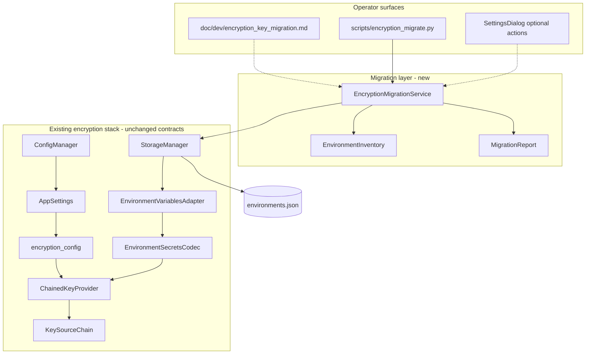
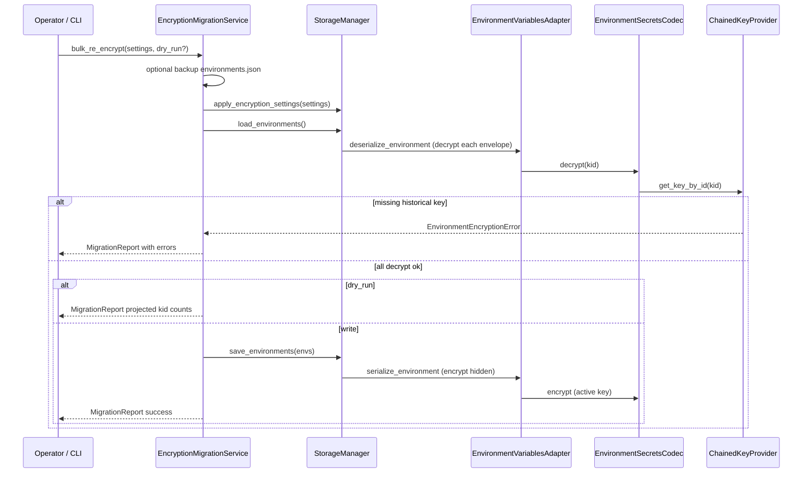

# PYPOST-487: Evaluate migration from env-var-only key source to configurable key provider strategy

## Programming Language

Python 3.10+ (type hints, union syntax, and `list[str]` usage in this design assume 3.10+).

## Research

### Current implementation (baseline from PYPOST-447/481/483)

- **Key resolution** is already multi-source: `ChainedKeyProvider` delegates to
  `KeySourceChain` over `EnvKeySource`, `KeyringKeySource`, and `SecretStoreKeySource`
  (`pypost/core/key_sources/`). Legacy env-var-only setups map to primary `environment` with no
  fallback — behavior unchanged from PYPOST-447.
- **Settings** (`AppSettings`) store policy only: `env_encryption_enabled`,
  `env_encryption_key_source`, `env_encryption_key_source_fallback`. Key material never enters
  `settings.json`.
- **Encrypt-on-save** is lazy: `EnvironmentVariablesAdapter.serialize_environment()` encrypts
  hidden keys when encryption is enabled; plaintext hidden values remain plain until the next
  save. Changing settings does not trigger an immediate bulk rewrite
  (`doc/dev/environment_encryption_at_rest.md`).
- **Decrypt-on-load** resolves historical `kid` values via `get_key_by_id()` across the
  configured chain. Mixed `kid` values after rotation are valid until optional bulk
  re-encryption.
- **Rotation model** is registry-based per source (env `KEYS_FILE`, keyring entries,
  secret-store spec). Operator steps are documented in dev docs but there is no consolidated
  migration runbook, rollout-stage guidance, or bulk re-encryption tooling.
- **Fallback behavior** is implemented in `KeySourceChain` (try primary, log warnings, continue;
  fail with `EnvironmentEncryptionError` when no source yields a key). Troubleshooting exists in
  dev docs but is not structured as operator migration procedures.
- **No migration module** exists today. Collection filename migration (PYPOST-327) is the
  nearest precedent: detect legacy state on load, migrate atomically, log structured events.

### Gaps relative to PYPOST-487 requirements

| Requirement area | Current state | Gap |
| --- | --- | --- |
| Migration path env → other sources | Per-source setup in dev docs | No staged procedure, prerequisites, or rollback matrix |
| Enable encryption on plaintext data | Lazy encrypt-on-save | No operator “encrypt all now” path without editing each env |
| Bulk re-encrypt after rotation | Deferred from PYPOST-483 | No service, CLI, or verification report |
| Rollout stages | Implicit in source types | No business-level maturity model with go/no-go criteria |
| Fallback operator runbook | Troubleshooting section | Not consolidated as migration/failure playbook |

### External references

- **Cryptography `MultiFernet.rotate()`** re-encrypts tokens under a new primary key while
  preserving metadata — analogous to bulk re-encryption of stored envelopes under the active
  `kid` ([Fernet docs](https://cryptography.io/en/latest/fernet/)).
- **Keystone Fernet rotation** separates *rotate keys*, *verify*, and *distribute* before
  retiring old material — applicable pattern for operator workflows
  ([OpenStack keystone FAQ](https://docs.openstack.org/keystone/latest/admin/fernet-token-faq.html)).
- **Twelve-factor config** keeps secrets in the environment; env-var sourcing remains a valid
  Stage 0 posture for CI and legacy desktop installs.

## Implementation Plan

1. **Add migration core module** (`pypost/core/encryption_migration.py`):
   - Inventory and verification (kid histogram, missing historical keys, plaintext hidden
     counts).
   - Bulk re-encrypt orchestration (load → decrypt → save) using existing
     `StorageManager` / `EnvironmentVariablesAdapter` — no codec or envelope changes.
   - Dry-run mode and structured `MigrationReport`.
2. **Add operator CLI** (`scripts/encryption_migrate.py`):
   - `verify` — decrypt-access check against current settings/env.
   - `report` — kid/plaintext/encrypted inventory without writes.
   - `re-encrypt` — optional bulk rewrite under active key (with `--dry-run`, `--backup`).
   - `encrypt-plaintext` — save-all path to encrypt previously plain hidden values after
     enabling encryption (no manual per-env edits).
   - Load `AppSettings` via `ConfigManager`; respect `PYPOST_ENV_ENCRYPTION_*` env overrides.
3. **Author operator runbook** (`doc/dev/encryption_key_migration.md`):
   - Rollout stages (0–4) with audience, prerequisites, and go/no-go criteria.
   - Per-scenario procedures: adopt new primary source, enable encryption, change fallback,
     rotate + optional re-encrypt, retire historical keys.
   - Fallback and safe-failure matrix aligned with `KeySourceChain` behavior.
   - Cross-link from `doc/dev/environment_encryption_at_rest.md`.
4. **Optional Settings UI hook** (Step 3, if scoped):
   - “Verify encryption” and “Re-encrypt all environments” actions delegating to migration
     service; require confirmation; run via `EnvironmentStorageGateway` when encryption is on.
5. **Tests**:
   - Unit tests for inventory, verify, dry-run, and bulk re-encrypt (mixed `kid`, plaintext
     → encrypted, missing historical key detection).
   - CLI integration tests with temp data dir and fixture registries.
6. **Documentation** (Step 7): finalize runbook, CLI usage, rollout tables; no algorithm or
   provider-backend changes.

## Architecture

### Module diagram



### Modules and responsibilities

| Module | Status | Responsibility |
| --- | --- | --- |
| `encryption_migration` | **New** | Verify decrypt access, inventory `kid`/plaintext mix, bulk re-encrypt, backup helper |
| `EnvironmentInventory` | **New** | Scan raw or loaded environments; per-env and aggregate stats |
| `MigrationReport` | **New** | Structured outcome: counts, `kid` histogram, errors, dry-run flag |
| `scripts/encryption_migrate.py` | **New** | Headless operator CLI; loads settings; invokes migration service |
| `doc/dev/encryption_key_migration.md` | **New** | Rollout stages, scenario runbooks, fallback matrix, verification checklist |
| `EncryptionMigrationService` | **New** | Facade: `verify()`, `report()`, `bulk_re_encrypt()`, `encrypt_plaintext_hidden()` |
| `ConfigManager` | Existing | Load `AppSettings` for CLI and UI |
| `encryption_config` | Existing | Unchanged: resolve chain, build provider |
| `StorageManager` | Existing | Unchanged I/O contract; migration calls `load_environments` / `save_environments` |
| `EnvironmentVariablesAdapter` | Existing | Lazy encrypt-on-save; migration relies on this for re-write |
| `EnvironmentSecretsCodec` | Existing | Unchanged envelope format and `kid` semantics |
| `KeySourceChain` / sources | Existing | Unchanged resolution and fallback |
| `SettingsDialog` | Optional Step 3 | Surface verify/re-encrypt with confirmation (operator-initiated) |
| `EnvironmentStorageGateway` | Existing | If UI actions added, queue bulk save off UI thread (PYPOST-486) |

### Rollout stages (business model — documented, not persisted)

Stages are operator guidance in the runbook; no new settings fields.

| Stage | Target audience | Primary source | Typical fallback | Prerequisites |
| --- | --- | --- | --- | --- |
| **0 — Legacy env-only** | Solo desktop, CI, quick start | `environment` | none | `PYPOST_ENV_ENCRYPTION_KEY` set when encryption on |
| **1 — Env with registry** | Rotation on env channel | `environment` | none | `PYPOST_ENV_ENCRYPTION_KEYS_FILE` with active + historical keys |
| **2 — Desktop keyring** | Individual developer workstation | `keyring` | `environment` | `keyring` installed; entries under `pypost/env-encryption`; backup taken |
| **3 — Team secret file** | Small team, shared machine image | `secret_store` | `environment` or `keyring` | Spec file + file backend; access controls on registry path |
| **4 — Central secrets** | Centrally managed deployments | `secret_store` (vault backend) | ordered chain per ops | Vault/token or env-indirection backend configured (PYPOST-500+) |

**Go/no-go between stages:** `verify` reports zero missing `kid`; sample decrypt succeeds; backup
of `environments.json` exists; new source yields active key; fallback tested intentionally
(primary disabled in dry check) when relied upon.

### Migration scenarios

Each scenario maps to runbook sections and optional CLI commands. All preserve backward
compatibility unless the operator explicitly changes settings.

| ID | Scenario | Mechanism | Operator action |
| --- | --- | --- | --- |
| **M1** | Stay on env-only legacy | No code change | None required; optional Stage 0 documentation acknowledgment |
| **M2** | Adopt env registry for rotation | Provision `KEYS_FILE`; retain env var | Add historical keys to registry; verify with `encryption_migrate verify` |
| **M3** | Change primary to keyring/secret_store | Reconfigure settings; keep old source in fallback during cutover | Provision keys in new source (same material or new active per rotation policy); set primary; verify; remove fallback when confident |
| **M4** | Enable encryption on plaintext hidden values | Lazy encrypt-on-save | Enable in Settings; run `encrypt-plaintext` or save all environments |
| **M5** | Change fallback order only | `apply_encryption_settings` rebuilds chain | Update Settings; run `verify`; no bulk rewrite required |
| **M6** | Rotate active key | Registry update per PYPOST-483 | New active in source; retain historical `kid`; verify decrypt |
| **M7** | Bulk re-encrypt under active key | **New** migration service | `encryption_migrate re-encrypt --backup`; confirm `kid` histogram single active |
| **M8** | Retire historical key material | Operator removes keys from registry | Only after M7 confirms no envelopes reference retired `kid` |

### Bulk re-encryption flow



**Safety properties:**

- Uses existing atomic `os.replace` save path in `StorageManager`.
- `--dry-run` performs full decrypt without `save_environments`.
- `--backup` copies `environments.json` to timestamped sibling before write.
- Does not run automatically on settings change (per requirements and PYPOST-481 decision).
- Fails closed: first decrypt error aborts with report; no partial file write.

### Enable-encryption-on-plaintext flow

No new crypto logic: encryption policy already flows through `serialize_environment`.

1. Operator enables encryption in Settings (or env var).
2. `encrypt_plaintext_hidden()` loads all environments and saves unchanged in-memory values;
   adapter encrypts hidden keys that were plain strings on disk.
3. Equivalent to user editing and saving each environment; suitable for one-shot migration.

### Fallback and safe-failure matrix

Documented for operators; behavior implemented in `KeySourceChain` (unchanged).

| Condition | Active key resolution | Historical `kid` resolution | User experience |
| --- | --- | --- | --- |
| Primary unavailable, fallback yields key | Uses fallback; logs `*_resolved_via_fallback` | Tries each source in order | Normal operation |
| No source yields active key | — | — | Save fails; `encryption_key_unavailable`; safe error, no key bytes in message |
| Active ok, historical `kid` missing | — | All sources return `None` | Load fails for affected env; `encryption_key_rotation_lookup_failed` |
| Encryption disabled, file has envelopes | N/A for new saves | Decrypt still attempted for envelope-shaped values | Load may fail if keys missing |
| Legacy env-only, single var | Env key is active | `get_key_by_id` succeeds only when `kid` matches env key | Rotation requires registry (Stage 1+) |

### Main interfaces

```python
@dataclass(frozen=True)
class EnvironmentInventory:
    environment_count: int
    hidden_value_count: int
    encrypted_envelope_count: int
    plaintext_hidden_count: int
    kid_histogram: dict[str, int]
    missing_kids: frozenset[str]


@dataclass(frozen=True)
class MigrationReport:
    inventory: EnvironmentInventory
    dry_run: bool
    backup_path: Path | None
    errors: tuple[str, ...]
    success: bool


class EncryptionMigrationService:
    def __init__(self, storage: StorageManager) -> None: ...

    def build_inventory(
        self,
        settings: AppSettings | None,
        *,
        check_decrypt: bool = False,
    ) -> EnvironmentInventory: ...

    def verify_decrypt_access(
        self, settings: AppSettings | None
    ) -> MigrationReport: ...

    def bulk_re_encrypt(
        self,
        settings: AppSettings | None,
        *,
        dry_run: bool = False,
        backup: bool = True,
    ) -> MigrationReport: ...

    def encrypt_plaintext_hidden(
        self,
        settings: AppSettings | None,
        *,
        dry_run: bool = False,
        backup: bool = True,
    ) -> MigrationReport: ...


def backup_environments_file(path: Path) -> Path: ...
```

CLI sketch (Step 3):

```
python scripts/encryption_migrate.py verify
python scripts/encryption_migrate.py report
python scripts/encryption_migrate.py re-encrypt [--dry-run] [--no-backup]
python scripts/encryption_migrate.py encrypt-plaintext [--dry-run] [--no-backup]
```

Inventory scans `environments.json` for envelope-shaped hidden values (read `kid` without
decrypt) and optionally full decrypt when `check_decrypt=True` for verify.

### Architectural patterns

| Pattern | Application | Justification |
| --- | --- | --- |
| **Facade** | `EncryptionMigrationService` | Single operator entry point over storage + adapter |
| **Template method** | verify → (backup) → load → transform → save | Consistent, auditable migration steps |
| **Strategy** | Scenario procedures in runbook | Business stages without encoding in settings schema |
| **Command** | CLI subcommands | Explicit operator intent; scriptable for teams |
| **Chain of Responsibility** | Existing `KeySourceChain` | Reused for migration verify; no duplication |
| **Repository** | `StorageManager` | Persistence boundary unchanged |

### Integration points (unchanged boundaries)

- `EnvironmentSecretsCodec`, `KeyProvider`, envelope format, and `kid` derivation — **no changes**.
- `build_key_provider()` / `resolve_key_source_chain()` — **no changes**; migration consumes them.
- Runtime request execution — **no encryption awareness** (PYPOST-447).
- New provider backends (PYPOST-500+) — **out of scope**; runbook references vault as Stage 4 when available.

### Dependencies

- No new runtime dependencies.
- CLI uses stdlib `argparse`; optional `scripts/` entry only (not required at app startup).

## Q&A

- Q: Why not auto re-encrypt when settings change?
  A: PYPOST-481/487 requirements — avoids surprise bulk writes, data-loss risk, and UI freezes;
  operators opt in via CLI or optional Settings action.

- Q: How does legacy env-only backward compatibility hold?
  A: Stage 0 is primary `environment`, empty fallback — identical to pre-PYPOST-483 behavior.
  No settings change means no migration activity.

- Q: Is bulk re-encryption the same as rotation?
  A: No. Rotation updates the active key in the registry; old envelopes keep their `kid` until
  re-encrypted. M7 rewrites envelopes under the current active key so historical material can be
  retired (M8).

- Q: Why a CLI instead of only UI?
  A: Operators need scriptable verify/re-encrypt for backups, CI smoke checks, and team runbooks
  without launching the desktop app. Optional UI wraps the same service.

- Q: Does migration copy key material between sources?
  A: No automatic copy — operators provision the new source (same Fernet bytes or new active key
  per rotation policy). Fallback preserves decrypt access during cutover.

- Q: What if verify passes but re-encrypt fails mid-save?
  A: Save is atomic (`tmp` + `os.replace`); failed replace leaves original file. Backup provides
  additional rollback.

- Q: Where do rollout stages live?
  A: In `doc/dev/encryption_key_migration.md` only — business guidance, not persisted config.

- Q: Relation to PYPOST-500 (vault backend)?
  A: Stage 4 references vault when implemented; this task documents migration using existing
  secret-store chain without adding backends.
