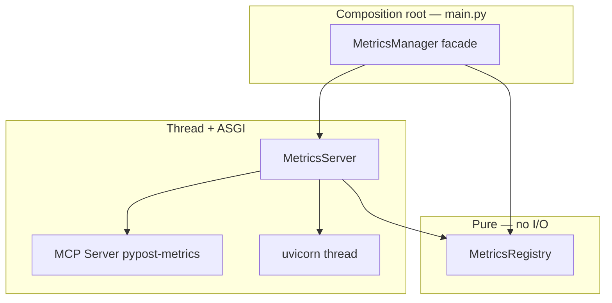

# PYPOST-49: Split MetricsManager into MetricsRegistry and MetricsServer

## Research

- **PYPOST-40 R7:** Split `MetricsManager` into `MetricsRegistry` (counters) and
  `MetricsServer` (uvicorn + MCP). Impact medium, effort medium (P2).
- **PYPOST-75:** Implemented the split as PYPOST-44 TD-3; documented in
  `ai-tasks/PYPOST-75/` and `doc/dev/mcp_integration.md`.
- **PYPOST-177:** Added component-level tests for registry MCP counters and server HTTP/MCP
  resource paths.
- **Dependency direction:** `metrics_registry.py` has no imports from `metrics_server.py`.

## Implementation Plan

1. Confirm three-module layout under `pypost/core/metrics*.py`.
2. Verify facade delegates all public methods without behavior change.
3. Run focused metrics unit tests.
4. Update PYPOST-40 tech-debt and architecture docs to mark R7 resolved.

## Architecture

### Module diagram

### Module responsibilities

| Module | Class | Responsibility |
| --- | --- | --- |
| `pypost/core/metrics_registry.py` | `MetricsRegistry` | `CollectorRegistry`, counter definitions, `track_*` |
| `pypost/core/metrics_server.py` | `MetricsServer` | MCP `metrics://all`, Starlette app, uvicorn lifecycle |
| `pypost/core/metrics.py` | `MetricsManager` | Facade; delegates to registry + server |

### Interfaces (unchanged public API)

- Facade `track_*` methods delegate to `MetricsRegistry`.
- `start_server` / `stop_server` / `restart_server` delegate to `MetricsServer`.
- `registry` property exposes Prometheus `CollectorRegistry` for scrape tests.
- `start_failed` Qt signal replays bind failures to `MainWindow`.

### Verification evidence

| Check | Result |
| --- | --- |
| Registry has no uvicorn/thread imports | Pass |
| Server imports registry only (plus MCP/ASGI stack) | Pass |
| Facade preserves injection API | Pass |
| Unit tests | 25 passed |

## Q&A

| Question | Answer |
|----------|--------|
| Can tests use `MetricsRegistry` directly? | Yes — preferred for counter-only unit tests. |
| Who starts the server? | `main.py` calls `metrics_manager.start_server(...)`. |
