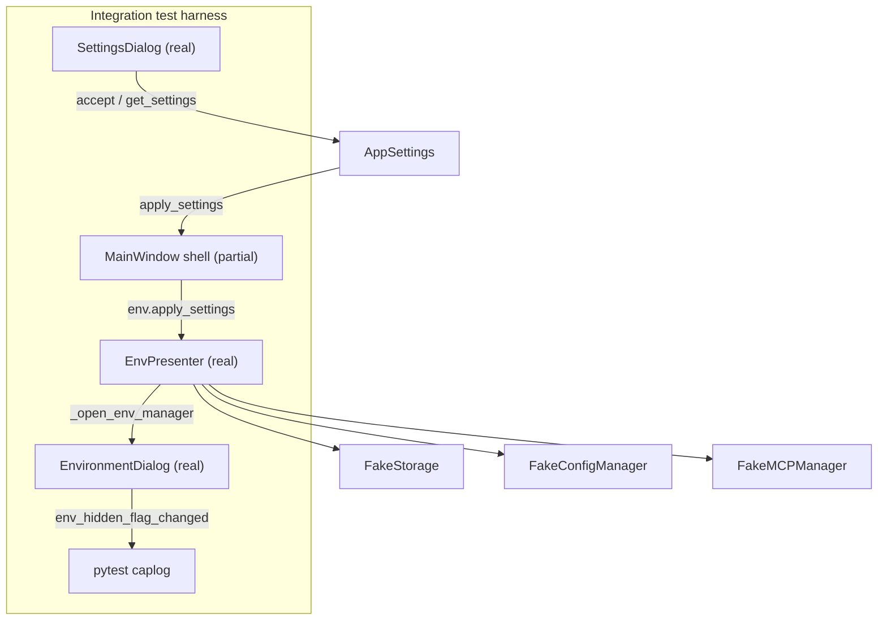

# PYPOST-490: Integration test for settings-to-masked hidden-toggle logging flow

## Research

- **Modal dialog testing:** patch `QDialog.exec` to run actions synchronously rather
  than driving full event loops — common Qt/pytest pattern for modal widgets.
- **Logging capture:** pytest `caplog` fixture at `logging.INFO` is the project
  standard for asserting structured log output in UI tests.

### Existing production wiring (PYPOST-448)

The observability chain under test is already implemented and split across four
touchpoints:

| Stage | Component | Responsibility |
| --- | --- | --- |
| 1 | `SettingsDialog` | Captures `log_hidden_key_names` via checkbox; builds `AppSettings` on `accept()` |
| 2 | `MainWindow.open_settings` / `apply_settings` | Persists settings, forwards to presenters |
| 3 | `EnvPresenter.apply_settings` | Updates `_settings` reference |
| 4 | `EnvPresenter._open_env_manager` | Passes `log_hidden_key_names=self._settings.log_hidden_key_names` into `EnvironmentDialog` |
| 5 | `EnvironmentDialog` | On hidden-checkbox toggle, logs `env_hidden_flag_changed` via `HiddenToggleLogPolicy` |

Key code paths:

- `MainWindow.apply_settings` delegates to `self.env.apply_settings(settings)`
  (`pypost/ui/main_window.py`).
- `EnvPresenter._open_env_manager` constructs `EnvironmentDialog(...,
  log_hidden_key_names=self._settings.log_hidden_key_names)` and calls `exec()`
  (`pypost/ui/presenters/env_presenter.py`).
- Toggle logging uses `HiddenToggleLogPolicy.format_key_name` before
  `logger.info("env_hidden_flag_changed env_name=%s key=%s hidden=%s", ...)`
  (`pypost/ui/dialogs/env_dialog.py`).

### Existing test coverage (gaps)

| File | What it covers | Gap |
| --- | --- | --- |
| `tests/test_hidden_toggle_log_policy.py` | Policy unit: enabled → real key; disabled → `HIDDEN_MASK` | No wiring |
| `tests/test_settings_dialog.py` | Checkbox on form; load/save via `accept()` | No apply or env dialog |
| `tests/test_env_presenter.py` | `apply_settings` replaces `_settings` reference | No dialog open or logging |
| `tests/test_env_dialog.py` | `caplog` toggle logs with constructor arg passed **directly** | Skips settings → apply → presenter chain |
| `tests/test_apply_settings_font.py` | Real `MainWindow.apply_settings` with heavy mocks | Mocks `EnvPresenter`; unrelated domain |
| `tests/test_env_persistence_e2e.py` | Presenter + storage round-trip; dialog without `log_hidden_key_names` | PYPOST-489 scope; no logging assertions |

The debt item in [PYPOST-448 technical-debt analysis](ai-tasks/PYPOST-448/60-tech-debt.md)
names the missing link explicitly: **Settings save → `MainWindow.apply_settings` →
`EnvPresenter._open_env_manager` → masked toggle log**.

### Test infrastructure patterns in this repo

- **Qt tests** use a module-scoped `qapp` fixture (`tests/test_env_dialog.py`,
  `tests/test_env_persistence_e2e.py`).
- **Logging assertions** use pytest `caplog` at `logging.INFO` while triggering the
  toggle via `_get_hidden_checkbox(row).setChecked(True)` (proven in
  `test_env_dialog.py`).
- **Presenter fakes** (`FakeStorage`, `FakeConfigManager`, `FakeMCPManager`) live in
  `tests/test_env_presenter.py` and can be reused or copied minimally.
- **MainWindow partial construction** pattern from `tests/test_apply_settings_font.py`:
  patch heavy dependencies during `__init__`, then call real instance methods after the
  patch context exits.
- **Dialog `exec()` bypass**: patch `EnvironmentDialog.exec` to run in-dialog actions
  synchronously instead of blocking on modal event loop — avoids brittle full UI
  automation while still exercising `_open_env_manager` construction wiring.

### Out-of-scope behaviors (confirmed)

- Policy change while environment manager is already open (PYPOST-448 accepted
  limitation).
- Persistence round-trip logging (PYPOST-489).
- Delete/move variable log events (PYPOST-467; separate caplog tests already exist).

## Implementation Plan

1. **Add** `tests/test_settings_hidden_toggle_logging_e2e.py` — focused acceptance
   module traceable to PYPOST-490 / PYPOST-448 debt.
2. **Reuse** presenter fakes and environment fixture data from existing tests; do not
   duplicate unit-level policy or checkbox scenarios.
3. **Implement two test cases** (parametrize optional):
   - Default policy (`log_hidden_key_names=False`): masked key in toggle log.
   - Opt-in policy (`log_hidden_key_names=True`): readable key in toggle log.
4. **Simulate the user journey** in order:
   1. Build `EnvPresenter` with fakes; call `load_environments()` so `_environments`
      contains a `Dev` environment with `API_KEY=secret`.
   2. Open `SettingsDialog`, set checkbox, call `accept()`, read `get_settings()`.
   3. Attach presenter to a minimal `MainWindow` shell; call real
      `MainWindow.apply_settings(new_settings)`.
   4. Call `presenter._open_env_manager()` with `EnvironmentDialog.exec` patched to
      select env row 0 and toggle hidden checkbox under `caplog`.
   5. Assert log content per policy and privacy rules.
5. **No production code changes** unless a wiring defect is discovered during
   implementation (minimal fix only).
6. **Run** the new module plus existing PYPOST-448-related tests to confirm no
   regressions.

## Architecture

### Module Diagram



### Test Approach

**Style:** presenter-centric integration test with a thin `MainWindow` shell — not a
full GUI click-through.

**Why not full UI automation?**

- Settings and environment manager are separate modal dialogs; driving both through Qt
  event loops is slow and brittle.
- Unit tests already cover Settings checkbox and dialog logging in isolation.
- The regression risk is **wiring** (settings reaching `EnvironmentDialog` constructor),
  which is testable by calling real methods in sequence.

**Why include `MainWindow.apply_settings`?**

- The debt item and requirements explicitly require that hop.
- `MainWindow.apply_settings` is a one-line forward to `EnvPresenter.apply_settings`;
  a partial window with injected real presenter verifies that forward without building
  the full application shell.

**Why patch `EnvironmentDialog.exec`?**

- `_open_env_manager` always calls `exec()`. Patching `exec` to perform the hidden
  toggle synchronously exercises the real constructor argument
  (`log_hidden_key_names=self._settings.log_hidden_key_names`) and the real toggle
  handler without waiting on modal dialog dismissal or clicking Manage.

### Fixtures and Mocks

| Piece | Real or mock | Notes |
| --- | --- | --- |
| `QApplication` | Real (`qapp` fixture) | Required for Qt widgets |
| `SettingsDialog` | Real | Toggle checkbox; `accept()` + `get_settings()` |
| `MainWindow` | Partial real | Patch storage/config/tabs/collections during init; inject real `EnvPresenter` after init |
| `EnvPresenter` | Real | `FakeStorage`, `FakeConfigManager`, `FakeMCPManager`, `MagicMock` metrics |
| `EnvironmentDialog` | Real | Constructed inside `_open_env_manager`; `exec` patched |
| `Environment` / `AppSettings` | Real | `Environment(name="Dev", variables={"API_KEY": "secret"})` |
| `ConfigManager.save_config` | Fake / no-op | Not under test; optional assert skip |
| `style_manager.apply_styles` | Patch no-op | Avoid font/stylesheet side effects from `apply_settings` |
| Logger | Real + `caplog` | Capture `pypost.ui.dialogs.env_dialog` INFO records |

**Shared test data constants:**

- `ENV_NAME = "Dev"`
- `VARIABLE_KEY = "API_KEY"`
- `VARIABLE_VALUE = "secret"` (must never appear in caplog records)

### Files to Create / Modify

| File | Action |
| --- | --- |
| `tests/test_settings_hidden_toggle_logging_e2e.py` | **Create** — two acceptance tests + helpers |
| `pypost/**` | **No change** expected (test-only task) |
| `ai-tasks/PYPOST-490/20-architecture.md` | This document |

No changes to existing test files unless a small shared helper extraction proves
necessary during Step 3 (prefer local helpers first to minimize scope).

### Key Assertions

For each test case, after the full chain runs under `caplog.at_level(logging.INFO)`:

**Default policy (`log_hidden_key_names=False`):**

- At least one record contains
  `env_hidden_flag_changed env_name=Dev key=******** hidden=True`.
- No caplog record message contains `API_KEY` (readable key suppressed).
- No caplog record message contains `secret` (variable value never logged).

**Opt-in policy (`log_hidden_key_names=True`):**

- At least one record contains
  `env_hidden_flag_changed env_name=Dev key=API_KEY hidden=True`.
- No caplog record message contains `secret`.

**Both modes:**

- Log includes `env_name=Dev` and `hidden=True`.
- Toggle log event is `env_hidden_flag_changed` (not delete/move events).

### Helper Sketch (Step 3 reference)

```python
def _settings_after_accept(current: AppSettings, *, log_hidden_key_names: bool) -> AppSettings:
    dlg = SettingsDialog(current)
    dlg.log_hidden_key_names_check.setChecked(log_hidden_key_names)
    dlg.accept()
    return dlg.get_settings()


def _make_integration_window(qapp, env_presenter):
    # Mirror test_apply_settings_font.py: patch heavy MainWindow deps during __init__,
    # then inject real env_presenter as window.env before calling apply_settings.
    ...


def _toggle_hidden_during_exec(dialog, caplog):
    dialog.on_env_selected(0)
    hidden_cb = dialog._get_hidden_checkbox(0)
    assert hidden_cb is not None
    with caplog.at_level(logging.INFO):
        hidden_cb.setChecked(True)


def _patch_env_dialog_exec(caplog):
    def exec_and_toggle(self):
        _toggle_hidden_during_exec(self, caplog)
        return 0  # QDialog.Rejected — logging already occurred
    return patch.object(EnvironmentDialog, "exec", exec_and_toggle)
```

### Test Cases

| ID | Name | Settings checkbox | Expected log fragment |
| --- | --- | --- | --- |
| T-1 | `test_default_masked_toggle_log_after_settings_apply` | Unchecked (default) | `key=********`, no `API_KEY` |
| T-2 | `test_readable_toggle_log_when_settings_opt_in` | Checked | `key=API_KEY` |

Optional negative guard (low priority): call `_open_env_manager` **before**
`apply_settings` with opt-in settings prepared but not applied — expect masked log —
proving policy is read at dialog construction time. Only add if it clarifies without
duplicating unit tests.

### Architectural Patterns

- **Integration test over end-to-end UI test:** real components in sequence; mock only
  infrastructure boundaries (storage persistence dirs, modal blocking, heavy main window).
- **Arrange–Act–Assert with explicit journey comments:** each test documents the five
  user-journey steps from requirements for traceability.
- **Reuse over duplication:** assertion strings align with existing
  `test_env_dialog.py` caplog tests; do not re-test policy unit logic.

### Boundaries with Existing Tests

| Concern | Owner |
| --- | --- |
| `HiddenToggleLogPolicy.format_key_name` | `test_hidden_toggle_log_policy.py` |
| Checkbox UI presence / `accept()` field | `test_settings_dialog.py` |
| Dialog logging with explicit constructor arg | `test_env_dialog.py` |
| `apply_settings` reference swap | `test_env_presenter.py` |
| **Connected flow** | **`test_settings_hidden_toggle_logging_e2e.py` (new)** |

## Q&A

| Question | Answer |
| --- | --- |
| Why a new file instead of extending `test_env_persistence_e2e.py`? | Keeps PYPOST-490 traceable; persistence e2e focuses on storage round-trip (PYPOST-489), not settings logging wiring. |
| Why patch `exec` instead of calling `EnvironmentDialog` directly? | Direct construction skips `_open_env_manager`, which is the wiring point that reads `_settings.log_hidden_key_names`. |
| Is `MainWindow.open_settings` required in the test? | No. Requirements require the **effect** of settings save + apply. `SettingsDialog.accept()` + `MainWindow.apply_settings()` covers the observable chain without persisting to disk or restarting metrics. |
| Must we assert `ConfigManager.save_config`? | No. Persistence of `log_hidden_key_names` is covered by `test_settings_persistence.py`. |
| What if wiring is broken? | Fix minimally in production code; document in Step 6 tech-debt if unexpected. |
| Source tickets? | [PYPOST-490](https://pypost.atlassian.net/browse/PYPOST-490), parent [PYPOST-448](https://pypost.atlassian.net/browse/PYPOST-448) |
