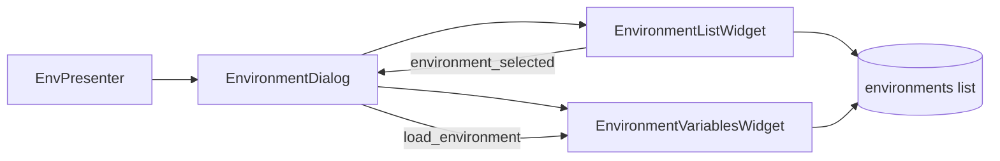

# PYPOST-496: Architecture

## Plan

1. **`EnvironmentListWidget`** (`pypost/ui/widgets/environments/environment_list_widget.py`)
   - Owns `QListWidget`, Add button, F2/context-menu rename, copy, delete.
   - Emits `environment_selected(int)` when the current row changes.
   - Mutates the shared `environments` list in place (unchanged presenter contract).

2. **`EnvironmentVariablesWidget`** (`pypost/ui/widgets/environments/environment_variables_widget.py`)
   - Owns variables `QTableWidget`, hidden-column checkboxes, MCP checkbox.
   - Loads table state via `load_environment(Environment | None)`.
   - Resolves the active environment through `get_selected_env` callback from the dialog.

3. **`EnvironmentDialog`** (`pypost/ui/dialogs/env_dialog.py`)
   - Horizontal layout: list widget (stretch 1) + variables widget (stretch 3).
   - Wires `environment_selected` → `on_env_selected` → `load_environment`.
   - Exposes legacy properties and `_`-prefixed helpers for tests.

## Data flow

## Backward compatibility

Tests and callers continue to use `EnvironmentDialog` as the entry point. Widget extraction is
internal; no presenter changes required.
