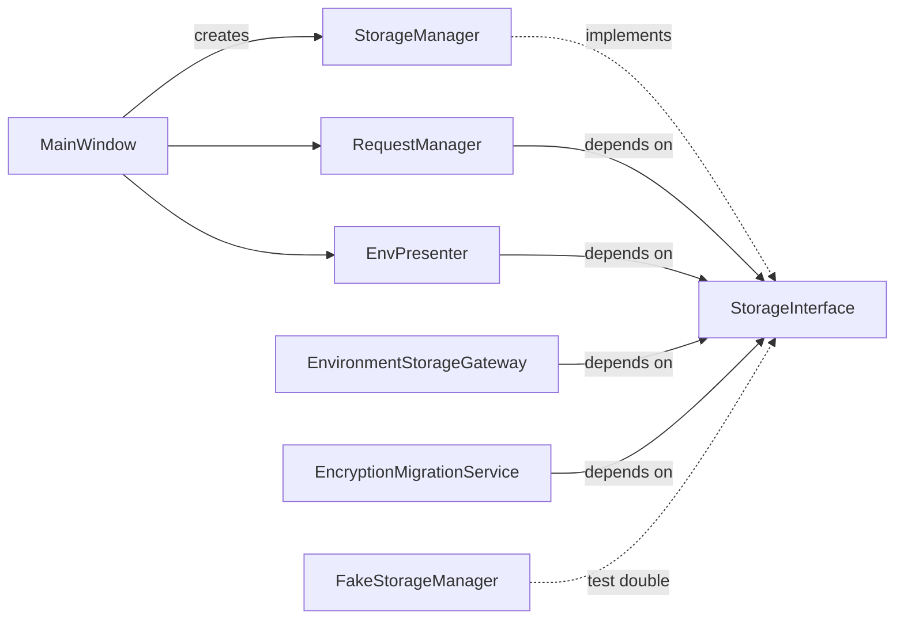

# PYPOST-50: StorageInterface architecture

## Research

- **PYPOST-40 R8:** Consumers imported `StorageManager` directly, coupling tests and services
  to a concrete filesystem implementation.
- **Prior art:** `HTTPClientProtocol` and `MetricsTrackerProtocol` use `@runtime_checkable`
  structural typing with `MagicMock(spec=...)` in tests.
- **`StorageManager` surface:** Collection CRUD plus environment load/save, encryption policy,
  and `environments_file` path used by `EncryptionMigrationService`.

## Implementation Plan

1. Add `pypost/core/storage_interface.py` with `StorageInterface` protocol.
2. Update type hints in consumers; keep `MainWindow` constructing `StorageManager`.
3. Extend `FakeStorageManager` with environment stubs for protocol compliance.
4. Add `tests/test_storage_interface.py` mirroring `test_http_client_protocol.py`.
5. Update developer docs and mark PYPOST-40 R8 resolved.

## Architecture

### Module diagram

### Protocol surface

| Method / attribute | Purpose |
| --- | --- |
| `environments_file` | Path for migration backup/inventory |
| `apply_encryption_settings` | Sync codec with `AppSettings` |
| `save_collection` / `delete_collection` / `load_collections` | Collection persistence |
| `save_environments` / `load_environments` / `load_environments_with_errors` | Environment persistence |
| `project_save_stats` | Dry-run encryption stats for migration |

### Component changes

| Module | Change |
| --- | --- |
| `storage_interface.py` | **New** protocol |
| `request_manager.py` | `StorageInterface` constructor param |
| `encryption_migration.py` | `StorageInterface` constructor param |
| `environment_storage_gateway.py` | `StorageInterface` constructor param |
| `environment_storage_worker.py` | `StorageInterface` constructor param |
| `env_presenter.py` | `StorageInterface` constructor param |
| `settings_dialog.py` | `StorageInterface` optional param |
| `tests/helpers/__init__.py` | Environment stubs on `FakeStorageManager` |

### Risks

- **Runtime protocol checks** do not validate `environments_file` attribute — static typing only.
  Mitigated by unit tests on `StorageManager` and `FakeStorageManager`.

## Q&A

| Question | Answer |
| --- | --- |
| Does `StorageManager` inherit explicitly? | No — structural typing; no API changes. |
| Why include `environments_file`? | `EncryptionMigrationService` reads the path for backup/inventory. |
