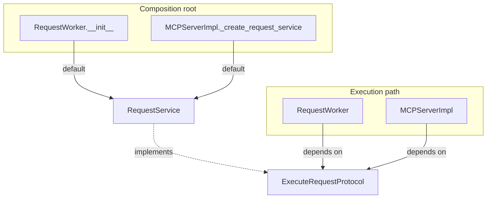

# PYPOST-51: ExecuteRequestProtocol architecture

## Research

- **PYPOST-40 R9:** Request execution was tied to concrete `RequestService` in worker and MCP
  inbound paths.
- **Prior art:** `HTTPClientProtocol` and `StorageInterface` use `@runtime_checkable`
  structural typing with `MagicMock(spec=...)` in tests.
- **Call surface:** `RequestWorker.run` and `MCPServerImpl._execute_request_sync` call only
  `execute(request, variables, ...)`.

## Implementation Plan

1. Add `pypost/core/execute_request_protocol.py` with `ExecuteRequestProtocol`.
2. Mirror `RequestService.execute` signature; import `ExecutionResult` from `request_service`.
3. Type `RequestWorker.service` as `ExecuteRequestProtocol` (default `RequestService`).
4. Type `MCPServerImpl._create_request_service` return as `ExecuteRequestProtocol`.
5. Add `tests/test_execute_request_protocol.py`.
6. Update `doc/dev/testability.md` and mark PYPOST-40 R9 resolved.

## Architecture

### Type boundaries

| Layer | Type | Rationale |
| --- | --- | --- |
| `RequestWorker` | `ExecuteRequestProtocol` | Background thread needs execute only |
| `MCPServerImpl` | `ExecuteRequestProtocol` | MCP tool handler needs execute only |
| Default path | `RequestService` | Production orchestration with HTTP/MCP/scripts |
| Tests | `MagicMock(spec=ExecuteRequestProtocol)` | Focused fake without subclassing |

### Alternatives considered

| Option | Verdict |
| --- | --- |
| `Protocol` on `execute` | **Selected** — matches PYPOST-46/50, minimal diff |
| ABC base class | Rejected — structural typing fits duck-typed service |
| Inject executor in `RequestWorker` now | Rejected — tracked as PYPOST-379 |
